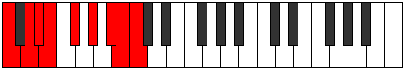

# Mode Aerothyllic

## Links

- [Documentation](index.md)
- [Scales Index](Scales.md)
- [Modes Index](Modes.md)
- [Chords Index](Chords.md)

## Parent Scale

[Racryllic](ScaleRacryllic.md)

## Number

[3421](https://ianring.com/musictheory/scales/3421)

## Perfection

- 4 Perfect notes
- 4 Perfect notes

## Interval Pattern

2, 1, 1, 2, 2, 2, 1, 1

## Perfection Profile

[false false true true false true false true]

## Permutations

| Tonic | Notes | Signature | Illustration | Audio |
|-------|-------|-----------|--------------|-------|
| [C](ModeCNaturalAerothyllic.md) | **C**, **D**, D#, E, **F#**, G#, **A#**, B, **C** | C |  | [midi](https://github.com/edipermadi/music/blob/main/docs/ModeCNaturalAerothyllic.mid?raw=true) |
| [C#](ModeCSharpAerothyllic.md) | **C#**, **D#**, E, F, **G**, A, **B**, C, **C#** | C |  | [midi](https://github.com/edipermadi/music/blob/main/docs/ModeCSharpAerothyllic.mid?raw=true) |
| [Db](ModeDFlatAerothyllic.md) | **Db**, **Eb**, E, F, **G**, A, **B**, C, **Db** | C |  | [midi](https://github.com/edipermadi/music/blob/main/docs/ModeDFlatAerothyllic.mid?raw=true) |
| [D](ModeDNaturalAerothyllic.md) | **D**, **E**, F, F#, **G#**, A#, **C**, C#, **D** | C |  | [midi](https://github.com/edipermadi/music/blob/main/docs/ModeDNaturalAerothyllic.mid?raw=true) |
| [D#](ModeDSharpAerothyllic.md) | **D#**, **F**, F#, G, **A**, B, **C#**, D, **D#** | C |  | [midi](https://github.com/edipermadi/music/blob/main/docs/ModeDSharpAerothyllic.mid?raw=true) |
| [Eb](ModeEFlatAerothyllic.md) | **Eb**, **F**, Gb, G, **A**, B, **Db**, D, **Eb** | C |  | [midi](https://github.com/edipermadi/music/blob/main/docs/ModeEFlatAerothyllic.mid?raw=true) |
| [E](ModeENaturalAerothyllic.md) | **E**, **F#**, G, G#, **A#**, C, **D**, D#, **E** | C |  | [midi](https://github.com/edipermadi/music/blob/main/docs/ModeENaturalAerothyllic.mid?raw=true) |
| [F](ModeFNaturalAerothyllic.md) | **F**, **G**, G#, A, **B**, C#, **D#**, E, **F** | C |  | [midi](https://github.com/edipermadi/music/blob/main/docs/ModeFNaturalAerothyllic.mid?raw=true) |
| [F#](ModeFSharpAerothyllic.md) | **F#**, **G#**, A, A#, **C**, D, **E**, F, **F#** | C |  | [midi](https://github.com/edipermadi/music/blob/main/docs/ModeFSharpAerothyllic.mid?raw=true) |
| [Gb](ModeGFlatAerothyllic.md) | **Gb**, **Ab**, A, Bb, **C**, D, **E**, F, **Gb** | C |  | [midi](https://github.com/edipermadi/music/blob/main/docs/ModeGFlatAerothyllic.mid?raw=true) |
| [G](ModeGNaturalAerothyllic.md) | **G**, **A**, A#, B, **C#**, D#, **F**, F#, **G** | C |  | [midi](https://github.com/edipermadi/music/blob/main/docs/ModeGNaturalAerothyllic.mid?raw=true) |
| [G#](ModeGSharpAerothyllic.md) | **G#**, **A#**, B, C, **D**, E, **F#**, G, **G#** | C |  | [midi](https://github.com/edipermadi/music/blob/main/docs/ModeGSharpAerothyllic.mid?raw=true) |
| [Ab](ModeAFlatAerothyllic.md) | **Ab**, **Bb**, B, C, **D**, E, **Gb**, G, **Ab** | C |  | [midi](https://github.com/edipermadi/music/blob/main/docs/ModeAFlatAerothyllic.mid?raw=true) |
| [A](ModeANaturalAerothyllic.md) | **A**, **B**, C, C#, **D#**, F, **G**, G#, **A** | C |  | [midi](https://github.com/edipermadi/music/blob/main/docs/ModeANaturalAerothyllic.mid?raw=true) |
| [A#](ModeASharpAerothyllic.md) | **A#**, **C**, C#, D, **E**, F#, **G#**, A, **A#** | C |  | [midi](https://github.com/edipermadi/music/blob/main/docs/ModeASharpAerothyllic.mid?raw=true) |
| [Bb](ModeBFlatAerothyllic.md) | **Bb**, **C**, Db, D, **E**, Gb, **Ab**, A, **Bb** | C |  | [midi](https://github.com/edipermadi/music/blob/main/docs/ModeBFlatAerothyllic.mid?raw=true) |
| [B](ModeBNaturalAerothyllic.md) | **B**, **C#**, D, D#, **F**, G, **A**, A#, **B** | C |  | [midi](https://github.com/edipermadi/music/blob/main/docs/ModeBNaturalAerothyllic.mid?raw=true) |
