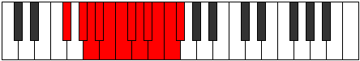

# Mode Aerycratic

## Links

- [Documentation](index.md)
- [Scales Index](Scales.md)
- [Modes Index](Modes.md)
- [Chords Index](Chords.md)

## Parent Scale

[Aerycratic](ScaleAerycratic.md)

## Number

[4093](https://ianring.com/musictheory/scales/4093)

## Interval Pattern

2, 1, 1, 1, 1, 1, 1, 1, 1, 1, 1

## Chord Pattern

## Perfection

- 10 Perfect notes
- 1 Perfect notes

## Perfection Profile

[true true true true true false true true true true true]

## Permutations

| Tonic | Notes | Signature | Illustration | Audio |
|-------|-------|-----------|--------------|-------|
| [C](ModeCNaturalAerycratic.md) | C, D, D#, E, F, **F#**, G, G#, A, A#, B, C | C |  | [midi](https://github.com/edipermadi/music/blob/main/docs/ModeCNaturalAerycratic.mid?raw=true) |
| [C#](ModeCSharpAerycratic.md) | C#, D#, E, F, F#, **G**, G#, A, A#, B, C, C# | C |  | [midi](https://github.com/edipermadi/music/blob/main/docs/ModeCSharpAerycratic.mid?raw=true) |
| [Db](ModeDFlatAerycratic.md) | Db, Eb, E, F, Gb, **G**, Ab, A, Bb, B, C, Db | C |  | [midi](https://github.com/edipermadi/music/blob/main/docs/ModeDFlatAerycratic.mid?raw=true) |
| [D](ModeDNaturalAerycratic.md) | D, E, F, F#, G, **G#**, A, A#, B, C, C#, D | C |  | [midi](https://github.com/edipermadi/music/blob/main/docs/ModeDNaturalAerycratic.mid?raw=true) |
| [D#](ModeDSharpAerycratic.md) | D#, F, F#, G, G#, **A**, A#, B, C, C#, D, D# | C |  | [midi](https://github.com/edipermadi/music/blob/main/docs/ModeDSharpAerycratic.mid?raw=true) |
| [Eb](ModeEFlatAerycratic.md) | Eb, F, Gb, G, Ab, **A**, Bb, B, C, Db, D, Eb | C |  | [midi](https://github.com/edipermadi/music/blob/main/docs/ModeEFlatAerycratic.mid?raw=true) |
| [E](ModeENaturalAerycratic.md) | E, F#, G, G#, A, **A#**, B, C, C#, D, D#, E | C |  | [midi](https://github.com/edipermadi/music/blob/main/docs/ModeENaturalAerycratic.mid?raw=true) |
| [F](ModeFNaturalAerycratic.md) | F, G, G#, A, A#, **B**, C, C#, D, D#, E, F | C |  | [midi](https://github.com/edipermadi/music/blob/main/docs/ModeFNaturalAerycratic.mid?raw=true) |
| [F#](ModeFSharpAerycratic.md) | F#, G#, A, A#, B, **C**, C#, D, D#, E, F, F# | C |  | [midi](https://github.com/edipermadi/music/blob/main/docs/ModeFSharpAerycratic.mid?raw=true) |
| [Gb](ModeGFlatAerycratic.md) | Gb, Ab, A, Bb, B, **C**, Db, D, Eb, E, F, Gb | C |  | [midi](https://github.com/edipermadi/music/blob/main/docs/ModeGFlatAerycratic.mid?raw=true) |
| [G](ModeGNaturalAerycratic.md) | G, A, A#, B, C, **C#**, D, D#, E, F, F#, G | C |  | [midi](https://github.com/edipermadi/music/blob/main/docs/ModeGNaturalAerycratic.mid?raw=true) |
| [G#](ModeGSharpAerycratic.md) | G#, A#, B, C, C#, **D**, D#, E, F, F#, G, G# | C |  | [midi](https://github.com/edipermadi/music/blob/main/docs/ModeGSharpAerycratic.mid?raw=true) |
| [Ab](ModeAFlatAerycratic.md) | Ab, Bb, B, C, Db, **D**, Eb, E, F, Gb, G, Ab | C |  | [midi](https://github.com/edipermadi/music/blob/main/docs/ModeAFlatAerycratic.mid?raw=true) |
| [A](ModeANaturalAerycratic.md) | A, B, C, C#, D, **D#**, E, F, F#, G, G#, A | C |  | [midi](https://github.com/edipermadi/music/blob/main/docs/ModeANaturalAerycratic.mid?raw=true) |
| [A#](ModeASharpAerycratic.md) | A#, C, C#, D, D#, **E**, F, F#, G, G#, A, A# | C |  | [midi](https://github.com/edipermadi/music/blob/main/docs/ModeASharpAerycratic.mid?raw=true) |
| [Bb](ModeBFlatAerycratic.md) | Bb, C, Db, D, Eb, **E**, F, Gb, G, Ab, A, Bb | C |  | [midi](https://github.com/edipermadi/music/blob/main/docs/ModeBFlatAerycratic.mid?raw=true) |
| [B](ModeBNaturalAerycratic.md) | B, C#, D, D#, E, **F**, F#, G, G#, A, A#, B | C |  | [midi](https://github.com/edipermadi/music/blob/main/docs/ModeBNaturalAerycratic.mid?raw=true) |
