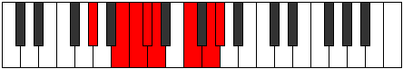

# Mode Aerycrian

## Links

- [Documentation](README.md)
- [Scales Index](Scales.md)
- [Modes Index](Modes.md)
- [Chords Index](Chords.md)

## Parent Scale

[Katocrian](ScaleKatocrian.md)

## Number

[2681](https://ianring.com/musictheory/scales/2681)

## Transposition

3, 1, 1, 1, 3, 2, 1

## Chord Pattern

Ib5, ii⁰b3, ii⁰b3, IV, vi, VIIb5

## Perfection

- 4 Perfect notes
- 3 Perfect notes

## Perfection Profile

[false false true true false true true]

## Permutations

| Tonic | Notes | Signature | Illustration | Audio |
|-------|-------|-----------|--------------|-------|
| [C](ModeCNaturalAerycrian.md) | **C**, **D#**, E, F, **Gb**, A, B, **C** | C |  | [midi](https://github.com/edipermadi/music/blob/main/docs/ModeCNaturalAerycrian.mid?raw=true) |
| [C#](ModeCSharpAerycrian.md) | **C#**, **D##**, E#, F#, **G**, A#, B#, **C#** | C |  | [midi](https://github.com/edipermadi/music/blob/main/docs/ModeCSharpAerycrian.mid?raw=true) |
| [Db](ModeDFlatAerycrian.md) | **Db**, **E**, F, Gb, **Abb**, Bb, C, **Db** | C |  | [midi](https://github.com/edipermadi/music/blob/main/docs/ModeDFlatAerycrian.mid?raw=true) |
| [D](ModeDNaturalAerycrian.md) | **D**, **E#**, F#, G, **Ab**, B, C#, **D** | C |  | [midi](https://github.com/edipermadi/music/blob/main/docs/ModeDNaturalAerycrian.mid?raw=true) |
| [D#](ModeDSharpAerycrian.md) | **D#**, **E##**, F##, G#, **A**, B#, C##, **D#** | C |  | [midi](https://github.com/edipermadi/music/blob/main/docs/ModeDSharpAerycrian.mid?raw=true) |
| [Eb](ModeEFlatAerycrian.md) | **Eb**, **F#**, G, Ab, **Bbb**, C, D, **Eb** | C |  | [midi](https://github.com/edipermadi/music/blob/main/docs/ModeEFlatAerycrian.mid?raw=true) |
| [E](ModeENaturalAerycrian.md) | **E**, **F##**, G#, A, **Bb**, C#, D#, **E** | C |  | [midi](https://github.com/edipermadi/music/blob/main/docs/ModeENaturalAerycrian.mid?raw=true) |
| [F](ModeFNaturalAerycrian.md) | **F**, **G#**, A, Bb, **Cb**, D, E, **F** | C |  | [midi](https://github.com/edipermadi/music/blob/main/docs/ModeFNaturalAerycrian.mid?raw=true) |
| [F#](ModeFSharpAerycrian.md) | **F#**, **G##**, A#, B, **C**, D#, E#, **F#** | C |  | [midi](https://github.com/edipermadi/music/blob/main/docs/ModeFSharpAerycrian.mid?raw=true) |
| [Gb](ModeGFlatAerycrian.md) | **Gb**, **A**, Bb, Cb, **Dbb**, Eb, F, **Gb** | C |  | [midi](https://github.com/edipermadi/music/blob/main/docs/ModeGFlatAerycrian.mid?raw=true) |
| [G](ModeGNaturalAerycrian.md) | **G**, **A#**, B, C, **Db**, E, F#, **G** | C |  | [midi](https://github.com/edipermadi/music/blob/main/docs/ModeGNaturalAerycrian.mid?raw=true) |
| [G#](ModeGSharpAerycrian.md) | **G#**, **A##**, B#, C#, **D**, E#, F##, **G#** | C |  | [midi](https://github.com/edipermadi/music/blob/main/docs/ModeGSharpAerycrian.mid?raw=true) |
| [Ab](ModeAFlatAerycrian.md) | **Ab**, **B**, C, Db, **Ebb**, F, G, **Ab** | C |  | [midi](https://github.com/edipermadi/music/blob/main/docs/ModeAFlatAerycrian.mid?raw=true) |
| [A](ModeANaturalAerycrian.md) | **A**, **B#**, C#, D, **Eb**, F#, G#, **A** | C |  | [midi](https://github.com/edipermadi/music/blob/main/docs/ModeANaturalAerycrian.mid?raw=true) |
| [A#](ModeASharpAerycrian.md) | **A#**, **B##**, C##, D#, **E**, F##, G##, **A#** | C |  | [midi](https://github.com/edipermadi/music/blob/main/docs/ModeASharpAerycrian.mid?raw=true) |
| [Bb](ModeBFlatAerycrian.md) | **Bb**, **C#**, D, Eb, **Fb**, G, A, **Bb** | C |  | [midi](https://github.com/edipermadi/music/blob/main/docs/ModeBFlatAerycrian.mid?raw=true) |
| [B](ModeBNaturalAerycrian.md) | **B**, **C##**, D#, E, **F**, G#, A#, **B** | C |  | [midi](https://github.com/edipermadi/music/blob/main/docs/ModeBNaturalAerycrian.mid?raw=true) |
