# Mode Aerycrygic

## Links

- [Documentation](README.md)
- [Scales Index](Scales.md)
- [Modes Index](Modes.md)
- [Chords Index](Chords.md)

## Parent Scale

[Aerycrygic](ScaleAerycrygic.md)

## Number

[3829](https://ianring.com/musictheory/scales/3829)

## Transposition

2, 2, 1, 1, 1, 2, 1, 1, 1

## Chord Pattern

Ib5, viii⁰b3, viii⁰b3, ix⁰

## Perfection

- 8 Perfect notes
- 1 Perfect notes

## Perfection Profile

[true true true true false true true true true]

## Permutations

| Tonic | Notes | Signature | Illustration | Audio |
|-------|-------|-----------|--------------|-------|
| [C](ModeCNaturalAerycrygic.md) | C, D, E, F, **F#**, G, A, A#, B, C | C | 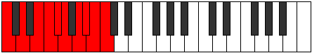 | [midi](https://github.com/edipermadi/music/blob/main/docs/ModeCNaturalAerycrygic.mid?raw=true) |
| [C#](ModeCSharpAerycrygic.md) | C#, D#, F, F#, **G**, G#, A#, B, C, C# | C | 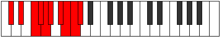 | [midi](https://github.com/edipermadi/music/blob/main/docs/ModeCSharpAerycrygic.mid?raw=true) |
| [Db](ModeDFlatAerycrygic.md) | Db, Eb, F, Gb, **G**, Ab, Bb, B, C, Db | C |  | [midi](https://github.com/edipermadi/music/blob/main/docs/ModeDFlatAerycrygic.mid?raw=true) |
| [D](ModeDNaturalAerycrygic.md) | D, E, F#, G, **G#**, A, B, C, C#, D | C | 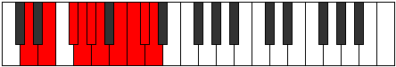 | [midi](https://github.com/edipermadi/music/blob/main/docs/ModeDNaturalAerycrygic.mid?raw=true) |
| [D#](ModeDSharpAerycrygic.md) | D#, F, G, G#, **A**, A#, C, C#, D, D# | C | 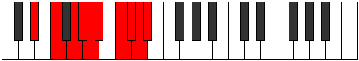 | [midi](https://github.com/edipermadi/music/blob/main/docs/ModeDSharpAerycrygic.mid?raw=true) |
| [Eb](ModeEFlatAerycrygic.md) | Eb, F, G, Ab, **A**, Bb, C, Db, D, Eb | C |  | [midi](https://github.com/edipermadi/music/blob/main/docs/ModeEFlatAerycrygic.mid?raw=true) |
| [E](ModeENaturalAerycrygic.md) | E, F#, G#, A, **A#**, B, C#, D, D#, E | C | 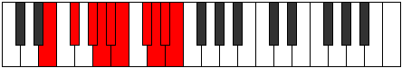 | [midi](https://github.com/edipermadi/music/blob/main/docs/ModeENaturalAerycrygic.mid?raw=true) |
| [F](ModeFNaturalAerycrygic.md) | F, G, A, A#, **B**, C, D, D#, E, F | C | 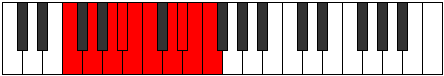 | [midi](https://github.com/edipermadi/music/blob/main/docs/ModeFNaturalAerycrygic.mid?raw=true) |
| [F#](ModeFSharpAerycrygic.md) | F#, G#, A#, B, **C**, C#, D#, E, F, F# | C | 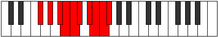 | [midi](https://github.com/edipermadi/music/blob/main/docs/ModeFSharpAerycrygic.mid?raw=true) |
| [Gb](ModeGFlatAerycrygic.md) | Gb, Ab, Bb, B, **C**, Db, Eb, E, F, Gb | C |  | [midi](https://github.com/edipermadi/music/blob/main/docs/ModeGFlatAerycrygic.mid?raw=true) |
| [G](ModeGNaturalAerycrygic.md) | G, A, B, C, **C#**, D, E, F, F#, G | C | 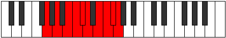 | [midi](https://github.com/edipermadi/music/blob/main/docs/ModeGNaturalAerycrygic.mid?raw=true) |
| [G#](ModeGSharpAerycrygic.md) | G#, A#, C, C#, **D**, D#, F, F#, G, G# | C | 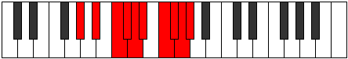 | [midi](https://github.com/edipermadi/music/blob/main/docs/ModeGSharpAerycrygic.mid?raw=true) |
| [Ab](ModeAFlatAerycrygic.md) | Ab, Bb, C, Db, **D**, Eb, F, Gb, G, Ab | C |  | [midi](https://github.com/edipermadi/music/blob/main/docs/ModeAFlatAerycrygic.mid?raw=true) |
| [A](ModeANaturalAerycrygic.md) | A, B, C#, D, **D#**, E, F#, G, G#, A | C | 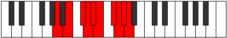 | [midi](https://github.com/edipermadi/music/blob/main/docs/ModeANaturalAerycrygic.mid?raw=true) |
| [A#](ModeASharpAerycrygic.md) | A#, C, D, D#, **E**, F, G, G#, A, A# | C | 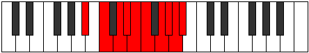 | [midi](https://github.com/edipermadi/music/blob/main/docs/ModeASharpAerycrygic.mid?raw=true) |
| [Bb](ModeBFlatAerycrygic.md) | Bb, C, D, Eb, **E**, F, G, Ab, A, Bb | C |  | [midi](https://github.com/edipermadi/music/blob/main/docs/ModeBFlatAerycrygic.mid?raw=true) |
| [B](ModeBNaturalAerycrygic.md) | B, C#, D#, E, **F**, F#, G#, A, A#, B | C | 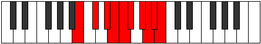 | [midi](https://github.com/edipermadi/music/blob/main/docs/ModeBNaturalAerycrygic.mid?raw=true) |
