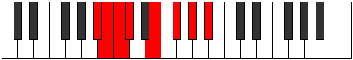

# Mode Aerygian

## Links

- [Documentation](README.md)
- [Scales Index](Scales.md)
- [Modes Index](Modes.md)
- [Chords Index](Chords.md)

## Parent Scale

[Phraptian](ScalePhraptian.md)

## Number

[1359](https://ianring.com/musictheory/scales/1359)

## Luminosity

-1

## Transposition

1, 1, 1, 3, 2, 2, 2

## Chord Pattern

i⁰b3, III⁺, V, VIb5

## Perfection

- 4 Perfect notes
- 3 Perfect notes

## Perfection Profile

false, true, false, true, true, true, false

## Permutations

| Tonic | Notes | Signature | Illustration | Audio |
|-------|-------|-----------|--------------|-------|
| [C](ModeCNaturalAerygian.md) | **C**, Db, **Ebb**, Fbb, Gb, Ab, **Bb**, **C** | C |  | [midi](https://github.com/edipermadi/music/blob/main/docs/ModeCNaturalAerygian.mid?raw=true) |
| [C#](ModeCSharpAerygian.md) | **C#**, D, **Eb**, Fb, G, A, **B**, **C#** | C |  | [midi](https://github.com/edipermadi/music/blob/main/docs/ModeCSharpAerygian.mid?raw=true) |
| [Db](ModeDFlatAerygian.md) | **Db**, Ebb, **Fbb**, Gbbb, Abb, Bbb, **Cb**, **Db** | C |  | [midi](https://github.com/edipermadi/music/blob/main/docs/ModeDFlatAerygian.mid?raw=true) |
| [D](ModeDNaturalAerygian.md) | **D**, Eb, **Fb**, Gbb, Ab, Bb, **C**, **D** | C |  | [midi](https://github.com/edipermadi/music/blob/main/docs/ModeDNaturalAerygian.mid?raw=true) |
| [D#](ModeDSharpAerygian.md) | **D#**, E, **F**, Gb, A, B, **C#**, **D#** | C |  | [midi](https://github.com/edipermadi/music/blob/main/docs/ModeDSharpAerygian.mid?raw=true) |
| [Eb](ModeEFlatAerygian.md) | **Eb**, Fb, **Gbb**, Abbb, Bbb, Cb, **Db**, **Eb** | C |  | [midi](https://github.com/edipermadi/music/blob/main/docs/ModeEFlatAerygian.mid?raw=true) |
| [E](ModeENaturalAerygian.md) | **E**, F, **Gb**, Abb, Bb, C, **D**, **E** | C |  | [midi](https://github.com/edipermadi/music/blob/main/docs/ModeENaturalAerygian.mid?raw=true) |
| [F](ModeFNaturalAerygian.md) | **F**, Gb, **Abb**, Bbbb, Cb, Db, **Eb**, **F** | C |  | [midi](https://github.com/edipermadi/music/blob/main/docs/ModeFNaturalAerygian.mid?raw=true) |
| [F#](ModeFSharpAerygian.md) | **F#**, G, **Ab**, Bbb, C, D, **E**, **F#** | C |  | [midi](https://github.com/edipermadi/music/blob/main/docs/ModeFSharpAerygian.mid?raw=true) |
| [Gb](ModeGFlatAerygian.md) | **Gb**, Abb, **Bbbb**, Cbbb, Dbb, Ebb, **Fb**, **Gb** | C |  | [midi](https://github.com/edipermadi/music/blob/main/docs/ModeGFlatAerygian.mid?raw=true) |
| [G](ModeGNaturalAerygian.md) | **G**, Ab, **Bbb**, Cbb, Db, Eb, **F**, **G** | C |  | [midi](https://github.com/edipermadi/music/blob/main/docs/ModeGNaturalAerygian.mid?raw=true) |
| [G#](ModeGSharpAerygian.md) | **G#**, A, **Bb**, Cb, D, E, **F#**, **G#** | C |  | [midi](https://github.com/edipermadi/music/blob/main/docs/ModeGSharpAerygian.mid?raw=true) |
| [Ab](ModeAFlatAerygian.md) | **Ab**, Bbb, **Cbb**, Dbbb, Ebb, Fb, **Gb**, **Ab** | C |  | [midi](https://github.com/edipermadi/music/blob/main/docs/ModeAFlatAerygian.mid?raw=true) |
| [A](ModeANaturalAerygian.md) | **A**, Bb, **Cb**, Dbb, Eb, F, **G**, **A** | C |  | [midi](https://github.com/edipermadi/music/blob/main/docs/ModeANaturalAerygian.mid?raw=true) |
| [A#](ModeASharpAerygian.md) | **A#**, B, **C**, Db, E, F#, **G#**, **A#** | C |  | [midi](https://github.com/edipermadi/music/blob/main/docs/ModeASharpAerygian.mid?raw=true) |
| [Bb](ModeBFlatAerygian.md) | **Bb**, Cb, **Dbb**, Ebbb, Fb, Gb, **Ab**, **Bb** | C |  | [midi](https://github.com/edipermadi/music/blob/main/docs/ModeBFlatAerygian.mid?raw=true) |
| [B](ModeBNaturalAerygian.md) | **B**, C, **Db**, Ebb, F, G, **A**, **B** | C |  | [midi](https://github.com/edipermadi/music/blob/main/docs/ModeBNaturalAerygian.mid?raw=true) |
