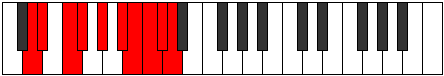

# Mode Aerygic

## Links

- [Documentation](README.md)
- [Scales Index](Scales.md)
- [Modes Index](Modes.md)
- [Chords Index](Chords.md)

## Parent Scale

[Apinygic](ScaleApinygic.md)

## Number

[3931](https://ianring.com/musictheory/scales/3931)

## Interval Pattern

1, 2, 1, 2, 2, 1, 1, 1, 1

## Chord Pattern

i⁰, ii, iii⁰, IVb5

## Perfection

- 7 Perfect notes
- 2 Perfect notes

## Perfection Profile

[false true true true true true true false true]

## Permutations

| Tonic | Notes | Signature | Illustration | Audio |
|-------|-------|-----------|--------------|-------|
| [C](ModeCNaturalAerygic.md) | **C**, C#, D#, E, F#, G#, A, **A#**, B, **C** | C |  | [midi](https://github.com/edipermadi/music/blob/main/docs/ModeCNaturalAerygic.mid?raw=true) |
| [C#](ModeCSharpAerygic.md) | **C#**, D, E, F, G, A, A#, **B**, C, **C#** | C |  | [midi](https://github.com/edipermadi/music/blob/main/docs/ModeCSharpAerygic.mid?raw=true) |
| [Db](ModeDFlatAerygic.md) | **Db**, D, E, F, G, A, Bb, **B**, C, **Db** | C |  | [midi](https://github.com/edipermadi/music/blob/main/docs/ModeDFlatAerygic.mid?raw=true) |
| [D](ModeDNaturalAerygic.md) | **D**, D#, F, F#, G#, A#, B, **C**, C#, **D** | C |  | [midi](https://github.com/edipermadi/music/blob/main/docs/ModeDNaturalAerygic.mid?raw=true) |
| [D#](ModeDSharpAerygic.md) | **D#**, E, F#, G, A, B, C, **C#**, D, **D#** | C |  | [midi](https://github.com/edipermadi/music/blob/main/docs/ModeDSharpAerygic.mid?raw=true) |
| [Eb](ModeEFlatAerygic.md) | **Eb**, E, Gb, G, A, B, C, **Db**, D, **Eb** | C |  | [midi](https://github.com/edipermadi/music/blob/main/docs/ModeEFlatAerygic.mid?raw=true) |
| [E](ModeENaturalAerygic.md) | **E**, F, G, G#, A#, C, C#, **D**, D#, **E** | C |  | [midi](https://github.com/edipermadi/music/blob/main/docs/ModeENaturalAerygic.mid?raw=true) |
| [F](ModeFNaturalAerygic.md) | **F**, F#, G#, A, B, C#, D, **D#**, E, **F** | C |  | [midi](https://github.com/edipermadi/music/blob/main/docs/ModeFNaturalAerygic.mid?raw=true) |
| [F#](ModeFSharpAerygic.md) | **F#**, G, A, A#, C, D, D#, **E**, F, **F#** | C |  | [midi](https://github.com/edipermadi/music/blob/main/docs/ModeFSharpAerygic.mid?raw=true) |
| [Gb](ModeGFlatAerygic.md) | **Gb**, G, A, Bb, C, D, Eb, **E**, F, **Gb** | C |  | [midi](https://github.com/edipermadi/music/blob/main/docs/ModeGFlatAerygic.mid?raw=true) |
| [G](ModeGNaturalAerygic.md) | **G**, G#, A#, B, C#, D#, E, **F**, F#, **G** | C |  | [midi](https://github.com/edipermadi/music/blob/main/docs/ModeGNaturalAerygic.mid?raw=true) |
| [G#](ModeGSharpAerygic.md) | **G#**, A, B, C, D, E, F, **F#**, G, **G#** | C |  | [midi](https://github.com/edipermadi/music/blob/main/docs/ModeGSharpAerygic.mid?raw=true) |
| [Ab](ModeAFlatAerygic.md) | **Ab**, A, B, C, D, E, F, **Gb**, G, **Ab** | C |  | [midi](https://github.com/edipermadi/music/blob/main/docs/ModeAFlatAerygic.mid?raw=true) |
| [A](ModeANaturalAerygic.md) | **A**, A#, C, C#, D#, F, F#, **G**, G#, **A** | C |  | [midi](https://github.com/edipermadi/music/blob/main/docs/ModeANaturalAerygic.mid?raw=true) |
| [A#](ModeASharpAerygic.md) | **A#**, B, C#, D, E, F#, G, **G#**, A, **A#** | C |  | [midi](https://github.com/edipermadi/music/blob/main/docs/ModeASharpAerygic.mid?raw=true) |
| [Bb](ModeBFlatAerygic.md) | **Bb**, B, Db, D, E, Gb, G, **Ab**, A, **Bb** | C |  | [midi](https://github.com/edipermadi/music/blob/main/docs/ModeBFlatAerygic.mid?raw=true) |
| [B](ModeBNaturalAerygic.md) | **B**, C, D, D#, F, G, G#, **A**, A#, **B** | C |  | [midi](https://github.com/edipermadi/music/blob/main/docs/ModeBNaturalAerygic.mid?raw=true) |
