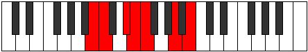

# Mode Aerygimic

## Links

- [Documentation](index.md)
- [Scales Index](Scales.md)
- [Modes Index](Modes.md)
- [Chords Index](Chords.md)

## Parent Scale

[Katythimic](ScaleKatythimic.md)

## Number

[1139](https://ianring.com/musictheory/scales/1139)

## Perfection

- 3 Perfect notes
- 3 Perfect notes

## Perfection Profile

[false false false true true true]

## Permutations

| Tonic | Notes | Signature | Illustration | Audio |
|-------|-------|-----------|--------------|-------|
| [C](ModeCNaturalAerygimic.md) | **C**, **Db**, **E**, F, Gb, A#, **C** | C |  | [midi](ModeCNaturalAerygimic.mid) [ogg](ModeCNaturalAerygimic.ogg) |
| [C#](ModeCSharpAerygimic.md) | **C#**, **D**, **E#**, F#, G, A##, **C#** | C |  | [midi](ModeCSharpAerygimic.mid) [ogg](ModeCSharpAerygimic.ogg) |
| [Db](ModeDFlatAerygimic.md) | **Db**, **Ebb**, **F**, Gb, Abb, B, **Db** | C |  | [midi](ModeDFlatAerygimic.mid) [ogg](ModeDFlatAerygimic.ogg) |
| [D](ModeDNaturalAerygimic.md) | **D**, **Eb**, **F#**, G, Ab, B#, **D** | C |  | [midi](ModeDNaturalAerygimic.mid) [ogg](ModeDNaturalAerygimic.ogg) |
| [D#](ModeDSharpAerygimic.md) | **D#**, **E**, **F##**, G#, A, B##, **D#** | C |  | [midi](ModeDSharpAerygimic.mid) [ogg](ModeDSharpAerygimic.ogg) |
| [Eb](ModeEFlatAerygimic.md) | **Eb**, **Fb**, **G**, Ab, Bbb, C#, **Eb** | C |  | [midi](ModeEFlatAerygimic.mid) [ogg](ModeEFlatAerygimic.ogg) |
| [E](ModeENaturalAerygimic.md) | **E**, **F**, **G#**, A, Bb, C##, **E** | C |  | [midi](ModeENaturalAerygimic.mid) [ogg](ModeENaturalAerygimic.ogg) |
| [F](ModeFNaturalAerygimic.md) | **F**, **Gb**, **A**, Bb, Cb, D#, **F** | C |  | [midi](ModeFNaturalAerygimic.mid) [ogg](ModeFNaturalAerygimic.ogg) |
| [F#](ModeFSharpAerygimic.md) | **F#**, **G**, **A#**, B, C, D##, **F#** | C |  | [midi](ModeFSharpAerygimic.mid) [ogg](ModeFSharpAerygimic.ogg) |
| [Gb](ModeGFlatAerygimic.md) | **Gb**, **Abb**, **Bb**, Cb, Dbb, E, **Gb** | C |  | [midi](ModeGFlatAerygimic.mid) [ogg](ModeGFlatAerygimic.ogg) |
| [G](ModeGNaturalAerygimic.md) | **G**, **Ab**, **B**, C, Db, E#, **G** | C |  | [midi](ModeGNaturalAerygimic.mid) [ogg](ModeGNaturalAerygimic.ogg) |
| [G#](ModeGSharpAerygimic.md) | **G#**, **A**, **B#**, C#, D, E##, **G#** | C |  | [midi](ModeGSharpAerygimic.mid) [ogg](ModeGSharpAerygimic.ogg) |
| [Ab](ModeAFlatAerygimic.md) | **Ab**, **Bbb**, **C**, Db, Ebb, F#, **Ab** | C |  | [midi](ModeAFlatAerygimic.mid) [ogg](ModeAFlatAerygimic.ogg) |
| [A](ModeANaturalAerygimic.md) | **A**, **Bb**, **C#**, D, Eb, F##, **A** | C |  | [midi](ModeANaturalAerygimic.mid) [ogg](ModeANaturalAerygimic.ogg) |
| [A#](ModeASharpAerygimic.md) | **A#**, **B**, **C##**, D#, E, F###, **A#** | C |  | [midi](ModeASharpAerygimic.mid) [ogg](ModeASharpAerygimic.ogg) |
| [Bb](ModeBFlatAerygimic.md) | **Bb**, **Cb**, **D**, Eb, Fb, G#, **Bb** | C |  | [midi](ModeBFlatAerygimic.mid) [ogg](ModeBFlatAerygimic.ogg) |
| [B](ModeBNaturalAerygimic.md) | **B**, **C**, **D#**, E, F, G##, **B** | C |  | [midi](ModeBNaturalAerygimic.mid) [ogg](ModeBNaturalAerygimic.ogg) |
