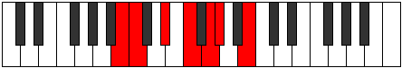

# Mode Aerylimic

## Links

- [Documentation](index.md)
- [Scales Index](Scales.md)
- [Modes Index](Modes.md)
- [Chords Index](Chords.md)

## Parent Scale

[Mothimic](ScaleMothimic.md)

## Number

[851](https://ianring.com/musictheory/scales/851)

## Interval Pattern

1, 3, 2, 2, 1, 3

## Chord Pattern

I⁺, III⁺, iv, V⁺

## Perfection

- 3 Perfect notes
- 3 Perfect notes

## Perfection Profile

[false true false true false true]

## Permutations

| Tonic | Notes | Signature | Illustration | Audio |
|-------|-------|-----------|--------------|-------|
| [C](ModeCNaturalAerylimic.md) | **C**, Db, **E**, F#, **G#**, A, **C** | C |  | [midi](https://github.com/edipermadi/music/blob/main/docs/ModeCNaturalAerylimic.mid?raw=true) |
| [C#](ModeCSharpAerylimic.md) | **C#**, D, **E#**, F##, **G##**, A#, **C#** | C |  | [midi](https://github.com/edipermadi/music/blob/main/docs/ModeCSharpAerylimic.mid?raw=true) |
| [Db](ModeDFlatAerylimic.md) | **Db**, Ebb, **F**, G, **A**, Bb, **Db** | C |  | [midi](https://github.com/edipermadi/music/blob/main/docs/ModeDFlatAerylimic.mid?raw=true) |
| [D](ModeDNaturalAerylimic.md) | **D**, Eb, **F#**, G#, **A#**, B, **D** | C |  | [midi](https://github.com/edipermadi/music/blob/main/docs/ModeDNaturalAerylimic.mid?raw=true) |
| [D#](ModeDSharpAerylimic.md) | **D#**, E, **F##**, G##, **A##**, B#, **D#** | C |  | [midi](https://github.com/edipermadi/music/blob/main/docs/ModeDSharpAerylimic.mid?raw=true) |
| [Eb](ModeEFlatAerylimic.md) | **Eb**, Fb, **G**, A, **B**, C, **Eb** | C |  | [midi](https://github.com/edipermadi/music/blob/main/docs/ModeEFlatAerylimic.mid?raw=true) |
| [E](ModeENaturalAerylimic.md) | **E**, F, **G#**, A#, **B#**, C#, **E** | C |  | [midi](https://github.com/edipermadi/music/blob/main/docs/ModeENaturalAerylimic.mid?raw=true) |
| [F](ModeFNaturalAerylimic.md) | **F**, Gb, **A**, B, **C#**, D, **F** | C |  | [midi](https://github.com/edipermadi/music/blob/main/docs/ModeFNaturalAerylimic.mid?raw=true) |
| [F#](ModeFSharpAerylimic.md) | **F#**, G, **A#**, B#, **C##**, D#, **F#** | C |  | [midi](https://github.com/edipermadi/music/blob/main/docs/ModeFSharpAerylimic.mid?raw=true) |
| [Gb](ModeGFlatAerylimic.md) | **Gb**, Abb, **Bb**, C, **D**, Eb, **Gb** | C |  | [midi](https://github.com/edipermadi/music/blob/main/docs/ModeGFlatAerylimic.mid?raw=true) |
| [G](ModeGNaturalAerylimic.md) | **G**, Ab, **B**, C#, **D#**, E, **G** | C |  | [midi](https://github.com/edipermadi/music/blob/main/docs/ModeGNaturalAerylimic.mid?raw=true) |
| [G#](ModeGSharpAerylimic.md) | **G#**, A, **B#**, C##, **D##**, E#, **G#** | C |  | [midi](https://github.com/edipermadi/music/blob/main/docs/ModeGSharpAerylimic.mid?raw=true) |
| [Ab](ModeAFlatAerylimic.md) | **Ab**, Bbb, **C**, D, **E**, F, **Ab** | C |  | [midi](https://github.com/edipermadi/music/blob/main/docs/ModeAFlatAerylimic.mid?raw=true) |
| [A](ModeANaturalAerylimic.md) | **A**, Bb, **C#**, D#, **E#**, F#, **A** | C |  | [midi](https://github.com/edipermadi/music/blob/main/docs/ModeANaturalAerylimic.mid?raw=true) |
| [A#](ModeASharpAerylimic.md) | **A#**, B, **C##**, D##, **E##**, F##, **A#** | C |  | [midi](https://github.com/edipermadi/music/blob/main/docs/ModeASharpAerylimic.mid?raw=true) |
| [Bb](ModeBFlatAerylimic.md) | **Bb**, Cb, **D**, E, **F#**, G, **Bb** | C |  | [midi](https://github.com/edipermadi/music/blob/main/docs/ModeBFlatAerylimic.mid?raw=true) |
| [B](ModeBNaturalAerylimic.md) | **B**, C, **D#**, E#, **F##**, G#, **B** | C |  | [midi](https://github.com/edipermadi/music/blob/main/docs/ModeBNaturalAerylimic.mid?raw=true) |
