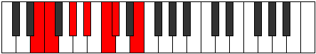

# Mode Aerylimic

## Links

- [Documentation](index.md)
- [Scales Index](Scales.md)
- [Modes Index](Modes.md)
- [Chords Index](Chords.md)

## Parent Scale

[Mothimic](ScaleMothimic.md)

## Number

[851](https://ianring.com/musictheory/scales/851)

## Perfection

- 3 Perfect notes
- 3 Perfect notes

## Perfection Profile

[false true false true false true]

## Permutations

| Tonic | Notes | Signature | Illustration | Audio |
|-------|-------|-----------|--------------|-------|
| [C](ModeCNaturalAerylimic.md) | **C**, Db, **E**, F#, **G#**, A, **C** | C |  | [midi](ModeCNaturalAerylimic.mid) [ogg](ModeCNaturalAerylimic.ogg) |
| [C#](ModeCSharpAerylimic.md) | **C#**, D, **E#**, F##, **G##**, A#, **C#** | C |  | [midi](ModeCSharpAerylimic.mid) [ogg](ModeCSharpAerylimic.ogg) |
| [Db](ModeDFlatAerylimic.md) | **Db**, Ebb, **F**, G, **A**, Bb, **Db** | C |  | [midi](ModeDFlatAerylimic.mid) [ogg](ModeDFlatAerylimic.ogg) |
| [D](ModeDNaturalAerylimic.md) | **D**, Eb, **F#**, G#, **A#**, B, **D** | C |  | [midi](ModeDNaturalAerylimic.mid) [ogg](ModeDNaturalAerylimic.ogg) |
| [D#](ModeDSharpAerylimic.md) | **D#**, E, **F##**, G##, **A##**, B#, **D#** | C |  | [midi](ModeDSharpAerylimic.mid) [ogg](ModeDSharpAerylimic.ogg) |
| [Eb](ModeEFlatAerylimic.md) | **Eb**, Fb, **G**, A, **B**, C, **Eb** | C |  | [midi](ModeEFlatAerylimic.mid) [ogg](ModeEFlatAerylimic.ogg) |
| [E](ModeENaturalAerylimic.md) | **E**, F, **G#**, A#, **B#**, C#, **E** | C |  | [midi](ModeENaturalAerylimic.mid) [ogg](ModeENaturalAerylimic.ogg) |
| [F](ModeFNaturalAerylimic.md) | **F**, Gb, **A**, B, **C#**, D, **F** | C |  | [midi](ModeFNaturalAerylimic.mid) [ogg](ModeFNaturalAerylimic.ogg) |
| [F#](ModeFSharpAerylimic.md) | **F#**, G, **A#**, B#, **C##**, D#, **F#** | C |  | [midi](ModeFSharpAerylimic.mid) [ogg](ModeFSharpAerylimic.ogg) |
| [Gb](ModeGFlatAerylimic.md) | **Gb**, Abb, **Bb**, C, **D**, Eb, **Gb** | C |  | [midi](ModeGFlatAerylimic.mid) [ogg](ModeGFlatAerylimic.ogg) |
| [G](ModeGNaturalAerylimic.md) | **G**, Ab, **B**, C#, **D#**, E, **G** | C |  | [midi](ModeGNaturalAerylimic.mid) [ogg](ModeGNaturalAerylimic.ogg) |
| [G#](ModeGSharpAerylimic.md) | **G#**, A, **B#**, C##, **D##**, E#, **G#** | C |  | [midi](ModeGSharpAerylimic.mid) [ogg](ModeGSharpAerylimic.ogg) |
| [Ab](ModeAFlatAerylimic.md) | **Ab**, Bbb, **C**, D, **E**, F, **Ab** | C |  | [midi](ModeAFlatAerylimic.mid) [ogg](ModeAFlatAerylimic.ogg) |
| [A](ModeANaturalAerylimic.md) | **A**, Bb, **C#**, D#, **E#**, F#, **A** | C |  | [midi](ModeANaturalAerylimic.mid) [ogg](ModeANaturalAerylimic.ogg) |
| [A#](ModeASharpAerylimic.md) | **A#**, B, **C##**, D##, **E##**, F##, **A#** | C |  | [midi](ModeASharpAerylimic.mid) [ogg](ModeASharpAerylimic.ogg) |
| [Bb](ModeBFlatAerylimic.md) | **Bb**, Cb, **D**, E, **F#**, G, **Bb** | C |  | [midi](ModeBFlatAerylimic.mid) [ogg](ModeBFlatAerylimic.ogg) |
| [B](ModeBNaturalAerylimic.md) | **B**, C, **D#**, E#, **F##**, G#, **B** | C |  | [midi](ModeBNaturalAerylimic.mid) [ogg](ModeBNaturalAerylimic.ogg) |
