# Mode Aerylitonic

## Links

- [Documentation](README.md)
- [Scales Index](Scales.md)
- [Modes Index](Modes.md)
- [Chords Index](Chords.md)

## Parent Scale

[Dolitonic](ScaleDolitonic.md)

## Number

[283](https://ianring.com/musictheory/scales/283)

## Transposition

1, 2, 1, 4, 4

## Chord Pattern

## Perfection

- 2 Perfect notes
- 3 Perfect notes

## Perfection Profile

[false true false false true]

## Permutations

| Tonic | Notes | Signature | Illustration | Audio |
|-------|-------|-----------|--------------|-------|
| [C](ModeCNaturalAerylitonic.md) | **C**, C#, **D#**, **E**, G#, **C** | C | 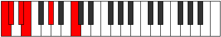 | [midi](https://github.com/edipermadi/music/blob/main/docs/ModeCNaturalAerylitonic.mid?raw=true) |
| [C#](ModeCSharpAerylitonic.md) | **C#**, D, **E**, **F**, A, **C#** | C |  | [midi](https://github.com/edipermadi/music/blob/main/docs/ModeCSharpAerylitonic.mid?raw=true) |
| [Db](ModeDFlatAerylitonic.md) | **Db**, D, **E**, **F**, A, **Db** | C | 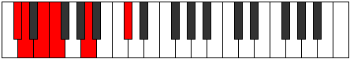 | [midi](https://github.com/edipermadi/music/blob/main/docs/ModeDFlatAerylitonic.mid?raw=true) |
| [D](ModeDNaturalAerylitonic.md) | **D**, D#, **F**, **F#**, A#, **D** | C | 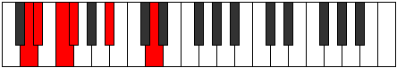 | [midi](https://github.com/edipermadi/music/blob/main/docs/ModeDNaturalAerylitonic.mid?raw=true) |
| [D#](ModeDSharpAerylitonic.md) | **D#**, E, **F#**, **G**, B, **D#** | C | 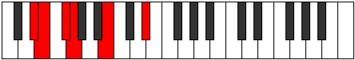 | [midi](https://github.com/edipermadi/music/blob/main/docs/ModeDSharpAerylitonic.mid?raw=true) |
| [Eb](ModeEFlatAerylitonic.md) | **Eb**, E, **Gb**, **G**, B, **Eb** | C |  | [midi](https://github.com/edipermadi/music/blob/main/docs/ModeEFlatAerylitonic.mid?raw=true) |
| [E](ModeENaturalAerylitonic.md) | **E**, F, **G**, **G#**, C, **E** | C | 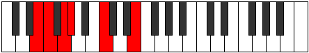 | [midi](https://github.com/edipermadi/music/blob/main/docs/ModeENaturalAerylitonic.mid?raw=true) |
| [F](ModeFNaturalAerylitonic.md) | **F**, F#, **G#**, **A**, C#, **F** | C | 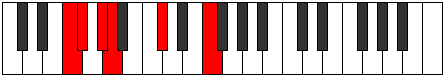 | [midi](https://github.com/edipermadi/music/blob/main/docs/ModeFNaturalAerylitonic.mid?raw=true) |
| [F#](ModeFSharpAerylitonic.md) | **F#**, G, **A**, **A#**, D, **F#** | C |  | [midi](https://github.com/edipermadi/music/blob/main/docs/ModeFSharpAerylitonic.mid?raw=true) |
| [Gb](ModeGFlatAerylitonic.md) | **Gb**, G, **A**, **Bb**, D, **Gb** | C | 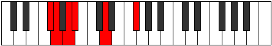 | [midi](https://github.com/edipermadi/music/blob/main/docs/ModeGFlatAerylitonic.mid?raw=true) |
| [G](ModeGNaturalAerylitonic.md) | **G**, G#, **A#**, **B**, D#, **G** | C | 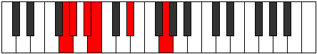 | [midi](https://github.com/edipermadi/music/blob/main/docs/ModeGNaturalAerylitonic.mid?raw=true) |
| [G#](ModeGSharpAerylitonic.md) | **G#**, A, **B**, **C**, E, **G#** | C |  | [midi](https://github.com/edipermadi/music/blob/main/docs/ModeGSharpAerylitonic.mid?raw=true) |
| [Ab](ModeAFlatAerylitonic.md) | **Ab**, A, **B**, **C**, E, **Ab** | C | 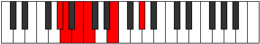 | [midi](https://github.com/edipermadi/music/blob/main/docs/ModeAFlatAerylitonic.mid?raw=true) |
| [A](ModeANaturalAerylitonic.md) | **A**, A#, **C**, **C#**, F, **A** | C | 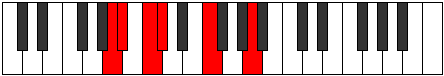 | [midi](https://github.com/edipermadi/music/blob/main/docs/ModeANaturalAerylitonic.mid?raw=true) |
| [A#](ModeASharpAerylitonic.md) | **A#**, B, **C#**, **D**, F#, **A#** | C | 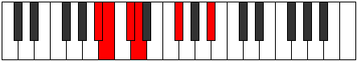 | [midi](https://github.com/edipermadi/music/blob/main/docs/ModeASharpAerylitonic.mid?raw=true) |
| [Bb](ModeBFlatAerylitonic.md) | **Bb**, B, **Db**, **D**, Gb, **Bb** | C |  | [midi](https://github.com/edipermadi/music/blob/main/docs/ModeBFlatAerylitonic.mid?raw=true) |
| [B](ModeBNaturalAerylitonic.md) | **B**, C, **D**, **D#**, G, **B** | C |  | [midi](https://github.com/edipermadi/music/blob/main/docs/ModeBNaturalAerylitonic.mid?raw=true) |
