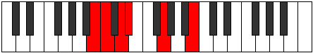

# Mode Aerylitonic

## Links

- [Documentation](index.md)
- [Scales Index](Scales.md)
- [Modes Index](Modes.md)
- [Chords Index](Chords.md)

## Parent Scale

[Dolitonic](ScaleDolitonic.md)

## Number

[283](https://ianring.com/musictheory/scales/283)

## Perfection

- 2 Perfect notes
- 3 Perfect notes

## Perfection Profile

[false true false false true]

## Permutations

| Tonic | Notes | Signature | Illustration | Audio |
|-------|-------|-----------|--------------|-------|
| [C](ModeCNaturalAerylitonic.md) | **C**, C#, **D#**, **E**, G#, **C** | C |  | [midi](ModeCNaturalAerylitonic.mid) [ogg](ModeCNaturalAerylitonic.ogg) |
| [C#](ModeCSharpAerylitonic.md) | **C#**, D, **E**, **F**, A, **C#** | C |  | [midi](ModeCSharpAerylitonic.mid) [ogg](ModeCSharpAerylitonic.ogg) |
| [Db](ModeDFlatAerylitonic.md) | **Db**, D, **E**, **F**, A, **Db** | C |  | [midi](ModeDFlatAerylitonic.mid) [ogg](ModeDFlatAerylitonic.ogg) |
| [D](ModeDNaturalAerylitonic.md) | **D**, D#, **F**, **F#**, A#, **D** | C |  | [midi](ModeDNaturalAerylitonic.mid) [ogg](ModeDNaturalAerylitonic.ogg) |
| [D#](ModeDSharpAerylitonic.md) | **D#**, E, **F#**, **G**, B, **D#** | C |  | [midi](ModeDSharpAerylitonic.mid) [ogg](ModeDSharpAerylitonic.ogg) |
| [Eb](ModeEFlatAerylitonic.md) | **Eb**, E, **Gb**, **G**, B, **Eb** | C |  | [midi](ModeEFlatAerylitonic.mid) [ogg](ModeEFlatAerylitonic.ogg) |
| [E](ModeENaturalAerylitonic.md) | **E**, F, **G**, **G#**, C, **E** | C |  | [midi](ModeENaturalAerylitonic.mid) [ogg](ModeENaturalAerylitonic.ogg) |
| [F](ModeFNaturalAerylitonic.md) | **F**, F#, **G#**, **A**, C#, **F** | C |  | [midi](ModeFNaturalAerylitonic.mid) [ogg](ModeFNaturalAerylitonic.ogg) |
| [F#](ModeFSharpAerylitonic.md) | **F#**, G, **A**, **A#**, D, **F#** | C |  | [midi](ModeFSharpAerylitonic.mid) [ogg](ModeFSharpAerylitonic.ogg) |
| [Gb](ModeGFlatAerylitonic.md) | **Gb**, G, **A**, **Bb**, D, **Gb** | C |  | [midi](ModeGFlatAerylitonic.mid) [ogg](ModeGFlatAerylitonic.ogg) |
| [G](ModeGNaturalAerylitonic.md) | **G**, G#, **A#**, **B**, D#, **G** | C |  | [midi](ModeGNaturalAerylitonic.mid) [ogg](ModeGNaturalAerylitonic.ogg) |
| [G#](ModeGSharpAerylitonic.md) | **G#**, A, **B**, **C**, E, **G#** | C |  | [midi](ModeGSharpAerylitonic.mid) [ogg](ModeGSharpAerylitonic.ogg) |
| [Ab](ModeAFlatAerylitonic.md) | **Ab**, A, **B**, **C**, E, **Ab** | C |  | [midi](ModeAFlatAerylitonic.mid) [ogg](ModeAFlatAerylitonic.ogg) |
| [A](ModeANaturalAerylitonic.md) | **A**, A#, **C**, **C#**, F, **A** | C |  | [midi](ModeANaturalAerylitonic.mid) [ogg](ModeANaturalAerylitonic.ogg) |
| [A#](ModeASharpAerylitonic.md) | **A#**, B, **C#**, **D**, F#, **A#** | C |  | [midi](ModeASharpAerylitonic.mid) [ogg](ModeASharpAerylitonic.ogg) |
| [Bb](ModeBFlatAerylitonic.md) | **Bb**, B, **Db**, **D**, Gb, **Bb** | C |  | [midi](ModeBFlatAerylitonic.mid) [ogg](ModeBFlatAerylitonic.ogg) |
| [B](ModeBNaturalAerylitonic.md) | **B**, C, **D**, **D#**, G, **B** | C |  | [midi](ModeBNaturalAerylitonic.mid) [ogg](ModeBNaturalAerylitonic.ogg) |
