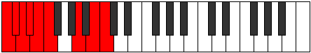
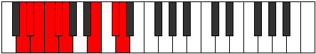
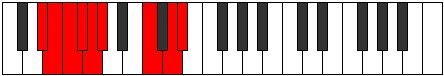
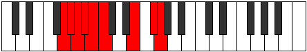

# Mode Aerylyllic

## Links

- [Documentation](index.md)
- [Scales Index](Scales.md)
- [Modes Index](Modes.md)
- [Chords Index](Chords.md)

## Parent Scale

[Stycryllic](ScaleStycryllic.md)

## Number

[2623](https://ianring.com/musictheory/scales/2623)

## Perfection

- 4 Perfect notes
- 4 Perfect notes

## Interval Pattern

1, 1, 1, 1, 1, 4, 2, 1

## Perfection Profile

[false false true false true true true false]

## Permutations

| Tonic | Notes | Signature | Illustration | Audio |
|-------|-------|-----------|--------------|-------|
| [C](ModeCNaturalAerylyllic.md) | **C**, **C#**, D, **D#**, E, F, A, **B**, **C** | C |  | [midi](https://github.com/edipermadi/music/blob/main/docs/ModeCNaturalAerylyllic.mid?raw=true) |
| [C#](ModeCSharpAerylyllic.md) | **C#**, **D**, D#, **E**, F, F#, A#, **C**, **C#** | C |  | [midi](https://github.com/edipermadi/music/blob/main/docs/ModeCSharpAerylyllic.mid?raw=true) |
| [Db](ModeDFlatAerylyllic.md) | **Db**, **D**, Eb, **E**, F, Gb, Bb, **C**, **Db** | C |  | [midi](https://github.com/edipermadi/music/blob/main/docs/ModeDFlatAerylyllic.mid?raw=true) |
| [D](ModeDNaturalAerylyllic.md) | **D**, **D#**, E, **F**, F#, G, B, **C#**, **D** | C |  | [midi](https://github.com/edipermadi/music/blob/main/docs/ModeDNaturalAerylyllic.mid?raw=true) |
| [D#](ModeDSharpAerylyllic.md) | **D#**, **E**, F, **F#**, G, G#, C, **D**, **D#** | C |  | [midi](https://github.com/edipermadi/music/blob/main/docs/ModeDSharpAerylyllic.mid?raw=true) |
| [Eb](ModeEFlatAerylyllic.md) | **Eb**, **E**, F, **Gb**, G, Ab, C, **D**, **Eb** | C |  | [midi](https://github.com/edipermadi/music/blob/main/docs/ModeEFlatAerylyllic.mid?raw=true) |
| [E](ModeENaturalAerylyllic.md) | **E**, **F**, F#, **G**, G#, A, C#, **D#**, **E** | C |  | [midi](https://github.com/edipermadi/music/blob/main/docs/ModeENaturalAerylyllic.mid?raw=true) |
| [F](ModeFNaturalAerylyllic.md) | **F**, **F#**, G, **G#**, A, A#, D, **E**, **F** | C |  | [midi](https://github.com/edipermadi/music/blob/main/docs/ModeFNaturalAerylyllic.mid?raw=true) |
| [F#](ModeFSharpAerylyllic.md) | **F#**, **G**, G#, **A**, A#, B, D#, **F**, **F#** | C |  | [midi](https://github.com/edipermadi/music/blob/main/docs/ModeFSharpAerylyllic.mid?raw=true) |
| [Gb](ModeGFlatAerylyllic.md) | **Gb**, **G**, Ab, **A**, Bb, B, Eb, **F**, **Gb** | C |  | [midi](https://github.com/edipermadi/music/blob/main/docs/ModeGFlatAerylyllic.mid?raw=true) |
| [G](ModeGNaturalAerylyllic.md) | **G**, **G#**, A, **A#**, B, C, E, **F#**, **G** | C |  | [midi](https://github.com/edipermadi/music/blob/main/docs/ModeGNaturalAerylyllic.mid?raw=true) |
| [G#](ModeGSharpAerylyllic.md) | **G#**, **A**, A#, **B**, C, C#, F, **G**, **G#** | C |  | [midi](https://github.com/edipermadi/music/blob/main/docs/ModeGSharpAerylyllic.mid?raw=true) |
| [Ab](ModeAFlatAerylyllic.md) | **Ab**, **A**, Bb, **B**, C, Db, F, **G**, **Ab** | C |  | [midi](https://github.com/edipermadi/music/blob/main/docs/ModeAFlatAerylyllic.mid?raw=true) |
| [A](ModeANaturalAerylyllic.md) | **A**, **A#**, B, **C**, C#, D, F#, **G#**, **A** | C |  | [midi](https://github.com/edipermadi/music/blob/main/docs/ModeANaturalAerylyllic.mid?raw=true) |
| [A#](ModeASharpAerylyllic.md) | **A#**, **B**, C, **C#**, D, D#, G, **A**, **A#** | C |  | [midi](https://github.com/edipermadi/music/blob/main/docs/ModeASharpAerylyllic.mid?raw=true) |
| [Bb](ModeBFlatAerylyllic.md) | **Bb**, **B**, C, **Db**, D, Eb, G, **A**, **Bb** | C |  | [midi](https://github.com/edipermadi/music/blob/main/docs/ModeBFlatAerylyllic.mid?raw=true) |
| [B](ModeBNaturalAerylyllic.md) | **B**, **C**, C#, **D**, D#, E, G#, **A#**, **B** | C |  | [midi](https://github.com/edipermadi/music/blob/main/docs/ModeBNaturalAerylyllic.mid?raw=true) |
