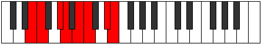

# Mode Aerynian

## Links

- [Documentation](index.md)
- [Scales Index](Scales.md)
- [Modes Index](Modes.md)
- [Chords Index](Chords.md)

## Parent Scale

[Loptian](ScaleLoptian.md)

## Number

[2483](https://ianring.com/musictheory/scales/2483)

## Perfection

- 4 Perfect notes
- 3 Perfect notes

## Perfection Profile

[true true true true false false false]

## Permutations

| Tonic | Notes | Signature | Illustration | Audio |
|-------|-------|-----------|--------------|-------|
| [C](ModeCNaturalAerynian.md) | C, Db, E, F, **G**, **Ab**, **B**, C | C |  | [midi](ModeCNaturalAerynian.mid) [ogg](ModeCNaturalAerynian.ogg) |
| [C#](ModeCSharpAerynian.md) | C#, D, E#, F#, **G#**, **A**, **B#**, C# | C |  | [midi](ModeCSharpAerynian.mid) [ogg](ModeCSharpAerynian.ogg) |
| [Db](ModeDFlatAerynian.md) | Db, Ebb, F, Gb, **Ab**, **Bbb**, **C**, Db | C |  | [midi](ModeDFlatAerynian.mid) [ogg](ModeDFlatAerynian.ogg) |
| [D](ModeDNaturalAerynian.md) | D, Eb, F#, G, **A**, **Bb**, **C#**, D | C |  | [midi](ModeDNaturalAerynian.mid) [ogg](ModeDNaturalAerynian.ogg) |
| [D#](ModeDSharpAerynian.md) | D#, E, F##, G#, **A#**, **B**, **C##**, D# | C |  | [midi](ModeDSharpAerynian.mid) [ogg](ModeDSharpAerynian.ogg) |
| [Eb](ModeEFlatAerynian.md) | Eb, Fb, G, Ab, **Bb**, **Cb**, **D**, Eb | C |  | [midi](ModeEFlatAerynian.mid) [ogg](ModeEFlatAerynian.ogg) |
| [E](ModeENaturalAerynian.md) | E, F, G#, A, **B**, **C**, **D#**, E | C |  | [midi](ModeENaturalAerynian.mid) [ogg](ModeENaturalAerynian.ogg) |
| [F](ModeFNaturalAerynian.md) | F, Gb, A, Bb, **C**, **Db**, **E**, F | C |  | [midi](ModeFNaturalAerynian.mid) [ogg](ModeFNaturalAerynian.ogg) |
| [F#](ModeFSharpAerynian.md) | F#, G, A#, B, **C#**, **D**, **E#**, F# | C |  | [midi](ModeFSharpAerynian.mid) [ogg](ModeFSharpAerynian.ogg) |
| [Gb](ModeGFlatAerynian.md) | Gb, Abb, Bb, Cb, **Db**, **Ebb**, **F**, Gb | C |  | [midi](ModeGFlatAerynian.mid) [ogg](ModeGFlatAerynian.ogg) |
| [G](ModeGNaturalAerynian.md) | G, Ab, B, C, **D**, **Eb**, **F#**, G | C |  | [midi](ModeGNaturalAerynian.mid) [ogg](ModeGNaturalAerynian.ogg) |
| [G#](ModeGSharpAerynian.md) | G#, A, B#, C#, **D#**, **E**, **F##**, G# | C |  | [midi](ModeGSharpAerynian.mid) [ogg](ModeGSharpAerynian.ogg) |
| [Ab](ModeAFlatAerynian.md) | Ab, Bbb, C, Db, **Eb**, **Fb**, **G**, Ab | C |  | [midi](ModeAFlatAerynian.mid) [ogg](ModeAFlatAerynian.ogg) |
| [A](ModeANaturalAerynian.md) | A, Bb, C#, D, **E**, **F**, **G#**, A | C |  | [midi](ModeANaturalAerynian.mid) [ogg](ModeANaturalAerynian.ogg) |
| [A#](ModeASharpAerynian.md) | A#, B, C##, D#, **E#**, **F#**, **G##**, A# | C |  | [midi](ModeASharpAerynian.mid) [ogg](ModeASharpAerynian.ogg) |
| [Bb](ModeBFlatAerynian.md) | Bb, Cb, D, Eb, **F**, **Gb**, **A**, Bb | C |  | [midi](ModeBFlatAerynian.mid) [ogg](ModeBFlatAerynian.ogg) |
| [B](ModeBNaturalAerynian.md) | B, C, D#, E, **F#**, **G**, **A#**, B | C |  | [midi](ModeBNaturalAerynian.mid) [ogg](ModeBNaturalAerynian.ogg) |
