# Mode Aerynimic

## Links

- [Documentation](README.md)
- [Scales Index](Scales.md)
- [Modes Index](Modes.md)
- [Chords Index](Chords.md)

## Parent Scale

[Ionodimic](ScaleIonodimic.md)

## Number

[2451](https://ianring.com/musictheory/scales/2451)

## Transposition

1, 3, 3, 1, 3, 1

## Chord Pattern

I⁺, III⁺, IVb5, V⁺

## Perfection

- 3 Perfect notes
- 3 Perfect notes

## Perfection Profile

[true true true false false false]

## Permutations

| Tonic | Notes | Signature | Illustration | Audio |
|-------|-------|-----------|--------------|-------|
| [C](ModeCNaturalAerynimic.md) | C, Db, E, **F##**, **G#**, **A##**, C | C | 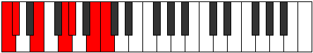 | [midi](https://github.com/edipermadi/music/blob/main/docs/ModeCNaturalAerynimic.mid?raw=true) |
| [C#](ModeCSharpAerynimic.md) | C#, D, E#, **F###**, **G##**, **A###**, C# | C | 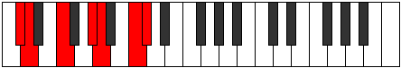 | [midi](https://github.com/edipermadi/music/blob/main/docs/ModeCSharpAerynimic.mid?raw=true) |
| [Db](ModeDFlatAerynimic.md) | Db, Ebb, F, **G#**, **A**, **B#**, Db | C |  | [midi](https://github.com/edipermadi/music/blob/main/docs/ModeDFlatAerynimic.mid?raw=true) |
| [D](ModeDNaturalAerynimic.md) | D, Eb, F#, **G##**, **A#**, **B##**, D | C | 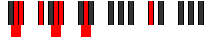 | [midi](https://github.com/edipermadi/music/blob/main/docs/ModeDNaturalAerynimic.mid?raw=true) |
| [D#](ModeDSharpAerynimic.md) | D#, E, F##, **G###**, **A##**, **B###**, D# | C |  | [midi](https://github.com/edipermadi/music/blob/main/docs/ModeDSharpAerynimic.mid?raw=true) |
| [Eb](ModeEFlatAerynimic.md) | Eb, Fb, G, **A#**, **B**, **C##**, Eb | C | 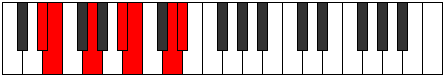 | [midi](https://github.com/edipermadi/music/blob/main/docs/ModeEFlatAerynimic.mid?raw=true) |
| [E](ModeENaturalAerynimic.md) | E, F, G#, **A##**, **B#**, **C###**, E | C |  | [midi](https://github.com/edipermadi/music/blob/main/docs/ModeENaturalAerynimic.mid?raw=true) |
| [F](ModeFNaturalAerynimic.md) | F, Gb, A, **B#**, **C#**, **D##**, F | C | 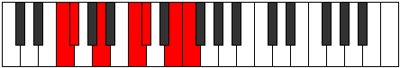 | [midi](https://github.com/edipermadi/music/blob/main/docs/ModeFNaturalAerynimic.mid?raw=true) |
| [F#](ModeFSharpAerynimic.md) | F#, G, A#, **B##**, **C##**, **D###**, F# | C | 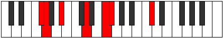 | [midi](https://github.com/edipermadi/music/blob/main/docs/ModeFSharpAerynimic.mid?raw=true) |
| [Gb](ModeGFlatAerynimic.md) | Gb, Abb, Bb, **C#**, **D**, **E#**, Gb | C | 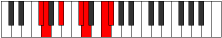 | [midi](https://github.com/edipermadi/music/blob/main/docs/ModeGFlatAerynimic.mid?raw=true) |
| [G](ModeGNaturalAerynimic.md) | G, Ab, B, **C##**, **D#**, **E##**, G | C | 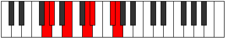 | [midi](https://github.com/edipermadi/music/blob/main/docs/ModeGNaturalAerynimic.mid?raw=true) |
| [G#](ModeGSharpAerynimic.md) | G#, A, B#, **C###**, **D##**, **E###**, G# | C | 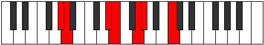 | [midi](https://github.com/edipermadi/music/blob/main/docs/ModeGSharpAerynimic.mid?raw=true) |
| [Ab](ModeAFlatAerynimic.md) | Ab, Bbb, C, **D#**, **E**, **F##**, Ab | C | 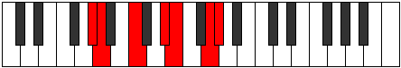 | [midi](https://github.com/edipermadi/music/blob/main/docs/ModeAFlatAerynimic.mid?raw=true) |
| [A](ModeANaturalAerynimic.md) | A, Bb, C#, **D##**, **E#**, **F###**, A | C |  | [midi](https://github.com/edipermadi/music/blob/main/docs/ModeANaturalAerynimic.mid?raw=true) |
| [A#](ModeASharpAerynimic.md) | A#, B, C##, **D###**, **E##**, **Cbbb**, A# | C |  | [midi](https://github.com/edipermadi/music/blob/main/docs/ModeASharpAerynimic.mid?raw=true) |
| [Bb](ModeBFlatAerynimic.md) | Bb, Cb, D, **E#**, **F#**, **G##**, Bb | C |  | [midi](https://github.com/edipermadi/music/blob/main/docs/ModeBFlatAerynimic.mid?raw=true) |
| [B](ModeBNaturalAerynimic.md) | B, C, D#, **E##**, **F##**, **G###**, B | C | 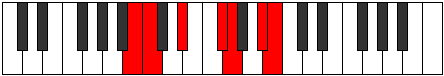 | [midi](https://github.com/edipermadi/music/blob/main/docs/ModeBNaturalAerynimic.mid?raw=true) |
