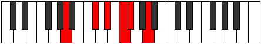
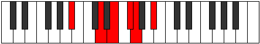

# Mode Aerynitonic

## Links

- [Documentation](index.md)
- [Scales Index](Scales.md)
- [Modes Index](Modes.md)
- [Chords Index](Chords.md)

## Parent Scale

[Aerynitonic](ScaleAerynitonic.md)

## Number

[849](https://ianring.com/musictheory/scales/849)

## Perfection

- 1 Perfect notes
- 4 Perfect notes

## Perfection Profile

[false false false false true]

## Permutations

| Tonic | Notes | Signature | Illustration | Audio |
|-------|-------|-----------|--------------|-------|
| [C](ModeCNaturalAerynitonic.md) | **C**, **E**, **F#**, **G#**, A, **C** | C |  | [midi](ModeCNaturalAerynitonic.mid) [ogg](ModeCNaturalAerynitonic.ogg) |
| [C#](ModeCSharpAerynitonic.md) | **C#**, **F**, **G**, **A**, A#, **C#** | C |  | [midi](ModeCSharpAerynitonic.mid) [ogg](ModeCSharpAerynitonic.ogg) |
| [Db](ModeDFlatAerynitonic.md) | **Db**, **F**, **G**, **A**, Bb, **Db** | C |  | [midi](ModeDFlatAerynitonic.mid) [ogg](ModeDFlatAerynitonic.ogg) |
| [D](ModeDNaturalAerynitonic.md) | **D**, **F#**, **G#**, **A#**, B, **D** | C |  | [midi](ModeDNaturalAerynitonic.mid) [ogg](ModeDNaturalAerynitonic.ogg) |
| [D#](ModeDSharpAerynitonic.md) | **D#**, **G**, **A**, **B**, C, **D#** | C |  | [midi](ModeDSharpAerynitonic.mid) [ogg](ModeDSharpAerynitonic.ogg) |
| [Eb](ModeEFlatAerynitonic.md) | **Eb**, **G**, **A**, **B**, C, **Eb** | C |  | [midi](ModeEFlatAerynitonic.mid) [ogg](ModeEFlatAerynitonic.ogg) |
| [E](ModeENaturalAerynitonic.md) | **E**, **G#**, **A#**, **C**, C#, **E** | C |  | [midi](ModeENaturalAerynitonic.mid) [ogg](ModeENaturalAerynitonic.ogg) |
| [F](ModeFNaturalAerynitonic.md) | **F**, **A**, **B**, **C#**, D, **F** | C |  | [midi](ModeFNaturalAerynitonic.mid) [ogg](ModeFNaturalAerynitonic.ogg) |
| [F#](ModeFSharpAerynitonic.md) | **F#**, **A#**, **C**, **D**, D#, **F#** | C |  | [midi](ModeFSharpAerynitonic.mid) [ogg](ModeFSharpAerynitonic.ogg) |
| [Gb](ModeGFlatAerynitonic.md) | **Gb**, **Bb**, **C**, **D**, Eb, **Gb** | C |  | [midi](ModeGFlatAerynitonic.mid) [ogg](ModeGFlatAerynitonic.ogg) |
| [G](ModeGNaturalAerynitonic.md) | **G**, **B**, **C#**, **D#**, E, **G** | C |  | [midi](ModeGNaturalAerynitonic.mid) [ogg](ModeGNaturalAerynitonic.ogg) |
| [G#](ModeGSharpAerynitonic.md) | **G#**, **C**, **D**, **E**, F, **G#** | C |  | [midi](ModeGSharpAerynitonic.mid) [ogg](ModeGSharpAerynitonic.ogg) |
| [Ab](ModeAFlatAerynitonic.md) | **Ab**, **C**, **D**, **E**, F, **Ab** | C |  | [midi](ModeAFlatAerynitonic.mid) [ogg](ModeAFlatAerynitonic.ogg) |
| [A](ModeANaturalAerynitonic.md) | **A**, **C#**, **D#**, **F**, F#, **A** | C |  | [midi](ModeANaturalAerynitonic.mid) [ogg](ModeANaturalAerynitonic.ogg) |
| [A#](ModeASharpAerynitonic.md) | **A#**, **D**, **E**, **F#**, G, **A#** | C |  | [midi](ModeASharpAerynitonic.mid) [ogg](ModeASharpAerynitonic.ogg) |
| [Bb](ModeBFlatAerynitonic.md) | **Bb**, **D**, **E**, **Gb**, G, **Bb** | C |  | [midi](ModeBFlatAerynitonic.mid) [ogg](ModeBFlatAerynitonic.ogg) |
| [B](ModeBNaturalAerynitonic.md) | **B**, **D#**, **F**, **G**, G#, **B** | C |  | [midi](ModeBNaturalAerynitonic.mid) [ogg](ModeBNaturalAerynitonic.ogg) |
