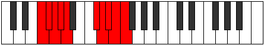

# Mode Aerynygic

## Links

- [Documentation](index.md)
- [Scales Index](Scales.md)
- [Modes Index](Modes.md)
- [Chords Index](Chords.md)

## Parent Scale

[Manygic](ScaleManygic.md)

## Number

[3871](https://ianring.com/musictheory/scales/3871)

## Perfection

- 6 Perfect notes
- 3 Perfect notes

## Interval Pattern

1, 1, 1, 1, 4, 1, 1, 1, 1

## Perfection Profile

[false true true true true true true false false]

## Permutations

| Tonic | Notes | Signature | Illustration | Audio |
|-------|-------|-----------|--------------|-------|
| [C](ModeCNaturalAerynygic.md) | **C**, C#, D, D#, E, G#, A, **A#**, **B**, **C** | C |  | [midi](https://github.com/edipermadi/music/blob/main/docs/ModeCNaturalAerynygic.mid?raw=true) |
| [C#](ModeCSharpAerynygic.md) | **C#**, D, D#, E, F, A, A#, **B**, **C**, **C#** | C |  | [midi](https://github.com/edipermadi/music/blob/main/docs/ModeCSharpAerynygic.mid?raw=true) |
| [Db](ModeDFlatAerynygic.md) | **Db**, D, Eb, E, F, A, Bb, **B**, **C**, **Db** | C |  | [midi](https://github.com/edipermadi/music/blob/main/docs/ModeDFlatAerynygic.mid?raw=true) |
| [D](ModeDNaturalAerynygic.md) | **D**, D#, E, F, F#, A#, B, **C**, **C#**, **D** | C |  | [midi](https://github.com/edipermadi/music/blob/main/docs/ModeDNaturalAerynygic.mid?raw=true) |
| [D#](ModeDSharpAerynygic.md) | **D#**, E, F, F#, G, B, C, **C#**, **D**, **D#** | C |  | [midi](https://github.com/edipermadi/music/blob/main/docs/ModeDSharpAerynygic.mid?raw=true) |
| [Eb](ModeEFlatAerynygic.md) | **Eb**, E, F, Gb, G, B, C, **Db**, **D**, **Eb** | C |  | [midi](https://github.com/edipermadi/music/blob/main/docs/ModeEFlatAerynygic.mid?raw=true) |
| [E](ModeENaturalAerynygic.md) | **E**, F, F#, G, G#, C, C#, **D**, **D#**, **E** | C |  | [midi](https://github.com/edipermadi/music/blob/main/docs/ModeENaturalAerynygic.mid?raw=true) |
| [F](ModeFNaturalAerynygic.md) | **F**, F#, G, G#, A, C#, D, **D#**, **E**, **F** | C |  | [midi](https://github.com/edipermadi/music/blob/main/docs/ModeFNaturalAerynygic.mid?raw=true) |
| [F#](ModeFSharpAerynygic.md) | **F#**, G, G#, A, A#, D, D#, **E**, **F**, **F#** | C |  | [midi](https://github.com/edipermadi/music/blob/main/docs/ModeFSharpAerynygic.mid?raw=true) |
| [Gb](ModeGFlatAerynygic.md) | **Gb**, G, Ab, A, Bb, D, Eb, **E**, **F**, **Gb** | C |  | [midi](https://github.com/edipermadi/music/blob/main/docs/ModeGFlatAerynygic.mid?raw=true) |
| [G](ModeGNaturalAerynygic.md) | **G**, G#, A, A#, B, D#, E, **F**, **F#**, **G** | C |  | [midi](https://github.com/edipermadi/music/blob/main/docs/ModeGNaturalAerynygic.mid?raw=true) |
| [G#](ModeGSharpAerynygic.md) | **G#**, A, A#, B, C, E, F, **F#**, **G**, **G#** | C |  | [midi](https://github.com/edipermadi/music/blob/main/docs/ModeGSharpAerynygic.mid?raw=true) |
| [Ab](ModeAFlatAerynygic.md) | **Ab**, A, Bb, B, C, E, F, **Gb**, **G**, **Ab** | C |  | [midi](https://github.com/edipermadi/music/blob/main/docs/ModeAFlatAerynygic.mid?raw=true) |
| [A](ModeANaturalAerynygic.md) | **A**, A#, B, C, C#, F, F#, **G**, **G#**, **A** | C |  | [midi](https://github.com/edipermadi/music/blob/main/docs/ModeANaturalAerynygic.mid?raw=true) |
| [A#](ModeASharpAerynygic.md) | **A#**, B, C, C#, D, F#, G, **G#**, **A**, **A#** | C |  | [midi](https://github.com/edipermadi/music/blob/main/docs/ModeASharpAerynygic.mid?raw=true) |
| [Bb](ModeBFlatAerynygic.md) | **Bb**, B, C, Db, D, Gb, G, **Ab**, **A**, **Bb** | C |  | [midi](https://github.com/edipermadi/music/blob/main/docs/ModeBFlatAerynygic.mid?raw=true) |
| [B](ModeBNaturalAerynygic.md) | **B**, C, C#, D, D#, G, G#, **A**, **A#**, **B** | C |  | [midi](https://github.com/edipermadi/music/blob/main/docs/ModeBNaturalAerynygic.mid?raw=true) |
