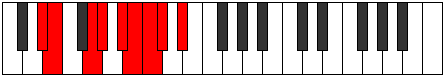

# Mode Aerynyllic

## Links

- [Documentation](index.md)
- [Scales Index](Scales.md)
- [Modes Index](Modes.md)
- [Chords Index](Chords.md)

## Parent Scale

[Doptyllic](ScaleDoptyllic.md)

## Number

[1971](https://ianring.com/musictheory/scales/1971)

## Perfection

- 5 Perfect notes
- 3 Perfect notes

## Perfection Profile

[true true false true false false true true]

## Permutations

| Tonic | Notes | Signature | Illustration | Audio |
|-------|-------|-----------|--------------|-------|
| [C](ModeCNaturalAerynyllic.md) | C, C#, **E**, F, **G**, **G#**, A, A#, C | C |  | [midi](ModeCNaturalAerynyllic.mid) [ogg](ModeCNaturalAerynyllic.ogg) |
| [C#](ModeCSharpAerynyllic.md) | C#, D, **F**, F#, **G#**, **A**, A#, B, C# | C |  | [midi](ModeCSharpAerynyllic.mid) [ogg](ModeCSharpAerynyllic.ogg) |
| [Db](ModeDFlatAerynyllic.md) | Db, D, **F**, Gb, **Ab**, **A**, Bb, B, Db | C |  | [midi](ModeDFlatAerynyllic.mid) [ogg](ModeDFlatAerynyllic.ogg) |
| [D](ModeDNaturalAerynyllic.md) | D, D#, **F#**, G, **A**, **A#**, B, C, D | C |  | [midi](ModeDNaturalAerynyllic.mid) [ogg](ModeDNaturalAerynyllic.ogg) |
| [D#](ModeDSharpAerynyllic.md) | D#, E, **G**, G#, **A#**, **B**, C, C#, D# | C |  | [midi](ModeDSharpAerynyllic.mid) [ogg](ModeDSharpAerynyllic.ogg) |
| [Eb](ModeEFlatAerynyllic.md) | Eb, E, **G**, Ab, **Bb**, **B**, C, Db, Eb | C |  | [midi](ModeEFlatAerynyllic.mid) [ogg](ModeEFlatAerynyllic.ogg) |
| [E](ModeENaturalAerynyllic.md) | E, F, **G#**, A, **B**, **C**, C#, D, E | C |  | [midi](ModeENaturalAerynyllic.mid) [ogg](ModeENaturalAerynyllic.ogg) |
| [F](ModeFNaturalAerynyllic.md) | F, F#, **A**, A#, **C**, **C#**, D, D#, F | C |  | [midi](ModeFNaturalAerynyllic.mid) [ogg](ModeFNaturalAerynyllic.ogg) |
| [F#](ModeFSharpAerynyllic.md) | F#, G, **A#**, B, **C#**, **D**, D#, E, F# | C |  | [midi](ModeFSharpAerynyllic.mid) [ogg](ModeFSharpAerynyllic.ogg) |
| [Gb](ModeGFlatAerynyllic.md) | Gb, G, **Bb**, B, **Db**, **D**, Eb, E, Gb | C |  | [midi](ModeGFlatAerynyllic.mid) [ogg](ModeGFlatAerynyllic.ogg) |
| [G](ModeGNaturalAerynyllic.md) | G, G#, **B**, C, **D**, **D#**, E, F, G | C |  | [midi](ModeGNaturalAerynyllic.mid) [ogg](ModeGNaturalAerynyllic.ogg) |
| [G#](ModeGSharpAerynyllic.md) | G#, A, **C**, C#, **D#**, **E**, F, F#, G# | C |  | [midi](ModeGSharpAerynyllic.mid) [ogg](ModeGSharpAerynyllic.ogg) |
| [Ab](ModeAFlatAerynyllic.md) | Ab, A, **C**, Db, **Eb**, **E**, F, Gb, Ab | C |  | [midi](ModeAFlatAerynyllic.mid) [ogg](ModeAFlatAerynyllic.ogg) |
| [A](ModeANaturalAerynyllic.md) | A, A#, **C#**, D, **E**, **F**, F#, G, A | C |  | [midi](ModeANaturalAerynyllic.mid) [ogg](ModeANaturalAerynyllic.ogg) |
| [A#](ModeASharpAerynyllic.md) | A#, B, **D**, D#, **F**, **F#**, G, G#, A# | C |  | [midi](ModeASharpAerynyllic.mid) [ogg](ModeASharpAerynyllic.ogg) |
| [Bb](ModeBFlatAerynyllic.md) | Bb, B, **D**, Eb, **F**, **Gb**, G, Ab, Bb | C |  | [midi](ModeBFlatAerynyllic.mid) [ogg](ModeBFlatAerynyllic.ogg) |
| [B](ModeBNaturalAerynyllic.md) | B, C, **D#**, E, **F#**, **G**, G#, A, B | C |  | [midi](ModeBNaturalAerynyllic.mid) [ogg](ModeBNaturalAerynyllic.ogg) |
