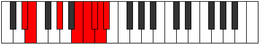

# Mode Aeryptian

## Links

- [Documentation](index.md)
- [Scales Index](Scales.md)
- [Modes Index](Modes.md)
- [Chords Index](Chords.md)

## Parent Scale

[Thadian](ScaleThadian.md)

## Number

[3875](https://ianring.com/musictheory/scales/3875)

## Perfection

- 3 Perfect notes
- 4 Perfect notes

## Perfection Profile

[false true true false false true false]

## Permutations

| Tonic | Notes | Signature | Illustration | Audio |
|-------|-------|-----------|--------------|-------|
| [C](ModeCNaturalAeryptian.md) | **C**, Db, E#, **F###**, **G##**, A#, **B**, **C** | C |  | [midi](ModeCNaturalAeryptian.mid) [ogg](ModeCNaturalAeryptian.ogg) |
| [C#](ModeCSharpAeryptian.md) | **C#**, D, E##, **Cbbb**, **Cbb**, Dbbb, **Dbb**, **C#** | C |  | [midi](ModeCSharpAeryptian.mid) [ogg](ModeCSharpAeryptian.ogg) |
| [Db](ModeDFlatAeryptian.md) | **Db**, Ebb, F#, **G##**, **A#**, B, **C**, **Db** | C |  | [midi](ModeDFlatAeryptian.mid) [ogg](ModeDFlatAeryptian.ogg) |
| [D](ModeDNaturalAeryptian.md) | **D**, Eb, F##, **G###**, **A##**, B#, **C#**, **D** | C |  | [midi](ModeDNaturalAeryptian.mid) [ogg](ModeDNaturalAeryptian.ogg) |
| [D#](ModeDSharpAeryptian.md) | **D#**, E, F###, **Cb**, **Dbb**, Ebbb, **Fbbb**, **D#** | C |  | [midi](ModeDSharpAeryptian.mid) [ogg](ModeDSharpAeryptian.ogg) |
| [Eb](ModeEFlatAeryptian.md) | **Eb**, Fb, G#, **A##**, **B#**, C#, **D**, **Eb** | C |  | [midi](ModeEFlatAeryptian.mid) [ogg](ModeEFlatAeryptian.ogg) |
| [E](ModeENaturalAeryptian.md) | **E**, F, G##, **A###**, **B##**, C##, **D#**, **E** | C |  | [midi](ModeENaturalAeryptian.mid) [ogg](ModeENaturalAeryptian.ogg) |
| [F](ModeFNaturalAeryptian.md) | **F**, Gb, A#, **B##**, **C##**, D#, **E**, **F** | C |  | [midi](ModeFNaturalAeryptian.mid) [ogg](ModeFNaturalAeryptian.ogg) |
| [F#](ModeFSharpAeryptian.md) | **F#**, G, A##, **B###**, **C###**, D##, **E#**, **F#** | C |  | [midi](ModeFSharpAeryptian.mid) [ogg](ModeFSharpAeryptian.ogg) |
| [Gb](ModeGFlatAeryptian.md) | **Gb**, Abb, B, **C##**, **D#**, E, **F**, **Gb** | C |  | [midi](ModeGFlatAeryptian.mid) [ogg](ModeGFlatAeryptian.ogg) |
| [G](ModeGNaturalAeryptian.md) | **G**, Ab, B#, **C###**, **D##**, E#, **F#**, **G** | C |  | [midi](ModeGNaturalAeryptian.mid) [ogg](ModeGNaturalAeryptian.ogg) |
| [G#](ModeGSharpAeryptian.md) | **G#**, A, B##, **D##**, **E#**, F#, **G**, **G#** | C |  | [midi](ModeGSharpAeryptian.mid) [ogg](ModeGSharpAeryptian.ogg) |
| [Ab](ModeAFlatAeryptian.md) | **Ab**, Bbb, C#, **D##**, **E#**, F#, **G**, **Ab** | C |  | [midi](ModeAFlatAeryptian.mid) [ogg](ModeAFlatAeryptian.ogg) |
| [A](ModeANaturalAeryptian.md) | **A**, Bb, C##, **D###**, **E##**, F##, **G#**, **A** | C |  | [midi](ModeANaturalAeryptian.mid) [ogg](ModeANaturalAeryptian.ogg) |
| [A#](ModeASharpAeryptian.md) | **A#**, B, C###, **E##**, **F##**, G#, **A**, **A#** | C |  | [midi](ModeASharpAeryptian.mid) [ogg](ModeASharpAeryptian.ogg) |
| [Bb](ModeBFlatAeryptian.md) | **Bb**, Cb, D#, **E##**, **F##**, G#, **A**, **Bb** | C |  | [midi](ModeBFlatAeryptian.mid) [ogg](ModeBFlatAeryptian.ogg) |
| [B](ModeBNaturalAeryptian.md) | **B**, C, D##, **E###**, **F###**, G##, **A#**, **B** | C |  | [midi](ModeBNaturalAeryptian.mid) [ogg](ModeBNaturalAeryptian.ogg) |
