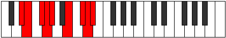
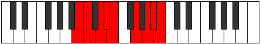

# Mode Aeryptyllic

## Links

- [Documentation](index.md)
- [Scales Index](Scales.md)
- [Modes Index](Modes.md)
- [Chords Index](Chords.md)

## Parent Scale

[Pothyllic](ScalePothyllic.md)

## Number

[3387](https://ianring.com/musictheory/scales/3387)

## Interval Pattern

1, 2, 1, 1, 3, 2, 1, 1

## Chord Pattern

ii, IV

## Perfection

- 6 Perfect notes
- 2 Perfect notes

## Perfection Profile

[false true true true true true true false]

## Permutations

| Tonic | Notes | Signature | Illustration | Audio |
|-------|-------|-----------|--------------|-------|
| [C](ModeCNaturalAeryptyllic.md) | **C**, C#, D#, E, F, G#, A#, **B**, **C** | C |  | [midi](https://github.com/edipermadi/music/blob/main/docs/ModeCNaturalAeryptyllic.mid?raw=true) |
| [C#](ModeCSharpAeryptyllic.md) | **C#**, D, E, F, F#, A, B, **C**, **C#** | C |  | [midi](https://github.com/edipermadi/music/blob/main/docs/ModeCSharpAeryptyllic.mid?raw=true) |
| [Db](ModeDFlatAeryptyllic.md) | **Db**, D, E, F, Gb, A, B, **C**, **Db** | C |  | [midi](https://github.com/edipermadi/music/blob/main/docs/ModeDFlatAeryptyllic.mid?raw=true) |
| [D](ModeDNaturalAeryptyllic.md) | **D**, D#, F, F#, G, A#, C, **C#**, **D** | C |  | [midi](https://github.com/edipermadi/music/blob/main/docs/ModeDNaturalAeryptyllic.mid?raw=true) |
| [D#](ModeDSharpAeryptyllic.md) | **D#**, E, F#, G, G#, B, C#, **D**, **D#** | C |  | [midi](https://github.com/edipermadi/music/blob/main/docs/ModeDSharpAeryptyllic.mid?raw=true) |
| [Eb](ModeEFlatAeryptyllic.md) | **Eb**, E, Gb, G, Ab, B, Db, **D**, **Eb** | C |  | [midi](https://github.com/edipermadi/music/blob/main/docs/ModeEFlatAeryptyllic.mid?raw=true) |
| [E](ModeENaturalAeryptyllic.md) | **E**, F, G, G#, A, C, D, **D#**, **E** | C |  | [midi](https://github.com/edipermadi/music/blob/main/docs/ModeENaturalAeryptyllic.mid?raw=true) |
| [F](ModeFNaturalAeryptyllic.md) | **F**, F#, G#, A, A#, C#, D#, **E**, **F** | C |  | [midi](https://github.com/edipermadi/music/blob/main/docs/ModeFNaturalAeryptyllic.mid?raw=true) |
| [F#](ModeFSharpAeryptyllic.md) | **F#**, G, A, A#, B, D, E, **F**, **F#** | C |  | [midi](https://github.com/edipermadi/music/blob/main/docs/ModeFSharpAeryptyllic.mid?raw=true) |
| [Gb](ModeGFlatAeryptyllic.md) | **Gb**, G, A, Bb, B, D, E, **F**, **Gb** | C |  | [midi](https://github.com/edipermadi/music/blob/main/docs/ModeGFlatAeryptyllic.mid?raw=true) |
| [G](ModeGNaturalAeryptyllic.md) | **G**, G#, A#, B, C, D#, F, **F#**, **G** | C |  | [midi](https://github.com/edipermadi/music/blob/main/docs/ModeGNaturalAeryptyllic.mid?raw=true) |
| [G#](ModeGSharpAeryptyllic.md) | **G#**, A, B, C, C#, E, F#, **G**, **G#** | C |  | [midi](https://github.com/edipermadi/music/blob/main/docs/ModeGSharpAeryptyllic.mid?raw=true) |
| [Ab](ModeAFlatAeryptyllic.md) | **Ab**, A, B, C, Db, E, Gb, **G**, **Ab** | C |  | [midi](https://github.com/edipermadi/music/blob/main/docs/ModeAFlatAeryptyllic.mid?raw=true) |
| [A](ModeANaturalAeryptyllic.md) | **A**, A#, C, C#, D, F, G, **G#**, **A** | C |  | [midi](https://github.com/edipermadi/music/blob/main/docs/ModeANaturalAeryptyllic.mid?raw=true) |
| [A#](ModeASharpAeryptyllic.md) | **A#**, B, C#, D, D#, F#, G#, **A**, **A#** | C |  | [midi](https://github.com/edipermadi/music/blob/main/docs/ModeASharpAeryptyllic.mid?raw=true) |
| [Bb](ModeBFlatAeryptyllic.md) | **Bb**, B, Db, D, Eb, Gb, Ab, **A**, **Bb** | C |  | [midi](https://github.com/edipermadi/music/blob/main/docs/ModeBFlatAeryptyllic.mid?raw=true) |
| [B](ModeBNaturalAeryptyllic.md) | **B**, C, D, D#, E, G, A, **A#**, **B** | C |  | [midi](https://github.com/edipermadi/music/blob/main/docs/ModeBNaturalAeryptyllic.mid?raw=true) |
