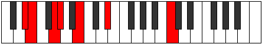
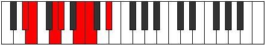
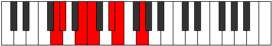
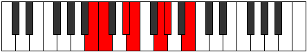

# Mode Aerythimic

## Links

- [Documentation](index.md)
- [Scales Index](Scales.md)
- [Modes Index](Modes.md)
- [Chords Index](Chords.md)

## Parent Scale

[Ionythimic](ScaleIonythimic.md)

## Number

[819](https://ianring.com/musictheory/scales/819)

## Interval Pattern

1, 3, 1, 3, 1, 3

## Chord Pattern

I⁺, ii, II, II⁺, III⁺, iv, IV, IV⁺, V⁺, vi, VI, VI⁺

## Perfection

- 3 Perfect notes
- 3 Perfect notes

## Perfection Profile

[false true false true false true]

## Permutations

| Tonic | Notes | Signature | Illustration | Audio |
|-------|-------|-----------|--------------|-------|
| [C](ModeCNaturalAerythimic.md) | **C**, Db, **E**, F, **G#**, A, **C** | C |  | [midi](https://github.com/edipermadi/music/blob/main/docs/ModeCNaturalAerythimic.mid?raw=true) |
| [C#](ModeCSharpAerythimic.md) | **C#**, D, **E#**, F#, **G##**, A#, **C#** | C |  | [midi](https://github.com/edipermadi/music/blob/main/docs/ModeCSharpAerythimic.mid?raw=true) |
| [Db](ModeDFlatAerythimic.md) | **Db**, Ebb, **F**, Gb, **A**, Bb, **Db** | C |  | [midi](https://github.com/edipermadi/music/blob/main/docs/ModeDFlatAerythimic.mid?raw=true) |
| [D](ModeDNaturalAerythimic.md) | **D**, Eb, **F#**, G, **A#**, B, **D** | C |  | [midi](https://github.com/edipermadi/music/blob/main/docs/ModeDNaturalAerythimic.mid?raw=true) |
| [D#](ModeDSharpAerythimic.md) | **D#**, E, **F##**, G#, **A##**, B#, **D#** | C |  | [midi](https://github.com/edipermadi/music/blob/main/docs/ModeDSharpAerythimic.mid?raw=true) |
| [Eb](ModeEFlatAerythimic.md) | **Eb**, Fb, **G**, Ab, **B**, C, **Eb** | C |  | [midi](https://github.com/edipermadi/music/blob/main/docs/ModeEFlatAerythimic.mid?raw=true) |
| [E](ModeENaturalAerythimic.md) | **E**, F, **G#**, A, **B#**, C#, **E** | C |  | [midi](https://github.com/edipermadi/music/blob/main/docs/ModeENaturalAerythimic.mid?raw=true) |
| [F](ModeFNaturalAerythimic.md) | **F**, Gb, **A**, Bb, **C#**, D, **F** | C |  | [midi](https://github.com/edipermadi/music/blob/main/docs/ModeFNaturalAerythimic.mid?raw=true) |
| [F#](ModeFSharpAerythimic.md) | **F#**, G, **A#**, B, **C##**, D#, **F#** | C |  | [midi](https://github.com/edipermadi/music/blob/main/docs/ModeFSharpAerythimic.mid?raw=true) |
| [Gb](ModeGFlatAerythimic.md) | **Gb**, Abb, **Bb**, Cb, **D**, Eb, **Gb** | C |  | [midi](https://github.com/edipermadi/music/blob/main/docs/ModeGFlatAerythimic.mid?raw=true) |
| [G](ModeGNaturalAerythimic.md) | **G**, Ab, **B**, C, **D#**, E, **G** | C |  | [midi](https://github.com/edipermadi/music/blob/main/docs/ModeGNaturalAerythimic.mid?raw=true) |
| [G#](ModeGSharpAerythimic.md) | **G#**, A, **B#**, C#, **D##**, E#, **G#** | C |  | [midi](https://github.com/edipermadi/music/blob/main/docs/ModeGSharpAerythimic.mid?raw=true) |
| [Ab](ModeAFlatAerythimic.md) | **Ab**, Bbb, **C**, Db, **E**, F, **Ab** | C |  | [midi](https://github.com/edipermadi/music/blob/main/docs/ModeAFlatAerythimic.mid?raw=true) |
| [A](ModeANaturalAerythimic.md) | **A**, Bb, **C#**, D, **E#**, F#, **A** | C |  | [midi](https://github.com/edipermadi/music/blob/main/docs/ModeANaturalAerythimic.mid?raw=true) |
| [A#](ModeASharpAerythimic.md) | **A#**, B, **C##**, D#, **E##**, F##, **A#** | C |  | [midi](https://github.com/edipermadi/music/blob/main/docs/ModeASharpAerythimic.mid?raw=true) |
| [Bb](ModeBFlatAerythimic.md) | **Bb**, Cb, **D**, Eb, **F#**, G, **Bb** | C |  | [midi](https://github.com/edipermadi/music/blob/main/docs/ModeBFlatAerythimic.mid?raw=true) |
| [B](ModeBNaturalAerythimic.md) | **B**, C, **D#**, E, **F##**, G#, **B** | C |  | [midi](https://github.com/edipermadi/music/blob/main/docs/ModeBNaturalAerythimic.mid?raw=true) |
