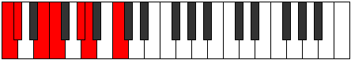
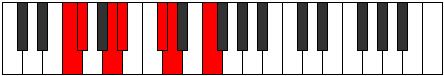
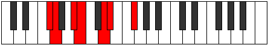
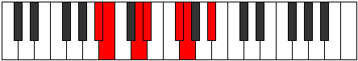

# Mode Aerythimic

## Links

- [Documentation](index.md)
- [Scales Index](Scales.md)
- [Modes Index](Modes.md)
- [Chords Index](Chords.md)

## Parent Scale

[Ionythimic](ScaleIonythimic.md)

## Number

[819](https://ianring.com/musictheory/scales/819)

## Perfection

- 3 Perfect notes
- 3 Perfect notes

## Perfection Profile

[false true false true false true]

## Permutations

| Tonic | Notes | Signature | Illustration | Audio |
|-------|-------|-----------|--------------|-------|
| [C](ModeCNaturalAerythimic.md) | **C**, Db, **E**, F, **G#**, A, **C** | C |  | [midi](ModeCNaturalAerythimic.mid) [ogg](ModeCNaturalAerythimic.ogg) |
| [C#](ModeCSharpAerythimic.md) | **C#**, D, **E#**, F#, **G##**, A#, **C#** | C |  | [midi](ModeCSharpAerythimic.mid) [ogg](ModeCSharpAerythimic.ogg) |
| [Db](ModeDFlatAerythimic.md) | **Db**, Ebb, **F**, Gb, **A**, Bb, **Db** | C |  | [midi](ModeDFlatAerythimic.mid) [ogg](ModeDFlatAerythimic.ogg) |
| [D](ModeDNaturalAerythimic.md) | **D**, Eb, **F#**, G, **A#**, B, **D** | C |  | [midi](ModeDNaturalAerythimic.mid) [ogg](ModeDNaturalAerythimic.ogg) |
| [D#](ModeDSharpAerythimic.md) | **D#**, E, **F##**, G#, **A##**, B#, **D#** | C |  | [midi](ModeDSharpAerythimic.mid) [ogg](ModeDSharpAerythimic.ogg) |
| [Eb](ModeEFlatAerythimic.md) | **Eb**, Fb, **G**, Ab, **B**, C, **Eb** | C |  | [midi](ModeEFlatAerythimic.mid) [ogg](ModeEFlatAerythimic.ogg) |
| [E](ModeENaturalAerythimic.md) | **E**, F, **G#**, A, **B#**, C#, **E** | C |  | [midi](ModeENaturalAerythimic.mid) [ogg](ModeENaturalAerythimic.ogg) |
| [F](ModeFNaturalAerythimic.md) | **F**, Gb, **A**, Bb, **C#**, D, **F** | C |  | [midi](ModeFNaturalAerythimic.mid) [ogg](ModeFNaturalAerythimic.ogg) |
| [F#](ModeFSharpAerythimic.md) | **F#**, G, **A#**, B, **C##**, D#, **F#** | C |  | [midi](ModeFSharpAerythimic.mid) [ogg](ModeFSharpAerythimic.ogg) |
| [Gb](ModeGFlatAerythimic.md) | **Gb**, Abb, **Bb**, Cb, **D**, Eb, **Gb** | C |  | [midi](ModeGFlatAerythimic.mid) [ogg](ModeGFlatAerythimic.ogg) |
| [G](ModeGNaturalAerythimic.md) | **G**, Ab, **B**, C, **D#**, E, **G** | C |  | [midi](ModeGNaturalAerythimic.mid) [ogg](ModeGNaturalAerythimic.ogg) |
| [G#](ModeGSharpAerythimic.md) | **G#**, A, **B#**, C#, **D##**, E#, **G#** | C |  | [midi](ModeGSharpAerythimic.mid) [ogg](ModeGSharpAerythimic.ogg) |
| [Ab](ModeAFlatAerythimic.md) | **Ab**, Bbb, **C**, Db, **E**, F, **Ab** | C |  | [midi](ModeAFlatAerythimic.mid) [ogg](ModeAFlatAerythimic.ogg) |
| [A](ModeANaturalAerythimic.md) | **A**, Bb, **C#**, D, **E#**, F#, **A** | C |  | [midi](ModeANaturalAerythimic.mid) [ogg](ModeANaturalAerythimic.ogg) |
| [A#](ModeASharpAerythimic.md) | **A#**, B, **C##**, D#, **E##**, F##, **A#** | C |  | [midi](ModeASharpAerythimic.mid) [ogg](ModeASharpAerythimic.ogg) |
| [Bb](ModeBFlatAerythimic.md) | **Bb**, Cb, **D**, Eb, **F#**, G, **Bb** | C |  | [midi](ModeBFlatAerythimic.mid) [ogg](ModeBFlatAerythimic.ogg) |
| [B](ModeBNaturalAerythimic.md) | **B**, C, **D#**, E, **F##**, G#, **B** | C |  | [midi](ModeBNaturalAerythimic.mid) [ogg](ModeBNaturalAerythimic.ogg) |
