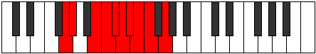

# Mode Aerythygic

## Links

- [Documentation](README.md)
- [Scales Index](Scales.md)
- [Modes Index](Modes.md)
- [Chords Index](Chords.md)

## Parent Scale

[Zothygic](ScaleZothygic.md)

## Number

[2035](https://ianring.com/musictheory/scales/2035)

## Transposition

1, 3, 1, 1, 1, 1, 1, 1, 2

## Chord Pattern

Ib5, IIb5, IIb5, viii, ix, ix

## Perfection

- 6 Perfect notes
- 3 Perfect notes

## Perfection Profile

[true true false true true false false true true]

## Permutations

| Tonic | Notes | Signature | Illustration | Audio |
|-------|-------|-----------|--------------|-------|
| [C](ModeCNaturalAerythygic.md) | C, C#, **E**, F, F#, **G**, **G#**, A, A#, C | C |  | [midi](https://github.com/edipermadi/music/blob/main/docs/ModeCNaturalAerythygic.mid?raw=true) |
| [C#](ModeCSharpAerythygic.md) | C#, D, **F**, F#, G, **G#**, **A**, A#, B, C# | C |  | [midi](https://github.com/edipermadi/music/blob/main/docs/ModeCSharpAerythygic.mid?raw=true) |
| [Db](ModeDFlatAerythygic.md) | Db, D, **F**, Gb, G, **Ab**, **A**, Bb, B, Db | C |  | [midi](https://github.com/edipermadi/music/blob/main/docs/ModeDFlatAerythygic.mid?raw=true) |
| [D](ModeDNaturalAerythygic.md) | D, D#, **F#**, G, G#, **A**, **A#**, B, C, D | C |  | [midi](https://github.com/edipermadi/music/blob/main/docs/ModeDNaturalAerythygic.mid?raw=true) |
| [D#](ModeDSharpAerythygic.md) | D#, E, **G**, G#, A, **A#**, **B**, C, C#, D# | C |  | [midi](https://github.com/edipermadi/music/blob/main/docs/ModeDSharpAerythygic.mid?raw=true) |
| [Eb](ModeEFlatAerythygic.md) | Eb, E, **G**, Ab, A, **Bb**, **B**, C, Db, Eb | C |  | [midi](https://github.com/edipermadi/music/blob/main/docs/ModeEFlatAerythygic.mid?raw=true) |
| [E](ModeENaturalAerythygic.md) | E, F, **G#**, A, A#, **B**, **C**, C#, D, E | C |  | [midi](https://github.com/edipermadi/music/blob/main/docs/ModeENaturalAerythygic.mid?raw=true) |
| [F](ModeFNaturalAerythygic.md) | F, F#, **A**, A#, B, **C**, **C#**, D, D#, F | C |  | [midi](https://github.com/edipermadi/music/blob/main/docs/ModeFNaturalAerythygic.mid?raw=true) |
| [F#](ModeFSharpAerythygic.md) | F#, G, **A#**, B, C, **C#**, **D**, D#, E, F# | C |  | [midi](https://github.com/edipermadi/music/blob/main/docs/ModeFSharpAerythygic.mid?raw=true) |
| [Gb](ModeGFlatAerythygic.md) | Gb, G, **Bb**, B, C, **Db**, **D**, Eb, E, Gb | C |  | [midi](https://github.com/edipermadi/music/blob/main/docs/ModeGFlatAerythygic.mid?raw=true) |
| [G](ModeGNaturalAerythygic.md) | G, G#, **B**, C, C#, **D**, **D#**, E, F, G | C |  | [midi](https://github.com/edipermadi/music/blob/main/docs/ModeGNaturalAerythygic.mid?raw=true) |
| [G#](ModeGSharpAerythygic.md) | G#, A, **C**, C#, D, **D#**, **E**, F, F#, G# | C |  | [midi](https://github.com/edipermadi/music/blob/main/docs/ModeGSharpAerythygic.mid?raw=true) |
| [Ab](ModeAFlatAerythygic.md) | Ab, A, **C**, Db, D, **Eb**, **E**, F, Gb, Ab | C |  | [midi](https://github.com/edipermadi/music/blob/main/docs/ModeAFlatAerythygic.mid?raw=true) |
| [A](ModeANaturalAerythygic.md) | A, A#, **C#**, D, D#, **E**, **F**, F#, G, A | C |  | [midi](https://github.com/edipermadi/music/blob/main/docs/ModeANaturalAerythygic.mid?raw=true) |
| [A#](ModeASharpAerythygic.md) | A#, B, **D**, D#, E, **F**, **F#**, G, G#, A# | C |  | [midi](https://github.com/edipermadi/music/blob/main/docs/ModeASharpAerythygic.mid?raw=true) |
| [Bb](ModeBFlatAerythygic.md) | Bb, B, **D**, Eb, E, **F**, **Gb**, G, Ab, Bb | C |  | [midi](https://github.com/edipermadi/music/blob/main/docs/ModeBFlatAerythygic.mid?raw=true) |
| [B](ModeBNaturalAerythygic.md) | B, C, **D#**, E, F, **F#**, **G**, G#, A, B | C |  | [midi](https://github.com/edipermadi/music/blob/main/docs/ModeBNaturalAerythygic.mid?raw=true) |
