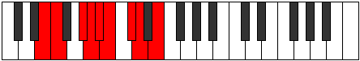

# Mode Aerythyllic

## Links

- [Documentation](index.md)
- [Scales Index](Scales.md)
- [Modes Index](Modes.md)
- [Chords Index](Chords.md)

## Parent Scale

[Aeolathyllic](ScaleAeolathyllic.md)

## Number

[1779](https://ianring.com/musictheory/scales/1779)

## Perfection

- 5 Perfect notes
- 3 Perfect notes

## Perfection Profile

[true false false true true false true true]

## Permutations

| Tonic | Notes | Signature | Illustration | Audio |
|-------|-------|-----------|--------------|-------|
| [C](ModeCNaturalAerythyllic.md) | C, **C#**, **E**, F, F#, **G**, A, A#, C | C |  | [midi](ModeCNaturalAerythyllic.mid) [ogg](ModeCNaturalAerythyllic.ogg) |
| [C#](ModeCSharpAerythyllic.md) | C#, **D**, **F**, F#, G, **G#**, A#, B, C# | C |  | [midi](ModeCSharpAerythyllic.mid) [ogg](ModeCSharpAerythyllic.ogg) |
| [Db](ModeDFlatAerythyllic.md) | Db, **D**, **F**, Gb, G, **Ab**, Bb, B, Db | C |  | [midi](ModeDFlatAerythyllic.mid) [ogg](ModeDFlatAerythyllic.ogg) |
| [D](ModeDNaturalAerythyllic.md) | D, **D#**, **F#**, G, G#, **A**, B, C, D | C |  | [midi](ModeDNaturalAerythyllic.mid) [ogg](ModeDNaturalAerythyllic.ogg) |
| [D#](ModeDSharpAerythyllic.md) | D#, **E**, **G**, G#, A, **A#**, C, C#, D# | C |  | [midi](ModeDSharpAerythyllic.mid) [ogg](ModeDSharpAerythyllic.ogg) |
| [Eb](ModeEFlatAerythyllic.md) | Eb, **E**, **G**, Ab, A, **Bb**, C, Db, Eb | C |  | [midi](ModeEFlatAerythyllic.mid) [ogg](ModeEFlatAerythyllic.ogg) |
| [E](ModeENaturalAerythyllic.md) | E, **F**, **G#**, A, A#, **B**, C#, D, E | C |  | [midi](ModeENaturalAerythyllic.mid) [ogg](ModeENaturalAerythyllic.ogg) |
| [F](ModeFNaturalAerythyllic.md) | F, **F#**, **A**, A#, B, **C**, D, D#, F | C |  | [midi](ModeFNaturalAerythyllic.mid) [ogg](ModeFNaturalAerythyllic.ogg) |
| [F#](ModeFSharpAerythyllic.md) | F#, **G**, **A#**, B, C, **C#**, D#, E, F# | C |  | [midi](ModeFSharpAerythyllic.mid) [ogg](ModeFSharpAerythyllic.ogg) |
| [Gb](ModeGFlatAerythyllic.md) | Gb, **G**, **Bb**, B, C, **Db**, Eb, E, Gb | C |  | [midi](ModeGFlatAerythyllic.mid) [ogg](ModeGFlatAerythyllic.ogg) |
| [G](ModeGNaturalAerythyllic.md) | G, **G#**, **B**, C, C#, **D**, E, F, G | C |  | [midi](ModeGNaturalAerythyllic.mid) [ogg](ModeGNaturalAerythyllic.ogg) |
| [G#](ModeGSharpAerythyllic.md) | G#, **A**, **C**, C#, D, **D#**, F, F#, G# | C |  | [midi](ModeGSharpAerythyllic.mid) [ogg](ModeGSharpAerythyllic.ogg) |
| [Ab](ModeAFlatAerythyllic.md) | Ab, **A**, **C**, Db, D, **Eb**, F, Gb, Ab | C |  | [midi](ModeAFlatAerythyllic.mid) [ogg](ModeAFlatAerythyllic.ogg) |
| [A](ModeANaturalAerythyllic.md) | A, **A#**, **C#**, D, D#, **E**, F#, G, A | C |  | [midi](ModeANaturalAerythyllic.mid) [ogg](ModeANaturalAerythyllic.ogg) |
| [A#](ModeASharpAerythyllic.md) | A#, **B**, **D**, D#, E, **F**, G, G#, A# | C |  | [midi](ModeASharpAerythyllic.mid) [ogg](ModeASharpAerythyllic.ogg) |
| [Bb](ModeBFlatAerythyllic.md) | Bb, **B**, **D**, Eb, E, **F**, G, Ab, Bb | C |  | [midi](ModeBFlatAerythyllic.mid) [ogg](ModeBFlatAerythyllic.ogg) |
| [B](ModeBNaturalAerythyllic.md) | B, **C**, **D#**, E, F, **F#**, G#, A, B | C |  | [midi](ModeBNaturalAerythyllic.mid) [ogg](ModeBNaturalAerythyllic.ogg) |
