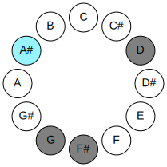
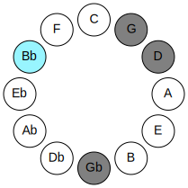
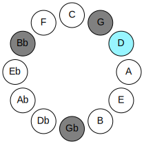
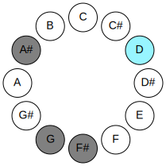
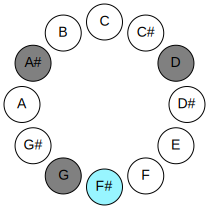
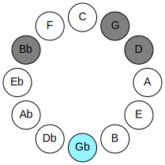
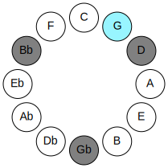
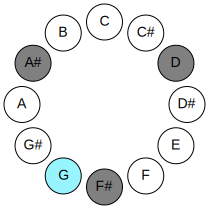

# Mode BFlatAeoloric

## Links

- [Documentation](README.md)
- [Scales Index](Scales.md)
- [Modes Index](Modes.md)
- [Chords Index](Chords.md)

## Scale

[Aeoloric](ScaleAeoloric.md)

## Mode

[BFlatAeoloric](ModeBFlatAeoloric.md)

## Tonic

Bb

## Signature

[CNaturalMajor]

## Transposition

4, 4, 1, 3

## Chord Pattern

## Perfection

 - 1 Perfect Notes

 - 3 Imperfect Notes

## Notes

- Bb (Imperfect)
- D (Imperfect)
- Gb (Imperfect)
- G
- Bb (Imperfect)

## Illustration

## Diagram

| Circle of Fifth | Chromatic Circle |
|-----------------|------------------|
|  |  |
## Relative Modes

| Number | Mode | Tonic | Notes | Illustration |
|--------|------|-------|-------|--------------|
| [785](https://ianring.com/musictheory/scales/785) | [Aeoloric](ModeAeoloric.md) | A# | A#, D, F#, G, A# |  |
| [785](https://ianring.com/musictheory/scales/785) | [Aeoloric](ModeAeoloric.md) | Bb | Bb, D, Gb, G, Bb |  |
| [305](https://ianring.com/musictheory/scales/305) | [Gonic](ModeGonic.md) | D | D, F#, G, A#, D |  |
| [275](https://ianring.com/musictheory/scales/275) | [Dalic](ModeDalic.md) | F# | F#, G, A#, D, F# |  |
| [275](https://ianring.com/musictheory/scales/275) | [Dalic](ModeDalic.md) | Gb | Gb, G, Bb, D, Gb |  |
| [2185](https://ianring.com/musictheory/scales/2185) | [Dygic](ModeDygic.md) | G | G, A#, D, F#, G |  |
## Relative Brightness

| Number | Mode | Tonic | Notes | Circle Of Fifth | Chromatic Circle |
|--------|------|-------|-------|-----------------|------------------|
| [785](https://ianring.com/musictheory/scales/785) | [Aeoloric](ModeAeoloric.md) | A# | A#, D, F#, G, A# |  |  |
| [785](https://ianring.com/musictheory/scales/785) | [Aeoloric](ModeAeoloric.md) | Bb | Bb, D, Gb, G, Bb |  |  |
| [305](https://ianring.com/musictheory/scales/305) | [Gonic](ModeGonic.md) | D | D, F#, G, A#, D |  |  |
| [275](https://ianring.com/musictheory/scales/275) | [Dalic](ModeDalic.md) | F# | F#, G, A#, D, F# |  |  |
| [275](https://ianring.com/musictheory/scales/275) | [Dalic](ModeDalic.md) | Gb | Gb, G, Bb, D, Gb |  |  |
| [2185](https://ianring.com/musictheory/scales/2185) | [Dygic](ModeDygic.md) | G | G, A#, D, F#, G |  |  |

## Chords

### Bb

| Number | Root | Name | Notes | Illustration | Audio |
|--------|------|------|-------|--------------|-------|
| 1092 | Bb | [A#+](ChordASharpAugmented.md) | A#, C##, E## |  | [midi](ChordASharpAugmentedRootPosition.mid) |
| 1092 | Bb | [A#+7](ChordASharpAugmentedAugmentedSeventh.md) | A#, C##, E##, G### |  | [midi](ChordASharpAugmentedAugmentedSeventhRootPosition.mid) |
| 1092 | Bb | [Bb+](ChordBFlatAugmented.md) | Bb, D, F# |  | [midi](ChordBFlatAugmentedRootPosition.mid) |
| 1092 | Bb | [Bb+7](ChordBFlatAugmentedAugmentedSeventh.md) | Bb, D, F#, A# |  | [midi](ChordBFlatAugmentedAugmentedSeventhRootPosition.mid) |
| 1156 | Bb | [A#M##5](ChordASharpMajorDoubleSharpFifth.md) | A#, C##, F## |  | [midi](ChordASharpMajorDoubleSharpFifthRootPosition.mid) |
| 1156 | Bb | [BbM##5](ChordBFlatMajorDoubleSharpFifth.md) | Bb, D, G |  | [midi](ChordBFlatMajorDoubleSharpFifthRootPosition.mid) |

### D

| Number | Root | Name | Notes | Illustration | Audio |
|--------|------|------|-------|--------------|-------|
| 1092 | D | [D+](ChordDNaturalAugmented.md) | D, F#, A# |  | [midi](ChordDNaturalAugmentedRootPosition.mid) |
| 1092 | D | [D+7](ChordDNaturalAugmentedAugmentedSeventh.md) | D, F#, A#, C## |  | [midi](ChordDNaturalAugmentedAugmentedSeventhRootPosition.mid) |
| 1156 | D | [Dsus4#5](ChordDNaturalSuspendedFourthSharpFifth.md) | D, G, A# |  | [midi](ChordDNaturalSuspendedFourthSharpFifthRootPosition.mid) |

### Gb

| Number | Root | Name | Notes | Illustration | Audio |
|--------|------|------|-------|--------------|-------|
| 1092 | Gb | [F#+](ChordFSharpAugmented.md) | F#, A#, C## |  | [midi](ChordFSharpAugmentedRootPosition.mid) |
| 1092 | Gb | [F#+7](ChordFSharpAugmentedAugmentedSeventh.md) | F#, A#, C##, E## |  | [midi](ChordFSharpAugmentedAugmentedSeventhRootPosition.mid) |
| 1092 | Gb | [Gb+](ChordGFlatAugmented.md) | Gb, Bb, D |  | [midi](ChordGFlatAugmentedRootPosition.mid) |
| 1092 | Gb | [Gb+7](ChordGFlatAugmentedAugmentedSeventh.md) | Gb, Bb, D, F# |  | [midi](ChordGFlatAugmentedAugmentedSeventhRootPosition.mid) |

### G

| Number | Root | Name | Notes | Illustration | Audio |
|--------|------|------|-------|--------------|-------|
| 132 | G | [G5](ChordGNaturalPowerChord.md) | G, D |  | [midi](ChordGNaturalPowerChordRootPosition.mid) |
| 1156 | G | [Gm](ChordGNaturalMinor.md) | G, Bb, D |  | [midi](ChordGNaturalMinorRootPosition.mid) |
| 1156 | G | [Gm(add(#9))](ChordGNaturalMinorAddSharpNinth.md) | G, Bb, D, A# |  | [midi](ChordGNaturalMinorAddSharpNinthRootPosition.mid) |
| 1220 | G | [Gm(M7)](ChordGNaturalMinorMajorSeventh.md) | G, Bb, D, F# |  | [midi](ChordGNaturalMinorMajorSeventhRootPosition.mid) |

