# Mode BFlatBolic

## Links

- [Documentation](README.md)
- [Scales Index](Scales.md)
- [Modes Index](Modes.md)
- [Chords Index](Chords.md)

## Parent Scale

[Daric](ScaleDaric.md)

## Mode

[BFlatBolic](ModeBFlatBolic.md)

## Number

581

## Luminosity

-1

## Tonic

Bb

## Signature

C

## Transposition

2, 4, 3, 3

## Chord Pattern

## Perfection

 - 1 Perfect Notes

 - 3 Imperfect Notes

 - Perfection Profile - false, true, false, false

## Notes

- Bb (Imperfect)
- C
- E (Imperfect)
- G (Imperfect)
- Bb (Imperfect)

## Illustration

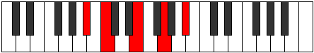

## Diagram

| Circle of Fifth | Chromatic Circle |
|-----------------|------------------|
| 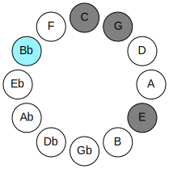 | 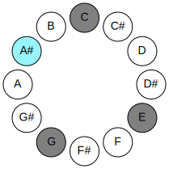 |
## Relative Modes

| Number | Mode | Luminosity | Tonic | Notes | Illustration |
|--------|------|------------|-------|-------|--------------|
| [581](https://ianring.com/musictheory/scales/581) | [Bolic](ModeBolic.md) | -1 | A# | A#, C, E, G, A# |  |
| [1169](https://ianring.com/musictheory/scales/1169) | [Daric](ModeDaric.md) | 4 | C | C, E, G, A#, C | 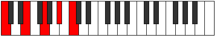 |
| [329](https://ianring.com/musictheory/scales/329) | [Lonic](ModeLonic.md) | -1 | E | E, G, A#, C, E | 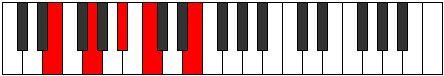 |
| [553](https://ianring.com/musictheory/scales/553) | [Phradic](ModePhradic.md) | 3 | G | G, A#, C, E, G | 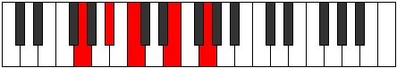 |
## Relative Brightness

| Number | Mode | Luminosity | Tonic | Notes | Circle Of Fifth | Chromatic Circle |
|--------|------|------------|-------|-------|-----------------|------------------|
| [581](https://ianring.com/musictheory/scales/581) | [Bolic](ModeBolic.md) | -1 | A# | A#, C, E, G, A# |  |  |
| [581](https://ianring.com/musictheory/scales/581) | [Bolic](ModeBolic.md) | -1 | Bb | Bb, C, E, G, Bb |  |  |
| [1169](https://ianring.com/musictheory/scales/1169) | [Daric](ModeDaric.md) | 4 | C | C, E, G, A#, C | 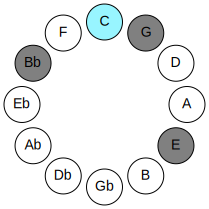 | 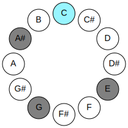 |
| [329](https://ianring.com/musictheory/scales/329) | [Lonic](ModeLonic.md) | -1 | E | E, G, A#, C, E | 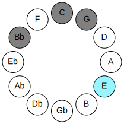 | 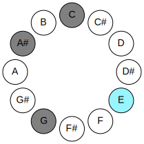 |
| [553](https://ianring.com/musictheory/scales/553) | [Phradic](ModePhradic.md) | 3 | G | G, A#, C, E, G | 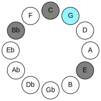 | 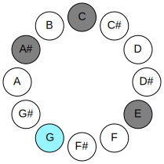 |

## Chords

### Bb

| Number | Root | Name | Notes | Illustration | Audio |
|--------|------|------|-------|--------------|-------|
| 1041 | Bb | [A#](ChordASharpDiminishedFlatThird.md) | A#, C, E |  | [midi](ChordASharpDiminishedFlatThirdRootPosition.mid) |
| 1041 | Bb | [A#sus2b5](ChordASharpSuspendedSecondFlatFifth.md) | A#, B#, E |  | [midi](ChordASharpSuspendedSecondFlatFifthRootPosition.mid) |
| 1041 | Bb | [Bb](ChordBFlatDiminishedFlatThird.md) | Bb, Dbb, Fb |  | [midi](ChordBFlatDiminishedFlatThirdRootPosition.mid) |
| 1041 | Bb | [Bbsus2b5](ChordBFlatSuspendedSecondFlatFifth.md) | Bb, C, Fb |  | [midi](ChordBFlatSuspendedSecondFlatFifthRootPosition.mid) |
| 1169 | Bb | [A#M6sus2b5](ChordASharpMajorSixthSuspendedSecondFlatFifth.md) | A#, B#, E, F## |  | [midi](ChordASharpMajorSixthSuspendedSecondFlatFifthRootPosition.mid) |
| 1169 | Bb | [BbM6sus2b5](ChordBFlatMajorSixthSuspendedSecondFlatFifth.md) | Bb, C, Fb, G |  | [midi](ChordBFlatMajorSixthSuspendedSecondFlatFifthRootPosition.mid) |

### C

| Number | Root | Name | Notes | Illustration | Audio |
|--------|------|------|-------|--------------|-------|
| 129 | C | [C5](ChordCNaturalPowerChord.md) | C, G |  | [midi](ChordCNaturalPowerChordRootPosition.mid) |
| 145 | C | [CM](ChordCNaturalMajor.md) | C, E, G |  | [midi](ChordCNaturalMajorRootPosition.mid) |
| 1169 | C | [C7](ChordCNaturalDominantSeventh.md) | C, E, G, Bb |  | [midi](ChordCNaturalDominantSeventhRootPosition.mid) |

### E

| Number | Root | Name | Notes | Illustration | Audio |
|--------|------|------|-------|--------------|-------|
| 1168 | E | [Eo](ChordENaturalDiminished.md) | E, G, Bb |  | [midi](ChordENaturalDiminishedRootPosition.mid) |
| 145 | E | [Em#5](ChordENaturalMinorSharpFifth.md) | E, G, C |  | [midi](ChordENaturalMinorSharpFifthRootPosition.mid) |

### G

| Number | Root | Name | Notes | Illustration | Audio |
|--------|------|------|-------|--------------|-------|
| 1153 | G | [Gmbb5](ChordGNaturalMinorDoubleFlatFifth.md) | G, Bb, C |  | [midi](ChordGNaturalMinorDoubleFlatFifthRootPosition.mid) |
| 145 | G | [Gsus4##5](ChordGNaturalSuspendedFourthDoubleSharpFifth.md) | G, C, E |  | [midi](ChordGNaturalSuspendedFourthDoubleSharpFifthRootPosition.mid) |

