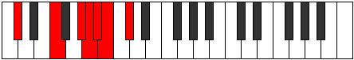
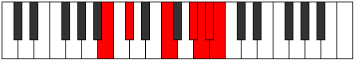

# Mode BFlatEpacrimic

## Links

- [Documentation](index.md)
- [Scales Index](Scales.md)
- [Modes Index](Modes.md)
- [Chords Index](Chords.md)

## Scale

[Galimic](ScaleGalimic.md)

## Mode

[BFlatEpacrimic](ModeBFlatEpacrimic.md)

## Tonic

Bb

## Signature

[CNaturalMajor]

## Perfection

 - 2 Perfect Notes

 - 4 Imperfect Notes

## Notes

- Bb
- Cb (Imperfect)
- Db
- E# (Imperfect)
- F### (Imperfect)
- G## (Imperfect)
- Bb

## Illustration

## Relative Modes

| Number | Mode | Tonic | Notes | Illustration |
|--------|------|-------|-------|--------------|
| [377](https://ianring.com/musictheory/scales/377) | [Kathimic](ModeKathimic.md) | F | F, G#, A, Bb, Cb, Db, F |  |
| [559](https://ianring.com/musictheory/scales/559) | [Lylimic](ModeLylimic.md) | G# | G#, A, Bb, Cb, Db, E#, G# |  |
| [559](https://ianring.com/musictheory/scales/559) | [Lylimic](ModeLylimic.md) | Ab | Ab, Bbb, Cbb, Dbbb, Ebbb, F, Ab |  |
| [1937](https://ianring.com/musictheory/scales/1937) | [Galimic](ModeGalimic.md) | C# | C#, D###, F###, G##, A#, B, C# |  |
| [1937](https://ianring.com/musictheory/scales/1937) | [Galimic](ModeGalimic.md) | Db | Db, E#, F###, G##, A#, B, Db |  |
| [2327](https://ianring.com/musictheory/scales/2327) | [Epalimic](ModeEpalimic.md) | A | A, Bb, Cb, Db, E#, F###, A |  |
| [3211](https://ianring.com/musictheory/scales/3211) | [Epacrimic](ModeEpacrimic.md) | A# | A#, B, C#, D###, F###, G##, A# |  |
| [3211](https://ianring.com/musictheory/scales/3211) | [Epacrimic](ModeEpacrimic.md) | Bb | Bb, Cb, Db, E#, F###, G##, Bb |  |
| [3653](https://ianring.com/musictheory/scales/3653) | [Sathimic](ModeSathimic.md) | B | B, C#, D###, F###, G##, A#, B |  |

## Chords

### Bb

| Number | Root | Name | Notes | Illustration | Audio |
|--------|------|------|-------|--------------|-------|

### Cb

| Number | Root | Name | Notes | Illustration | Audio |
|--------|------|------|-------|--------------|-------|

### Db

| Number | Root | Name | Notes | Illustration | Audio |
|--------|------|------|-------|--------------|-------|

### E#

| Number | Root | Name | Notes | Illustration | Audio |
|--------|------|------|-------|--------------|-------|

### F###

| Number | Root | Name | Notes | Illustration | Audio |
|--------|------|------|-------|--------------|-------|

### G##

| Number | Root | Name | Notes | Illustration | Audio |
|--------|------|------|-------|--------------|-------|

