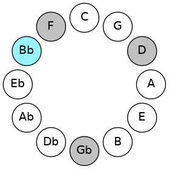

# Mode BFlatEpogic

## Links

- [Documentation](README.md)
- [Scales Index](Scales.md)
- [Modes Index](Modes.md)
- [Chords Index](Chords.md)

## Scale

[Zyphic](ScaleZyphic.md)

## Mode

[BFlatEpogic](ModeBFlatEpogic.md)

## Tonic

Bb

## Signature

[CNaturalMajor]

## Interval Pattern

4, 3, 1, 4

## Chord Pattern

## Perfection

 - 1 Perfect Notes

 - 3 Imperfect Notes

## Notes

- Bb
- D (Imperfect)
- F (Imperfect)
- Gb (Imperfect)
- Bb

## Illustration

## Diagram

## Relative Modes

| Number | Mode | Tonic | Notes | Illustration |
|--------|------|-------|-------|--------------|
| [401](https://ianring.com/musictheory/scales/401) | [Epogic](ModeEpogic.md) | Bb | Bb, D, F, Gb, Bb |  |
| [281](https://ianring.com/musictheory/scales/281) | [Lanic](ModeLanic.md) | D | D, F, F#, A#, D |  |
| [547](https://ianring.com/musictheory/scales/547) | [Pyrric](ModePyrric.md) | F | F, F#, A#, D, F |  |
| [2321](https://ianring.com/musictheory/scales/2321) | [Zyphic](ModeZyphic.md) | Gb | Gb, Bb, D, F, Gb |  |
## Relative Brightness

| Number | Mode | Tonic | Notes | Illustration |
|--------|------|-------|-------|--------------|
| [401](https://ianring.com/musictheory/scales/401) | [Epogic](ModeEpogic.md) | Bb | Bb, D, F, Gb, Bb |  |
| [281](https://ianring.com/musictheory/scales/281) | [Lanic](ModeLanic.md) | D | D, F, F#, A#, D |  |
| [547](https://ianring.com/musictheory/scales/547) | [Pyrric](ModePyrric.md) | F | F, F#, A#, D, F |  |
| [2321](https://ianring.com/musictheory/scales/2321) | [Zyphic](ModeZyphic.md) | Gb | Gb, Bb, D, F, Gb |  |

## Chords

### Bb

| Number | Root | Name | Notes | Illustration | Audio |
|--------|------|------|-------|--------------|-------|
| 1056 | Bb | [Bb5](ChordBFlatPowerChord.md) | Bb, F |  | [midi](ChordBFlatPowerChordRootPosition.mid) |
| 1060 | Bb | [BbM](ChordBFlatMajor.md) | Bb, D, F |  | [midi](ChordBFlatMajorRootPosition.mid) |
| 1092 | Bb | [Bb+](ChordBFlatAugmented.md) | Bb, D, F# |  | [midi](ChordBFlatAugmentedRootPosition.mid) |
| 1092 | Bb | [Bb+7](ChordBFlatAugmentedAugmentedSeventh.md) | Bb, D, F#, A# |  | [midi](ChordBFlatAugmentedAugmentedSeventhRootPosition.mid) |

### D

| Number | Root | Name | Notes | Illustration | Audio |
|--------|------|------|-------|--------------|-------|
| 1060 | D | [Dm#5](ChordDNaturalMinorSharpFifth.md) | D, F, Bb |  | [midi](ChordDNaturalMinorSharpFifthRootPosition.mid) |
| 1092 | D | [D+](ChordDNaturalAugmented.md) | D, F#, A# |  | [midi](ChordDNaturalAugmentedRootPosition.mid) |
| 1092 | D | [D+7](ChordDNaturalAugmentedAugmentedSeventh.md) | D, F#, A#, C## |  | [midi](ChordDNaturalAugmentedAugmentedSeventhRootPosition.mid) |

### F

| Number | Root | Name | Notes | Illustration | Audio |
|--------|------|------|-------|--------------|-------|
| 1060 | F | [Fsus4##5](ChordFNaturalSuspendedFourthDoubleSharpFifth.md) | F, Bb, D |  | [midi](ChordFNaturalSuspendedFourthDoubleSharpFifthRootPosition.mid) |

### Gb

| Number | Root | Name | Notes | Illustration | Audio |
|--------|------|------|-------|--------------|-------|
| 1092 | Gb | [Gb+](ChordGFlatAugmented.md) | Gb, Bb, D |  | [midi](ChordGFlatAugmentedRootPosition.mid) |
| 1092 | Gb | [Gb+7](ChordGFlatAugmentedAugmentedSeventh.md) | Gb, Bb, D, F# |  | [midi](ChordGFlatAugmentedAugmentedSeventhRootPosition.mid) |
| 1124 | Gb | [Gb+(M7)](ChordGFlatAugmentedMajorSeventh.md) | Gb, Bb, D, F |  | [midi](ChordGFlatAugmentedMajorSeventhRootPosition.mid) |

