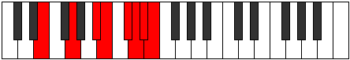

# Mode BFlatEpolian

## Links

- [Documentation](index.md)
- [Scales Index](Scales.md)
- [Modes Index](Modes.md)
- [Chords Index](Chords.md)

## Scale

[Epagian](ScaleEpagian.md)

## Mode

[BFlatEpolian](ModeBFlatEpolian.md)

## Tonic

Bb

## Signature

[CNaturalMajor]

## Perfection

 - 3 Perfect Notes

 - 4 Imperfect Notes

## Notes

- Bb (Imperfect)
- Cb (Imperfect)
- Db (Imperfect)
- Ebb (Imperfect)
- Fbb
- Gbbb
- Abb
- Bb (Imperfect)

## Illustration

## Relative Modes

| Number | Mode | Tonic | Notes | Illustration |
|--------|------|-------|-------|--------------|
| [635](https://ianring.com/musictheory/scales/635) | [Epolian](ModeEpolian.md) | A# | A#, B, C#, D, Eb, Fb, G, A# |  |
| [635](https://ianring.com/musictheory/scales/635) | [Epolian](ModeEpolian.md) | Bb | Bb, Cb, Db, Ebb, Fbb, Gbbb, Abb, Bb |  |
| [985](https://ianring.com/musictheory/scales/985) | [Raptian](ModeRaptian.md) | G | G, A#, B, C#, D, Eb, Fb, G |  |
| [1615](https://ianring.com/musictheory/scales/1615) | [Sydian](ModeSydian.md) | C# | C#, D, Eb, Fb, G, A#, B, C# |  |
| [1615](https://ianring.com/musictheory/scales/1615) | [Sydian](ModeSydian.md) | Db | Db, Ebb, Fbb, Gbbb, Abb, Bb, Cb, Db |  |
| [2365](https://ianring.com/musictheory/scales/2365) | [Sythian](ModeSythian.md) | B | B, C#, D, Eb, Fb, G, A#, B |  |
| [2855](https://ianring.com/musictheory/scales/2855) | [Epocrian](ModeEpocrian.md) | D | D, Eb, Fb, G, A#, B, C#, D |  |
| [3475](https://ianring.com/musictheory/scales/3475) | [Kylian](ModeKylian.md) | D# | D#, E, F##, G###, A##, B##, C##, D# |  |
| [3475](https://ianring.com/musictheory/scales/3475) | [Kylian](ModeKylian.md) | Eb | Eb, Fb, G, A#, B, C#, D, Eb |  |
| [3785](https://ianring.com/musictheory/scales/3785) | [Epagian](ModeEpagian.md) | E | E, F##, G###, A##, B##, C##, D#, E |  |

## Chords

### Bb

| Number | Root | Name | Notes | Illustration | Audio |
|--------|------|------|-------|--------------|-------|

### Cb

| Number | Root | Name | Notes | Illustration | Audio |
|--------|------|------|-------|--------------|-------|

### Db

| Number | Root | Name | Notes | Illustration | Audio |
|--------|------|------|-------|--------------|-------|

### Ebb

| Number | Root | Name | Notes | Illustration | Audio |
|--------|------|------|-------|--------------|-------|

### Fbb

| Number | Root | Name | Notes | Illustration | Audio |
|--------|------|------|-------|--------------|-------|

### Gbbb

| Number | Root | Name | Notes | Illustration | Audio |
|--------|------|------|-------|--------------|-------|

### Abb

| Number | Root | Name | Notes | Illustration | Audio |
|--------|------|------|-------|--------------|-------|

