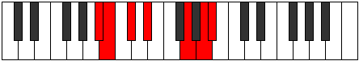

# Mode BFlatGadimic

## Links

- [Documentation](index.md)
- [Scales Index](Scales.md)
- [Modes Index](Modes.md)
- [Chords Index](Chords.md)

## Scale

[Gacrimic](ScaleGacrimic.md)

## Mode

[BFlatGadimic](ModeBFlatGadimic.md)

## Tonic

Bb

## Signature

[CNaturalMajor]

## Perfection

 - 1 Perfect Notes

 - 5 Imperfect Notes

## Notes

- Bb (Imperfect)
- Cb (Imperfect)
- Db (Imperfect)
- Eb
- F## (Imperfect)
- G## (Imperfect)
- Bb (Imperfect)

## Illustration

## Relative Modes

| Number | Mode | Tonic | Notes | Illustration |
|--------|------|-------|-------|--------------|
| [2603](https://ianring.com/musictheory/scales/2603) | [Gadimic](ModeGadimic.md) | Bb | Bb, Cb, Db, Eb, F##, G##, Bb |  |
| [1861](https://ianring.com/musictheory/scales/1861) | [Phrygimic](ModePhrygimic.md) | Db | Db, Eb, F##, G##, A#, B, Db |  |
| [1489](https://ianring.com/musictheory/scales/1489) | [Gacrimic](ModeGacrimic.md) | Eb | Eb, F##, G##, A#, B, C#, Eb |  |

## Chords

### Bb

| Number | Root | Name | Notes | Illustration | Audio |
|--------|------|------|-------|--------------|-------|

### Cb

| Number | Root | Name | Notes | Illustration | Audio |
|--------|------|------|-------|--------------|-------|

### Db

| Number | Root | Name | Notes | Illustration | Audio |
|--------|------|------|-------|--------------|-------|

### Eb

| Number | Root | Name | Notes | Illustration | Audio |
|--------|------|------|-------|--------------|-------|

### F##

| Number | Root | Name | Notes | Illustration | Audio |
|--------|------|------|-------|--------------|-------|

### G##

| Number | Root | Name | Notes | Illustration | Audio |
|--------|------|------|-------|--------------|-------|

