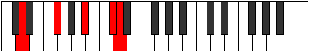

# Mode BFlatLanic

## Links

- [Documentation](README.md)
- [Scales Index](Scales.md)
- [Modes Index](Modes.md)
- [Chords Index](Chords.md)

## Scale

[Zyphic](ScaleZyphic.md)

## Mode

[BFlatLanic](ModeBFlatLanic.md)

## Tonic

Bb

## Signature

[CNaturalMajor]

## Transposition

3, 1, 4, 4

## Chord Pattern

## Perfection

 - 1 Perfect Notes

 - 3 Imperfect Notes

## Notes

- Bb (Imperfect)
- Db (Imperfect)
- D (Imperfect)
- Gb
- Bb (Imperfect)

## Illustration

## Diagram

## Relative Modes

| Number | Mode | Tonic | Notes | Illustration |
|--------|------|-------|-------|--------------|
| [281](https://ianring.com/musictheory/scales/281) | [Lanic](ModeLanic.md) | A# | A#, C#, D, F#, A# |  |
| [281](https://ianring.com/musictheory/scales/281) | [Lanic](ModeLanic.md) | Bb | Bb, Db, D, Gb, Bb |  |
| [547](https://ianring.com/musictheory/scales/547) | [Pyrric](ModePyrric.md) | C# | C#, D, F#, A#, C# |  |
| [547](https://ianring.com/musictheory/scales/547) | [Pyrric](ModePyrric.md) | Db | Db, D, Gb, Bb, Db |  |
| [2321](https://ianring.com/musictheory/scales/2321) | [Zyphic](ModeZyphic.md) | D | D, F#, A#, C#, D |  |
| [401](https://ianring.com/musictheory/scales/401) | [Epogic](ModeEpogic.md) | F# | F#, A#, C#, D, F# |  |
| [401](https://ianring.com/musictheory/scales/401) | [Epogic](ModeEpogic.md) | Gb | Gb, Bb, Db, D, Gb |  |
## Relative Brightness

| Number | Mode | Tonic | Notes | Illustration |
|--------|------|-------|-------|--------------|
| [281](https://ianring.com/musictheory/scales/281) | [Lanic](ModeLanic.md) | A# | A#, C#, D, F#, A# |  |
| [281](https://ianring.com/musictheory/scales/281) | [Lanic](ModeLanic.md) | Bb | Bb, Db, D, Gb, Bb |  |
| [547](https://ianring.com/musictheory/scales/547) | [Pyrric](ModePyrric.md) | C# | C#, D, F#, A#, C# |  |
| [547](https://ianring.com/musictheory/scales/547) | [Pyrric](ModePyrric.md) | Db | Db, D, Gb, Bb, Db |  |
| [2321](https://ianring.com/musictheory/scales/2321) | [Zyphic](ModeZyphic.md) | D | D, F#, A#, C#, D |  |
| [401](https://ianring.com/musictheory/scales/401) | [Epogic](ModeEpogic.md) | F# | F#, A#, C#, D, F# |  |
| [401](https://ianring.com/musictheory/scales/401) | [Epogic](ModeEpogic.md) | Gb | Gb, Bb, Db, D, Gb |  |

## Chords

### Bb

| Number | Root | Name | Notes | Illustration | Audio |
|--------|------|------|-------|--------------|-------|
| 1090 | Bb | [A#m#5](ChordASharpMinorSharpFifth.md) | A#, C#, F# |  | [midi](ChordASharpMinorSharpFifthRootPosition.mid) |
| 1090 | Bb | [Bbm#5](ChordBFlatMinorSharpFifth.md) | Bb, Db, Gb |  | [midi](ChordBFlatMinorSharpFifthRootPosition.mid) |
| 1092 | Bb | [A#+](ChordASharpAugmented.md) | A#, C##, E## |  | [midi](ChordASharpAugmentedRootPosition.mid) |
| 1092 | Bb | [A#+7](ChordASharpAugmentedAugmentedSeventh.md) | A#, C##, E##, G### |  | [midi](ChordASharpAugmentedAugmentedSeventhRootPosition.mid) |
| 1092 | Bb | [Bb+](ChordBFlatAugmented.md) | Bb, D, F# |  | [midi](ChordBFlatAugmentedRootPosition.mid) |
| 1092 | Bb | [Bb+7](ChordBFlatAugmentedAugmentedSeventh.md) | Bb, D, F#, A# |  | [midi](ChordBFlatAugmentedAugmentedSeventhRootPosition.mid) |

### Db

| Number | Root | Name | Notes | Illustration | Audio |
|--------|------|------|-------|--------------|-------|
| 1090 | Db | [C#sus4##5](ChordCSharpSuspendedFourthDoubleSharpFifth.md) | C#, F#, A# |  | [midi](ChordCSharpSuspendedFourthDoubleSharpFifthRootPosition.mid) |
| 1090 | Db | [Dbsus4##5](ChordDFlatSuspendedFourthDoubleSharpFifth.md) | Db, Gb, Bb |  | [midi](ChordDFlatSuspendedFourthDoubleSharpFifthRootPosition.mid) |

### D

| Number | Root | Name | Notes | Illustration | Audio |
|--------|------|------|-------|--------------|-------|
| 1092 | D | [D+](ChordDNaturalAugmented.md) | D, F#, A# |  | [midi](ChordDNaturalAugmentedRootPosition.mid) |
| 1092 | D | [D+7](ChordDNaturalAugmentedAugmentedSeventh.md) | D, F#, A#, C## |  | [midi](ChordDNaturalAugmentedAugmentedSeventhRootPosition.mid) |
| 1094 | D | [D+(M7)](ChordDNaturalAugmentedMajorSeventh.md) | D, F#, A#, C# |  | [midi](ChordDNaturalAugmentedMajorSeventhRootPosition.mid) |

### Gb

| Number | Root | Name | Notes | Illustration | Audio |
|--------|------|------|-------|--------------|-------|
| 66 | Gb | [F#5](ChordFSharpPowerChord.md) | F#, C# |  | [midi](ChordFSharpPowerChordRootPosition.mid) |
| 66 | Gb | [Gb5](ChordGFlatPowerChord.md) | Gb, Db |  | [midi](ChordGFlatPowerChordRootPosition.mid) |
| 1090 | Gb | [F#M](ChordFSharpMajor.md) | F#, A#, C# |  | [midi](ChordFSharpMajorRootPosition.mid) |
| 1090 | Gb | [GbM](ChordGFlatMajor.md) | Gb, Bb, Db |  | [midi](ChordGFlatMajorRootPosition.mid) |
| 1092 | Gb | [F#+](ChordFSharpAugmented.md) | F#, A#, C## |  | [midi](ChordFSharpAugmentedRootPosition.mid) |
| 1092 | Gb | [F#+7](ChordFSharpAugmentedAugmentedSeventh.md) | F#, A#, C##, E## |  | [midi](ChordFSharpAugmentedAugmentedSeventhRootPosition.mid) |
| 1092 | Gb | [Gb+](ChordGFlatAugmented.md) | Gb, Bb, D |  | [midi](ChordGFlatAugmentedRootPosition.mid) |
| 1092 | Gb | [Gb+7](ChordGFlatAugmentedAugmentedSeventh.md) | Gb, Bb, D, F# |  | [midi](ChordGFlatAugmentedAugmentedSeventhRootPosition.mid) |

