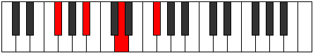

# Mode BFlatMinoric

## Links

- [Documentation](index.md)
- [Scales Index](Scales.md)
- [Modes Index](Modes.md)
- [Chords Index](Chords.md)

## Scale

[Minoric](ScaleMinoric.md)

## Mode

[BFlatMinoric](ModeBFlatMinoric.md)

## Tonic

Bb

## Signature

[CNaturalMajor]

## Perfection

 - 0 Perfect Notes

 - 3 Imperfect Notes

## Notes

- Bb (Imperfect)
- D (Imperfect)
- Gb (Imperfect)
- Bb (Imperfect)

## Illustration

## Relative Modes

| Number | Mode | Tonic | Notes | Illustration |
|--------|------|-------|-------|--------------|
| [273](https://ianring.com/musictheory/scales/273) | [Minoric](ModeMinoric.md) | D | D, F#, A#, D |  |
| [273](https://ianring.com/musictheory/scales/273) | [Minoric](ModeMinoric.md) | F# | F#, A#, D, F# |  |
| [273](https://ianring.com/musictheory/scales/273) | [Minoric](ModeMinoric.md) | Gb | Gb, Bb, D, Gb |  |
| [273](https://ianring.com/musictheory/scales/273) | [Minoric](ModeMinoric.md) | A# | A#, D, F#, A# |  |
| [273](https://ianring.com/musictheory/scales/273) | [Minoric](ModeMinoric.md) | Bb | Bb, D, Gb, Bb |  |

## Chords

### Bb

| Number | Root | Name | Notes | Illustration | Audio |
|--------|------|------|-------|--------------|-------|
| 1092 | Bb | [Bb+](ChordBFlatAugmented.md) | Bb, D, F# |  | [midi](ChordBFlatAugmentedRootPosition.mid) [ogg](ChordBFlatAugmentedRootPosition.ogg) |
| 1092 | Bb | [Bb+7](ChordBFlatAugmentedAugmentedSeventh.md) | Bb, D, F#, A# |  | [midi](ChordBFlatAugmentedAugmentedSeventhRootPosition.mid) [ogg](ChordBFlatAugmentedAugmentedSeventhRootPosition.ogg) |

### D

| Number | Root | Name | Notes | Illustration | Audio |
|--------|------|------|-------|--------------|-------|
| 1092 | D | [D+](ChordDNaturalAugmented.md) | D, F#, A# |  | [midi](ChordDNaturalAugmentedRootPosition.mid) [ogg](ChordDNaturalAugmentedRootPosition.ogg) |
| 1092 | D | [D+7](ChordDNaturalAugmentedAugmentedSeventh.md) | D, F#, A#, C## |  | [midi](ChordDNaturalAugmentedAugmentedSeventhRootPosition.mid) [ogg](ChordDNaturalAugmentedAugmentedSeventhRootPosition.ogg) |

### Gb

| Number | Root | Name | Notes | Illustration | Audio |
|--------|------|------|-------|--------------|-------|
| 1092 | Gb | [Gb+](ChordGFlatAugmented.md) | Gb, Bb, D |  | [midi](ChordGFlatAugmentedRootPosition.mid) [ogg](ChordGFlatAugmentedRootPosition.ogg) |
| 1092 | Gb | [Gb+7](ChordGFlatAugmentedAugmentedSeventh.md) | Gb, Bb, D, F# |  | [midi](ChordGFlatAugmentedAugmentedSeventhRootPosition.mid) [ogg](ChordGFlatAugmentedAugmentedSeventhRootPosition.ogg) |

