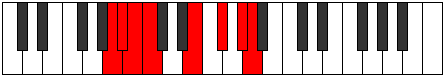

# Mode BFlatZonian

## Links

- [Documentation](index.md)
- [Scales Index](Scales.md)
- [Modes Index](Modes.md)
- [Chords Index](Chords.md)

## Scale

[Pythian](ScalePythian.md)

## Mode

[BFlatZonian](ModeBFlatZonian.md)

## Tonic

Bb

## Signature

[CNaturalMajor]

## Perfection

 - 3 Perfect Notes

 - 4 Imperfect Notes

## Notes

- Bb (Imperfect)
- Cb
- Dbb (Imperfect)
- E
- F# (Imperfect)
- G# (Imperfect)
- A
- Bb (Imperfect)

## Illustration

## Relative Modes

| Number | Mode | Tonic | Notes | Illustration |
|--------|------|-------|-------|--------------|
| [3399](https://ianring.com/musictheory/scales/3399) | [Zonian](ModeZonian.md) | Bb | Bb, Cb, Dbb, E, F#, G#, A, Bb |  |
| [501](https://ianring.com/musictheory/scales/501) | [Katylian](ModeKatylian.md) | E | E, F#, G#, A, Bb, Cb, Dbb, E |  |
| [1149](https://ianring.com/musictheory/scales/1149) | [Bydian](ModeBydian.md) | F# | F#, G#, A, Bb, Cb, Dbb, E, F# |  |
| [1311](https://ianring.com/musictheory/scales/1311) | [Bynian](ModeBynian.md) | G# | G#, A, Bb, Cb, Dbb, E, F#, G# |  |
| [2703](https://ianring.com/musictheory/scales/2703) | [Galian](ModeGalian.md) | A | A, Bb, Cb, Dbb, E, F#, G#, A |  |

## Chords

### Bb

| Number | Root | Name | Notes | Illustration | Audio |
|--------|------|------|-------|--------------|-------|

### Cb

| Number | Root | Name | Notes | Illustration | Audio |
|--------|------|------|-------|--------------|-------|

### Dbb

| Number | Root | Name | Notes | Illustration | Audio |
|--------|------|------|-------|--------------|-------|

### E

| Number | Root | Name | Notes | Illustration | Audio |
|--------|------|------|-------|--------------|-------|

### F#

| Number | Root | Name | Notes | Illustration | Audio |
|--------|------|------|-------|--------------|-------|

### G#

| Number | Root | Name | Notes | Illustration | Audio |
|--------|------|------|-------|--------------|-------|

### A

| Number | Root | Name | Notes | Illustration | Audio |
|--------|------|------|-------|--------------|-------|

