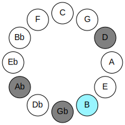
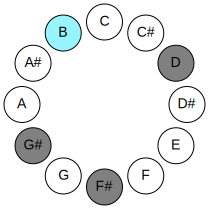
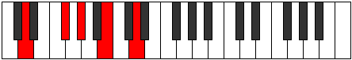
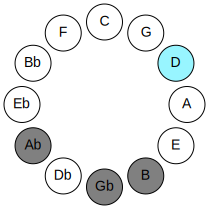
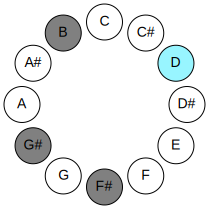
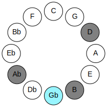
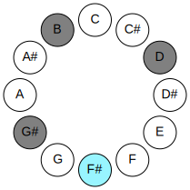
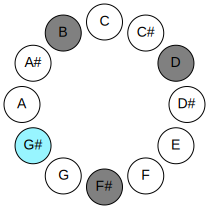
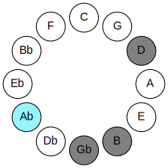

# Mode BNaturalByptic

## Links

- [Documentation](README.md)
- [Scales Index](Scales.md)
- [Modes Index](Modes.md)
- [Chords Index](Chords.md)

## Scale

[Saric](ScaleSaric.md)

## Mode

[BNaturalByptic](ModeBNaturalByptic.md)

## Tonic

B

## Signature

[CNaturalMajor]

## Transposition

3, 4, 2, 3

## Chord Pattern

## Perfection

 - 1 Perfect Notes

 - 3 Imperfect Notes

## Notes

- B
- D (Imperfect)
- F# (Imperfect)
- G# (Imperfect)
- B

## Illustration

## Diagram

| Circle of Fifth | Chromatic Circle |
|-----------------|------------------|
|  |  |
## Relative Modes

| Number | Mode | Tonic | Notes | Illustration |
|--------|------|-------|-------|--------------|
| [649](https://ianring.com/musictheory/scales/649) | [Byptic](ModeByptic.md) | B | B, D, F#, G#, B |  |
| [593](https://ianring.com/musictheory/scales/593) | [Saric](ModeSaric.md) | D | D, F#, G#, B, D |  |
| [293](https://ianring.com/musictheory/scales/293) | [Zoptic](ModeZoptic.md) | F# | F#, G#, B, D, F# |  |
| [293](https://ianring.com/musictheory/scales/293) | [Zoptic](ModeZoptic.md) | Gb | Gb, Ab, B, D, Gb |  |
| [1097](https://ianring.com/musictheory/scales/1097) | [Aeraphic](ModeAeraphic.md) | G# | G#, B, D, F#, G# |  |
| [1097](https://ianring.com/musictheory/scales/1097) | [Aeraphic](ModeAeraphic.md) | Ab | Ab, B, D, Gb, Ab |  |
## Relative Brightness

| Number | Mode | Tonic | Notes | Circle Of Fifth | Chromatic Circle |
|--------|------|-------|-------|-----------------|------------------|
| [649](https://ianring.com/musictheory/scales/649) | [Byptic](ModeByptic.md) | B | B, D, F#, G#, B |  |  |
| [593](https://ianring.com/musictheory/scales/593) | [Saric](ModeSaric.md) | D | D, F#, G#, B, D |  |  |
| [293](https://ianring.com/musictheory/scales/293) | [Zoptic](ModeZoptic.md) | F# | F#, G#, B, D, F# |  |  |
| [293](https://ianring.com/musictheory/scales/293) | [Zoptic](ModeZoptic.md) | Gb | Gb, Ab, B, D, Gb |  |  |
| [1097](https://ianring.com/musictheory/scales/1097) | [Aeraphic](ModeAeraphic.md) | G# | G#, B, D, F#, G# |  |  |
| [1097](https://ianring.com/musictheory/scales/1097) | [Aeraphic](ModeAeraphic.md) | Ab | Ab, B, D, Gb, Ab |  |  |

## Chords

### B

| Number | Root | Name | Notes | Illustration | Audio |
|--------|------|------|-------|--------------|-------|
| 2112 | B | [B5](ChordBNaturalPowerChord.md) | B, F# |  | [midi](ChordBNaturalPowerChordRootPosition.mid) |
| 2116 | B | [Bm](ChordBNaturalMinor.md) | B, D, F# |  | [midi](ChordBNaturalMinorRootPosition.mid) |
| 2116 | B | [Bm(add(#9))](ChordBNaturalMinorAddSharpNinth.md) | B, D, F#, C## |  | [midi](ChordBNaturalMinorAddSharpNinthRootPosition.mid) |
| 2372 | B | [Bm6](ChordBNaturalMinorSixth.md) | B, D, F#, G# |  | [midi](ChordBNaturalMinorSixthRootPosition.mid) |

### D

| Number | Root | Name | Notes | Illustration | Audio |
|--------|------|------|-------|--------------|-------|
| 324 | D | [DMb5](ChordDNaturalMajorFlatFifth.md) | D, F#, Ab |  | [midi](ChordDNaturalMajorFlatFifthRootPosition.mid) |
| 2116 | D | [DM##5](ChordDNaturalMajorDoubleSharpFifth.md) | D, F#, B |  | [midi](ChordDNaturalMajorDoubleSharpFifthRootPosition.mid) |
| 2372 | D | [DM6b5](ChordDNaturalMajorSixthFlatFifth.md) | D, F#, Ab, B |  | [midi](ChordDNaturalMajorSixthFlatFifthRootPosition.mid) |

### F#

| Number | Root | Name | Notes | Illustration | Audio |
|--------|------|------|-------|--------------|-------|
| 2368 | F# | [F#sus2bb5](ChordFSharpSuspendedSecondDoubleFlatFifth.md) | F#, G#, B |  | [midi](ChordFSharpSuspendedSecondDoubleFlatFifthRootPosition.mid) |
| 2368 | F# | [Gbsus2bb5](ChordGFlatSuspendedSecondDoubleFlatFifth.md) | Gb, Ab, Cb |  | [midi](ChordGFlatSuspendedSecondDoubleFlatFifthRootPosition.mid) |
| 324 | F# | [F#sus2#5](ChordFSharpSuspendedSecondSharpFifth.md) | F#, G#, C## |  | [midi](ChordFSharpSuspendedSecondSharpFifthRootPosition.mid) |
| 324 | F# | [Gbsus2#5](ChordGFlatSuspendedSecondSharpFifth.md) | Gb, Ab, D |  | [midi](ChordGFlatSuspendedSecondSharpFifthRootPosition.mid) |
| 2116 | F# | [F#sus4#5](ChordFSharpSuspendedFourthSharpFifth.md) | F#, B, C## |  | [midi](ChordFSharpSuspendedFourthSharpFifthRootPosition.mid) |
| 2116 | F# | [Gbsus4#5](ChordGFlatSuspendedFourthSharpFifth.md) | Gb, Cb, D |  | [midi](ChordGFlatSuspendedFourthSharpFifthRootPosition.mid) |

### G#

| Number | Root | Name | Notes | Illustration | Audio |
|--------|------|------|-------|--------------|-------|
| 2308 | G# | [G#o](ChordGSharpDiminished.md) | G#, B, D |  | [midi](ChordGSharpDiminishedRootPosition.mid) |
| 2308 | G# | [Abo](ChordAFlatDiminished.md) | Ab, Cb, Ebb |  | [midi](ChordAFlatDiminishedRootPosition.mid) |
| 2372 | G# | [G#ø7](ChordGSharpHalfDiminishedSeventh.md) | G#, B, D, F# |  | [midi](ChordGSharpHalfDiminishedSeventhRootPosition.mid) |
| 2372 | G# | [Abø7](ChordAFlatHalfDiminishedSeventh.md) | Ab, Cb, Ebb, Gb |  | [midi](ChordAFlatHalfDiminishedSeventhRootPosition.mid) |

