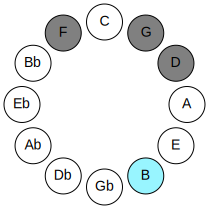
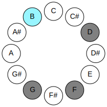
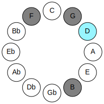
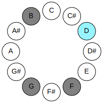
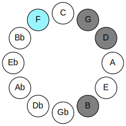
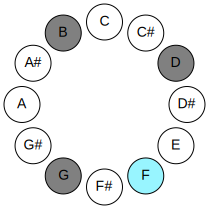
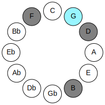
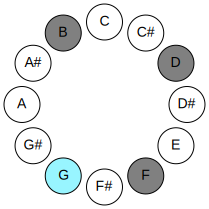

# Mode BNaturalLonic

## Links

- [Documentation](README.md)
- [Scales Index](Scales.md)
- [Modes Index](Modes.md)
- [Chords Index](Chords.md)

## Parent Scale

[Daric](ScaleDaric.md)

## Mode

[BNaturalLonic](ModeBNaturalLonic.md)

## Number

329

## Luminosity

-1

## Tonic

B

## Signature

C

## Transposition

3, 3, 2, 4

## Chord Pattern

## Perfection

 - 1 Perfect Notes

 - 3 Imperfect Notes

 - Perfection Profile - false, false, false, true

## Notes

- B (Imperfect)
- D (Imperfect)
- F (Imperfect)
- G
- B (Imperfect)

## Illustration

## Diagram

| Circle of Fifth | Chromatic Circle |
|-----------------|------------------|
|  |  |
## Relative Modes

| Number | Mode | Luminosity | Tonic | Notes | Illustration |
|--------|------|------------|-------|-------|--------------|
| [329](https://ianring.com/musictheory/scales/329) | [Lonic](ModeLonic.md) | -1 | B | B, D, F, G, B |  |
| [553](https://ianring.com/musictheory/scales/553) | [Phradic](ModePhradic.md) | 3 | D | D, F, G, B, D |  |
| [581](https://ianring.com/musictheory/scales/581) | [Bolic](ModeBolic.md) | -1 | F | F, G, B, D, F |  |
| [1169](https://ianring.com/musictheory/scales/1169) | [Daric](ModeDaric.md) | 4 | G | G, B, D, F, G |  |
## Relative Brightness

| Number | Mode | Luminosity | Tonic | Notes | Circle Of Fifth | Chromatic Circle |
|--------|------|------------|-------|-------|-----------------|------------------|
| [329](https://ianring.com/musictheory/scales/329) | [Lonic](ModeLonic.md) | -1 | B | B, D, F, G, B |  |  |
| [553](https://ianring.com/musictheory/scales/553) | [Phradic](ModePhradic.md) | 3 | D | D, F, G, B, D |  |  |
| [581](https://ianring.com/musictheory/scales/581) | [Bolic](ModeBolic.md) | -1 | F | F, G, B, D, F |  |  |
| [1169](https://ianring.com/musictheory/scales/1169) | [Daric](ModeDaric.md) | 4 | G | G, B, D, F, G |  |  |

## Chords

### B

| Number | Root | Name | Notes | Illustration | Audio |
|--------|------|------|-------|--------------|-------|
| 2084 | B | [Bo](ChordBNaturalDiminished.md) | B, D, F |  | [midi](ChordBNaturalDiminishedRootPosition.mid) |
| 2180 | B | [Bm#5](ChordBNaturalMinorSharpFifth.md) | B, D, G |  | [midi](ChordBNaturalMinorSharpFifthRootPosition.mid) |

### D

| Number | Root | Name | Notes | Illustration | Audio |
|--------|------|------|-------|--------------|-------|
| 164 | D | [Dmbb5](ChordDNaturalMinorDoubleFlatFifth.md) | D, F, G |  | [midi](ChordDNaturalMinorDoubleFlatFifthRootPosition.mid) |
| 2180 | D | [Dsus4##5](ChordDNaturalSuspendedFourthDoubleSharpFifth.md) | D, G, B |  | [midi](ChordDNaturalSuspendedFourthDoubleSharpFifthRootPosition.mid) |

### F

| Number | Root | Name | Notes | Illustration | Audio |
|--------|------|------|-------|--------------|-------|
| 2208 | F | [F](ChordFNaturalDiminishedFlatThird.md) | F, Abb, Cb |  | [midi](ChordFNaturalDiminishedFlatThirdRootPosition.mid) |
| 2208 | F | [Fsus2b5](ChordFNaturalSuspendedSecondFlatFifth.md) | F, G, Cb |  | [midi](ChordFNaturalSuspendedSecondFlatFifthRootPosition.mid) |
| 2212 | F | [FM6sus2b5](ChordFNaturalMajorSixthSuspendedSecondFlatFifth.md) | F, G, Cb, D |  | [midi](ChordFNaturalMajorSixthSuspendedSecondFlatFifthRootPosition.mid) |

### G

| Number | Root | Name | Notes | Illustration | Audio |
|--------|------|------|-------|--------------|-------|
| 132 | G | [G5](ChordGNaturalPowerChord.md) | G, D |  | [midi](ChordGNaturalPowerChordRootPosition.mid) |
| 2180 | G | [GM](ChordGNaturalMajor.md) | G, B, D |  | [midi](ChordGNaturalMajorRootPosition.mid) |
| 2212 | G | [G7](ChordGNaturalDominantSeventh.md) | G, B, D, F |  | [midi](ChordGNaturalDominantSeventhRootPosition.mid) |

