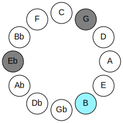
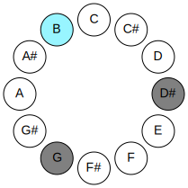
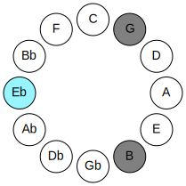
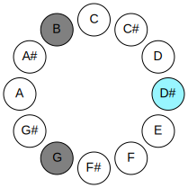
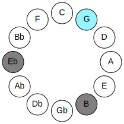
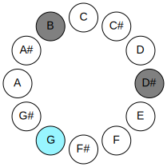

# Mode BNaturalMinoric

## Links

- [Documentation](README.md)
- [Scales Index](Scales.md)
- [Modes Index](Modes.md)
- [Chords Index](Chords.md)

## Parent Scale

[Minoric](ScaleMinoric.md)

## Mode

[BNaturalMinoric](ModeBNaturalMinoric.md)

## Number

273

## Luminosity

-1

## Tonic

B

## Signature

C

## Transposition

4, 4, 4

## Chord Pattern

I⁺, II⁺, III⁺

## Perfection

 - 0 Perfect Notes

 - 3 Imperfect Notes

 - Perfection Profile - false, false, false

## Notes

- B (Imperfect)
- D# (Imperfect)
- G (Imperfect)
- B (Imperfect)

## Illustration

## Diagram

| Circle of Fifth | Chromatic Circle |
|-----------------|------------------|
|  |  |
## Relative Modes

| Number | Mode | Luminosity | Tonic | Notes | Illustration |
|--------|------|------------|-------|-------|--------------|
| [273](https://ianring.com/musictheory/scales/273) | [Minoric](ModeMinoric.md) | -1 | B | B, D#, G, B |  |
| [273](https://ianring.com/musictheory/scales/273) | [Minoric](ModeMinoric.md) | -1 | D# | D#, G, B, D# |  |
| [273](https://ianring.com/musictheory/scales/273) | [Minoric](ModeMinoric.md) | -1 | Eb | Eb, G, B, Eb |  |
| [273](https://ianring.com/musictheory/scales/273) | [Minoric](ModeMinoric.md) | -1 | G | G, B, D#, G |  |
## Relative Brightness

| Number | Mode | Luminosity | Tonic | Notes | Circle Of Fifth | Chromatic Circle |
|--------|------|------------|-------|-------|-----------------|------------------|
| [273](https://ianring.com/musictheory/scales/273) | [Minoric](ModeMinoric.md) | -1 | B | B, D#, G, B |  |  |
| [273](https://ianring.com/musictheory/scales/273) | [Minoric](ModeMinoric.md) | -1 | D# | D#, G, B, D# |  |  |
| [273](https://ianring.com/musictheory/scales/273) | [Minoric](ModeMinoric.md) | -1 | Eb | Eb, G, B, Eb |  |  |
| [273](https://ianring.com/musictheory/scales/273) | [Minoric](ModeMinoric.md) | -1 | G | G, B, D#, G |  |  |

## Chords

### B

| Number | Root | Name | Notes | Illustration | Audio |
|--------|------|------|-------|--------------|-------|
| 2184 | B | [B+](ChordBNaturalAugmented.md) | B, D#, F## |  | [midi](ChordBNaturalAugmentedRootPosition.mid) |
| 2184 | B | [B+7](ChordBNaturalAugmentedAugmentedSeventh.md) | B, D#, F##, A## |  | [midi](ChordBNaturalAugmentedAugmentedSeventhRootPosition.mid) |

### D#

| Number | Root | Name | Notes | Illustration | Audio |
|--------|------|------|-------|--------------|-------|
| 2184 | D# | [D#+](ChordDSharpAugmented.md) | D#, F##, A## |  | [midi](ChordDSharpAugmentedRootPosition.mid) |
| 2184 | D# | [D#+7](ChordDSharpAugmentedAugmentedSeventh.md) | D#, F##, A##, C### |  | [midi](ChordDSharpAugmentedAugmentedSeventhRootPosition.mid) |
| 2184 | D# | [Eb+](ChordEFlatAugmented.md) | Eb, G, B |  | [midi](ChordEFlatAugmentedRootPosition.mid) |
| 2184 | D# | [Eb+7](ChordEFlatAugmentedAugmentedSeventh.md) | Eb, G, B, D# |  | [midi](ChordEFlatAugmentedAugmentedSeventhRootPosition.mid) |

### G

| Number | Root | Name | Notes | Illustration | Audio |
|--------|------|------|-------|--------------|-------|
| 2184 | G | [G+](ChordGNaturalAugmented.md) | G, B, D# |  | [midi](ChordGNaturalAugmentedRootPosition.mid) |
| 2184 | G | [G+7](ChordGNaturalAugmentedAugmentedSeventh.md) | G, B, D#, F## |  | [midi](ChordGNaturalAugmentedAugmentedSeventhRootPosition.mid) |

