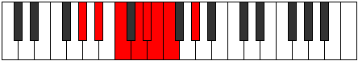

# Mode Bacrian

## Links

- [Documentation](README.md)
- [Scales Index](Scales.md)
- [Modes Index](Modes.md)
- [Chords Index](Chords.md)

## Parent Scale

[Phraptian](ScalePhraptian.md)

## Number

[981](https://ianring.com/musictheory/scales/981)

## Interval Pattern

2, 2, 2, 1, 1, 1, 3

## Chord Pattern

I, VI⁺

## Perfection

- 4 Perfect notes
- 3 Perfect notes

## Perfection Profile

[true true false false true false true]

## Permutations

| Tonic | Notes | Signature | Illustration | Audio |
|-------|-------|-----------|--------------|-------|
| [C](ModeCNaturalBacrian.md) | C, D, **E**, **F#**, G, **Ab**, Bbb, C | C |  | [midi](https://github.com/edipermadi/music/blob/main/docs/ModeCNaturalBacrian.mid?raw=true) |
| [C#](ModeCSharpBacrian.md) | C#, D#, **E#**, **F##**, G#, **A**, Bb, C# | C |  | [midi](https://github.com/edipermadi/music/blob/main/docs/ModeCSharpBacrian.mid?raw=true) |
| [Db](ModeDFlatBacrian.md) | Db, Eb, **F**, **G**, Ab, **Bbb**, Cbb, Db | C |  | [midi](https://github.com/edipermadi/music/blob/main/docs/ModeDFlatBacrian.mid?raw=true) |
| [D](ModeDNaturalBacrian.md) | D, E, **F#**, **G#**, A, **Bb**, Cb, D | C |  | [midi](https://github.com/edipermadi/music/blob/main/docs/ModeDNaturalBacrian.mid?raw=true) |
| [D#](ModeDSharpBacrian.md) | D#, E#, **F##**, **G##**, A#, **B**, C, D# | C |  | [midi](https://github.com/edipermadi/music/blob/main/docs/ModeDSharpBacrian.mid?raw=true) |
| [Eb](ModeEFlatBacrian.md) | Eb, F, **G**, **A**, Bb, **Cb**, Dbb, Eb | C |  | [midi](https://github.com/edipermadi/music/blob/main/docs/ModeEFlatBacrian.mid?raw=true) |
| [E](ModeENaturalBacrian.md) | E, F#, **G#**, **A#**, B, **C**, Db, E | C |  | [midi](https://github.com/edipermadi/music/blob/main/docs/ModeENaturalBacrian.mid?raw=true) |
| [F](ModeFNaturalBacrian.md) | F, G, **A**, **B**, C, **Db**, Ebb, F | C |  | [midi](https://github.com/edipermadi/music/blob/main/docs/ModeFNaturalBacrian.mid?raw=true) |
| [F#](ModeFSharpBacrian.md) | F#, G#, **A#**, **B#**, C#, **D**, Eb, F# | C |  | [midi](https://github.com/edipermadi/music/blob/main/docs/ModeFSharpBacrian.mid?raw=true) |
| [Gb](ModeGFlatBacrian.md) | Gb, Ab, **Bb**, **C**, Db, **Ebb**, Fbb, Gb | C |  | [midi](https://github.com/edipermadi/music/blob/main/docs/ModeGFlatBacrian.mid?raw=true) |
| [G](ModeGNaturalBacrian.md) | G, A, **B**, **C#**, D, **Eb**, Fb, G | C |  | [midi](https://github.com/edipermadi/music/blob/main/docs/ModeGNaturalBacrian.mid?raw=true) |
| [G#](ModeGSharpBacrian.md) | G#, A#, **B#**, **C##**, D#, **E**, F, G# | C |  | [midi](https://github.com/edipermadi/music/blob/main/docs/ModeGSharpBacrian.mid?raw=true) |
| [Ab](ModeAFlatBacrian.md) | Ab, Bb, **C**, **D**, Eb, **Fb**, Gbb, Ab | C |  | [midi](https://github.com/edipermadi/music/blob/main/docs/ModeAFlatBacrian.mid?raw=true) |
| [A](ModeANaturalBacrian.md) | A, B, **C#**, **D#**, E, **F**, Gb, A | C |  | [midi](https://github.com/edipermadi/music/blob/main/docs/ModeANaturalBacrian.mid?raw=true) |
| [A#](ModeASharpBacrian.md) | A#, B#, **C##**, **D##**, E#, **F#**, G, A# | C |  | [midi](https://github.com/edipermadi/music/blob/main/docs/ModeASharpBacrian.mid?raw=true) |
| [Bb](ModeBFlatBacrian.md) | Bb, C, **D**, **E**, F, **Gb**, Abb, Bb | C |  | [midi](https://github.com/edipermadi/music/blob/main/docs/ModeBFlatBacrian.mid?raw=true) |
| [B](ModeBNaturalBacrian.md) | B, C#, **D#**, **E#**, F#, **G**, Ab, B | C |  | [midi](https://github.com/edipermadi/music/blob/main/docs/ModeBNaturalBacrian.mid?raw=true) |
