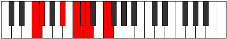

# Mode Bacrimic

## Links

- [Documentation](index.md)
- [Scales Index](Scales.md)
- [Modes Index](Modes.md)
- [Chords Index](Chords.md)

## Parent Scale

[Aerycrimic](ScaleAerycrimic.md)

## Number

[931](https://ianring.com/musictheory/scales/931)

## Perfection

- 3 Perfect notes
- 3 Perfect notes

## Perfection Profile

[true true true false false false]

## Permutations

| Tonic | Notes | Signature | Illustration | Audio |
|-------|-------|-----------|--------------|-------|
| [C](ModeCNaturalBacrimic.md) | C, Db, E#, **F##**, **G#**, **A**, C | C |  | [midi](ModeCNaturalBacrimic.mid) [ogg](ModeCNaturalBacrimic.ogg) |
| [C#](ModeCSharpBacrimic.md) | C#, D, E##, **F###**, **G##**, **A#**, C# | C |  | [midi](ModeCSharpBacrimic.mid) [ogg](ModeCSharpBacrimic.ogg) |
| [Db](ModeDFlatBacrimic.md) | Db, Ebb, F#, **G#**, **A**, **Bb**, Db | C |  | [midi](ModeDFlatBacrimic.mid) [ogg](ModeDFlatBacrimic.ogg) |
| [D](ModeDNaturalBacrimic.md) | D, Eb, F##, **G##**, **A#**, **B**, D | C |  | [midi](ModeDNaturalBacrimic.mid) [ogg](ModeDNaturalBacrimic.ogg) |
| [D#](ModeDSharpBacrimic.md) | D#, E, F###, **G###**, **A##**, **B#**, D# | C |  | [midi](ModeDSharpBacrimic.mid) [ogg](ModeDSharpBacrimic.ogg) |
| [Eb](ModeEFlatBacrimic.md) | Eb, Fb, G#, **A#**, **B**, **C**, Eb | C |  | [midi](ModeEFlatBacrimic.mid) [ogg](ModeEFlatBacrimic.ogg) |
| [E](ModeENaturalBacrimic.md) | E, F, G##, **A##**, **B#**, **C#**, E | C |  | [midi](ModeENaturalBacrimic.mid) [ogg](ModeENaturalBacrimic.ogg) |
| [F](ModeFNaturalBacrimic.md) | F, Gb, A#, **B#**, **C#**, **D**, F | C |  | [midi](ModeFNaturalBacrimic.mid) [ogg](ModeFNaturalBacrimic.ogg) |
| [F#](ModeFSharpBacrimic.md) | F#, G, A##, **B##**, **C##**, **D#**, F# | C |  | [midi](ModeFSharpBacrimic.mid) [ogg](ModeFSharpBacrimic.ogg) |
| [Gb](ModeGFlatBacrimic.md) | Gb, Abb, B, **C#**, **D**, **Eb**, Gb | C |  | [midi](ModeGFlatBacrimic.mid) [ogg](ModeGFlatBacrimic.ogg) |
| [G](ModeGNaturalBacrimic.md) | G, Ab, B#, **C##**, **D#**, **E**, G | C |  | [midi](ModeGNaturalBacrimic.mid) [ogg](ModeGNaturalBacrimic.ogg) |
| [G#](ModeGSharpBacrimic.md) | G#, A, B##, **C###**, **D##**, **E#**, G# | C |  | [midi](ModeGSharpBacrimic.mid) [ogg](ModeGSharpBacrimic.ogg) |
| [Ab](ModeAFlatBacrimic.md) | Ab, Bbb, C#, **D#**, **E**, **F**, Ab | C |  | [midi](ModeAFlatBacrimic.mid) [ogg](ModeAFlatBacrimic.ogg) |
| [A](ModeANaturalBacrimic.md) | A, Bb, C##, **D##**, **E#**, **F#**, A | C |  | [midi](ModeANaturalBacrimic.mid) [ogg](ModeANaturalBacrimic.ogg) |
| [A#](ModeASharpBacrimic.md) | A#, B, C###, **D###**, **E##**, **F##**, A# | C |  | [midi](ModeASharpBacrimic.mid) [ogg](ModeASharpBacrimic.ogg) |
| [Bb](ModeBFlatBacrimic.md) | Bb, Cb, D#, **E#**, **F#**, **G**, Bb | C |  | [midi](ModeBFlatBacrimic.mid) [ogg](ModeBFlatBacrimic.ogg) |
| [B](ModeBNaturalBacrimic.md) | B, C, D##, **E##**, **F##**, **G#**, B | C |  | [midi](ModeBNaturalBacrimic.mid) [ogg](ModeBNaturalBacrimic.ogg) |
