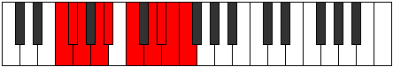

# Mode Bacrygic

## Links

- [Documentation](index.md)
- [Scales Index](Scales.md)
- [Modes Index](Modes.md)
- [Chords Index](Chords.md)

## Parent Scale

[Apinygic](ScaleApinygic.md)

## Number

[3767](https://ianring.com/musictheory/scales/3767)

## Interval Pattern

1, 1, 2, 1, 2, 2, 1, 1, 1

## Chord Pattern

I, ii⁰, II⁺, iii, iv⁰, iv, V, V⁺, vi⁰, vi, VI, vii, VII, VII⁺, viii⁰, viii, VIII, ix⁰

## Perfection

- 7 Perfect notes
- 2 Perfect notes

## Perfection Profile

[true false true true true true true true false]

## Permutations

| Tonic | Notes | Signature | Illustration | Audio |
|-------|-------|-----------|--------------|-------|
| [C](ModeCNaturalBacrygic.md) | C, **C#**, D, E, F, G, A, A#, **B**, C | C |  | [midi](https://github.com/edipermadi/music/blob/main/docs/ModeCNaturalBacrygic.mid?raw=true) |
| [C#](ModeCSharpBacrygic.md) | C#, **D**, D#, F, F#, G#, A#, B, **C**, C# | C |  | [midi](https://github.com/edipermadi/music/blob/main/docs/ModeCSharpBacrygic.mid?raw=true) |
| [Db](ModeDFlatBacrygic.md) | Db, **D**, Eb, F, Gb, Ab, Bb, B, **C**, Db | C |  | [midi](https://github.com/edipermadi/music/blob/main/docs/ModeDFlatBacrygic.mid?raw=true) |
| [D](ModeDNaturalBacrygic.md) | D, **D#**, E, F#, G, A, B, C, **C#**, D | C |  | [midi](https://github.com/edipermadi/music/blob/main/docs/ModeDNaturalBacrygic.mid?raw=true) |
| [D#](ModeDSharpBacrygic.md) | D#, **E**, F, G, G#, A#, C, C#, **D**, D# | C |  | [midi](https://github.com/edipermadi/music/blob/main/docs/ModeDSharpBacrygic.mid?raw=true) |
| [Eb](ModeEFlatBacrygic.md) | Eb, **E**, F, G, Ab, Bb, C, Db, **D**, Eb | C |  | [midi](https://github.com/edipermadi/music/blob/main/docs/ModeEFlatBacrygic.mid?raw=true) |
| [E](ModeENaturalBacrygic.md) | E, **F**, F#, G#, A, B, C#, D, **D#**, E | C |  | [midi](https://github.com/edipermadi/music/blob/main/docs/ModeENaturalBacrygic.mid?raw=true) |
| [F](ModeFNaturalBacrygic.md) | F, **F#**, G, A, A#, C, D, D#, **E**, F | C |  | [midi](https://github.com/edipermadi/music/blob/main/docs/ModeFNaturalBacrygic.mid?raw=true) |
| [F#](ModeFSharpBacrygic.md) | F#, **G**, G#, A#, B, C#, D#, E, **F**, F# | C |  | [midi](https://github.com/edipermadi/music/blob/main/docs/ModeFSharpBacrygic.mid?raw=true) |
| [Gb](ModeGFlatBacrygic.md) | Gb, **G**, Ab, Bb, B, Db, Eb, E, **F**, Gb | C |  | [midi](https://github.com/edipermadi/music/blob/main/docs/ModeGFlatBacrygic.mid?raw=true) |
| [G](ModeGNaturalBacrygic.md) | G, **G#**, A, B, C, D, E, F, **F#**, G | C |  | [midi](https://github.com/edipermadi/music/blob/main/docs/ModeGNaturalBacrygic.mid?raw=true) |
| [G#](ModeGSharpBacrygic.md) | G#, **A**, A#, C, C#, D#, F, F#, **G**, G# | C |  | [midi](https://github.com/edipermadi/music/blob/main/docs/ModeGSharpBacrygic.mid?raw=true) |
| [Ab](ModeAFlatBacrygic.md) | Ab, **A**, Bb, C, Db, Eb, F, Gb, **G**, Ab | C |  | [midi](https://github.com/edipermadi/music/blob/main/docs/ModeAFlatBacrygic.mid?raw=true) |
| [A](ModeANaturalBacrygic.md) | A, **A#**, B, C#, D, E, F#, G, **G#**, A | C |  | [midi](https://github.com/edipermadi/music/blob/main/docs/ModeANaturalBacrygic.mid?raw=true) |
| [A#](ModeASharpBacrygic.md) | A#, **B**, C, D, D#, F, G, G#, **A**, A# | C |  | [midi](https://github.com/edipermadi/music/blob/main/docs/ModeASharpBacrygic.mid?raw=true) |
| [Bb](ModeBFlatBacrygic.md) | Bb, **B**, C, D, Eb, F, G, Ab, **A**, Bb | C |  | [midi](https://github.com/edipermadi/music/blob/main/docs/ModeBFlatBacrygic.mid?raw=true) |
| [B](ModeBNaturalBacrygic.md) | B, **C**, C#, D#, E, F#, G#, A, **A#**, B | C |  | [midi](https://github.com/edipermadi/music/blob/main/docs/ModeBNaturalBacrygic.mid?raw=true) |
