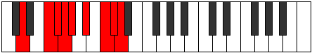

# Mode Bacryllic

## Links

- [Documentation](README.md)
- [Scales Index](Scales.md)
- [Modes Index](Modes.md)
- [Chords Index](Chords.md)

## Parent Scale

[Bacryllic](ScaleBacryllic.md)

## Number

[3449](https://ianring.com/musictheory/scales/3449)

## Interval Pattern

3, 1, 1, 1, 2, 2, 1, 1

## Chord Pattern

Ib5, iii⁰b3, iv⁰, Vb5, vi, vii⁰b3, VIIIb5

## Perfection

- 6 Perfect notes
- 2 Perfect notes

## Perfection Profile

[false true true true false true true true]

## Permutations

| Tonic | Notes | Signature | Illustration | Audio |
|-------|-------|-----------|--------------|-------|
| [C](ModeCNaturalBacryllic.md) | **C**, D#, E, F, **F#**, G#, A#, B, **C** | C |  | [midi](https://github.com/edipermadi/music/blob/main/docs/ModeCNaturalBacryllic.mid?raw=true) |
| [C#](ModeCSharpBacryllic.md) | **C#**, E, F, F#, **G**, A, B, C, **C#** | C |  | [midi](https://github.com/edipermadi/music/blob/main/docs/ModeCSharpBacryllic.mid?raw=true) |
| [Db](ModeDFlatBacryllic.md) | **Db**, E, F, Gb, **G**, A, B, C, **Db** | C |  | [midi](https://github.com/edipermadi/music/blob/main/docs/ModeDFlatBacryllic.mid?raw=true) |
| [D](ModeDNaturalBacryllic.md) | **D**, F, F#, G, **G#**, A#, C, C#, **D** | C |  | [midi](https://github.com/edipermadi/music/blob/main/docs/ModeDNaturalBacryllic.mid?raw=true) |
| [D#](ModeDSharpBacryllic.md) | **D#**, F#, G, G#, **A**, B, C#, D, **D#** | C |  | [midi](https://github.com/edipermadi/music/blob/main/docs/ModeDSharpBacryllic.mid?raw=true) |
| [Eb](ModeEFlatBacryllic.md) | **Eb**, Gb, G, Ab, **A**, B, Db, D, **Eb** | C |  | [midi](https://github.com/edipermadi/music/blob/main/docs/ModeEFlatBacryllic.mid?raw=true) |
| [E](ModeENaturalBacryllic.md) | **E**, G, G#, A, **A#**, C, D, D#, **E** | C |  | [midi](https://github.com/edipermadi/music/blob/main/docs/ModeENaturalBacryllic.mid?raw=true) |
| [F](ModeFNaturalBacryllic.md) | **F**, G#, A, A#, **B**, C#, D#, E, **F** | C |  | [midi](https://github.com/edipermadi/music/blob/main/docs/ModeFNaturalBacryllic.mid?raw=true) |
| [F#](ModeFSharpBacryllic.md) | **F#**, A, A#, B, **C**, D, E, F, **F#** | C |  | [midi](https://github.com/edipermadi/music/blob/main/docs/ModeFSharpBacryllic.mid?raw=true) |
| [Gb](ModeGFlatBacryllic.md) | **Gb**, A, Bb, B, **C**, D, E, F, **Gb** | C |  | [midi](https://github.com/edipermadi/music/blob/main/docs/ModeGFlatBacryllic.mid?raw=true) |
| [G](ModeGNaturalBacryllic.md) | **G**, A#, B, C, **C#**, D#, F, F#, **G** | C |  | [midi](https://github.com/edipermadi/music/blob/main/docs/ModeGNaturalBacryllic.mid?raw=true) |
| [G#](ModeGSharpBacryllic.md) | **G#**, B, C, C#, **D**, E, F#, G, **G#** | C |  | [midi](https://github.com/edipermadi/music/blob/main/docs/ModeGSharpBacryllic.mid?raw=true) |
| [Ab](ModeAFlatBacryllic.md) | **Ab**, B, C, Db, **D**, E, Gb, G, **Ab** | C |  | [midi](https://github.com/edipermadi/music/blob/main/docs/ModeAFlatBacryllic.mid?raw=true) |
| [A](ModeANaturalBacryllic.md) | **A**, C, C#, D, **D#**, F, G, G#, **A** | C |  | [midi](https://github.com/edipermadi/music/blob/main/docs/ModeANaturalBacryllic.mid?raw=true) |
| [A#](ModeASharpBacryllic.md) | **A#**, C#, D, D#, **E**, F#, G#, A, **A#** | C |  | [midi](https://github.com/edipermadi/music/blob/main/docs/ModeASharpBacryllic.mid?raw=true) |
| [Bb](ModeBFlatBacryllic.md) | **Bb**, Db, D, Eb, **E**, Gb, Ab, A, **Bb** | C |  | [midi](https://github.com/edipermadi/music/blob/main/docs/ModeBFlatBacryllic.mid?raw=true) |
| [B](ModeBNaturalBacryllic.md) | **B**, D, D#, E, **F**, G, A, A#, **B** | C |  | [midi](https://github.com/edipermadi/music/blob/main/docs/ModeBNaturalBacryllic.mid?raw=true) |
