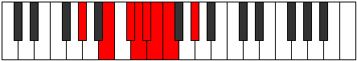

# Mode Badian

## Links

- [Documentation](index.md)
- [Scales Index](Scales.md)
- [Modes Index](Modes.md)
- [Chords Index](Chords.md)

## Parent Scale

[Bonian](ScaleBonian.md)

## Number

[1001](https://ianring.com/musictheory/scales/1001)

## Perfection

- 3 Perfect notes
- 4 Perfect notes

## Perfection Profile

[true false true false false true false]

## Permutations

| Tonic | Notes | Signature | Illustration | Audio |
|-------|-------|-----------|--------------|-------|
| [C](ModeCNaturalBadian.md) | C, **D#**, E#, **F#**, **G**, Ab, **Bbb**, C | C |  | [midi](ModeCNaturalBadian.mid) [ogg](ModeCNaturalBadian.ogg) |
| [C#](ModeCSharpBadian.md) | C#, **D##**, E##, **F##**, **G#**, A, **Bb**, C# | C |  | [midi](ModeCSharpBadian.mid) [ogg](ModeCSharpBadian.ogg) |
| [Db](ModeDFlatBadian.md) | Db, **E**, F#, **G**, **Ab**, Bbb, **Cbb**, Db | C |  | [midi](ModeDFlatBadian.mid) [ogg](ModeDFlatBadian.ogg) |
| [D](ModeDNaturalBadian.md) | D, **E#**, F##, **G#**, **A**, Bb, **Cb**, D | C |  | [midi](ModeDNaturalBadian.mid) [ogg](ModeDNaturalBadian.ogg) |
| [D#](ModeDSharpBadian.md) | D#, **E##**, F###, **G##**, **A#**, B, **C**, D# | C |  | [midi](ModeDSharpBadian.mid) [ogg](ModeDSharpBadian.ogg) |
| [Eb](ModeEFlatBadian.md) | Eb, **F#**, G#, **A**, **Bb**, Cb, **Dbb**, Eb | C |  | [midi](ModeEFlatBadian.mid) [ogg](ModeEFlatBadian.ogg) |
| [E](ModeENaturalBadian.md) | E, **F##**, G##, **A#**, **B**, C, **Db**, E | C |  | [midi](ModeENaturalBadian.mid) [ogg](ModeENaturalBadian.ogg) |
| [F](ModeFNaturalBadian.md) | F, **G#**, A#, **B**, **C**, Db, **Ebb**, F | C |  | [midi](ModeFNaturalBadian.mid) [ogg](ModeFNaturalBadian.ogg) |
| [F#](ModeFSharpBadian.md) | F#, **G##**, A##, **B#**, **C#**, D, **Eb**, F# | C |  | [midi](ModeFSharpBadian.mid) [ogg](ModeFSharpBadian.ogg) |
| [Gb](ModeGFlatBadian.md) | Gb, **A**, B, **C**, **Db**, Ebb, **Fbb**, Gb | C |  | [midi](ModeGFlatBadian.mid) [ogg](ModeGFlatBadian.ogg) |
| [G](ModeGNaturalBadian.md) | G, **A#**, B#, **C#**, **D**, Eb, **Fb**, G | C |  | [midi](ModeGNaturalBadian.mid) [ogg](ModeGNaturalBadian.ogg) |
| [G#](ModeGSharpBadian.md) | G#, **A##**, B##, **C##**, **D#**, E, **F**, G# | C |  | [midi](ModeGSharpBadian.mid) [ogg](ModeGSharpBadian.ogg) |
| [Ab](ModeAFlatBadian.md) | Ab, **B**, C#, **D**, **Eb**, Fb, **Gbb**, Ab | C |  | [midi](ModeAFlatBadian.mid) [ogg](ModeAFlatBadian.ogg) |
| [A](ModeANaturalBadian.md) | A, **B#**, C##, **D#**, **E**, F, **Gb**, A | C |  | [midi](ModeANaturalBadian.mid) [ogg](ModeANaturalBadian.ogg) |
| [A#](ModeASharpBadian.md) | A#, **B##**, C###, **D##**, **E#**, F#, **G**, A# | C |  | [midi](ModeASharpBadian.mid) [ogg](ModeASharpBadian.ogg) |
| [Bb](ModeBFlatBadian.md) | Bb, **C#**, D#, **E**, **F**, Gb, **Abb**, Bb | C |  | [midi](ModeBFlatBadian.mid) [ogg](ModeBFlatBadian.ogg) |
| [B](ModeBNaturalBadian.md) | B, **C##**, D##, **E#**, **F#**, G, **Ab**, B | C |  | [midi](ModeBNaturalBadian.mid) [ogg](ModeBNaturalBadian.ogg) |
