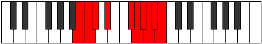

# Mode Badygic

## Links

- [Documentation](index.md)
- [Scales Index](Scales.md)
- [Modes Index](Modes.md)
- [Chords Index](Chords.md)

## Parent Scale

[Aeolacrygic](ScaleAeolacrygic.md)

## Number

[3991](https://ianring.com/musictheory/scales/3991)

## Perfection

- 6 Perfect notes
- 3 Perfect notes

## Perfection Profile

[true true true true true false true false false]

## Permutations

| Tonic | Notes | Signature | Illustration | Audio |
|-------|-------|-----------|--------------|-------|
| [C](ModeCNaturalBadygic.md) | C, C#, D, E, G, **G#**, A, **A#**, **B**, C | C |  | [midi](ModeCNaturalBadygic.mid) [ogg](ModeCNaturalBadygic.ogg) |
| [C#](ModeCSharpBadygic.md) | C#, D, D#, F, G#, **A**, A#, **B**, **C**, C# | C |  | [midi](ModeCSharpBadygic.mid) [ogg](ModeCSharpBadygic.ogg) |
| [Db](ModeDFlatBadygic.md) | Db, D, Eb, F, Ab, **A**, Bb, **B**, **C**, Db | C |  | [midi](ModeDFlatBadygic.mid) [ogg](ModeDFlatBadygic.ogg) |
| [D](ModeDNaturalBadygic.md) | D, D#, E, F#, A, **A#**, B, **C**, **C#**, D | C |  | [midi](ModeDNaturalBadygic.mid) [ogg](ModeDNaturalBadygic.ogg) |
| [D#](ModeDSharpBadygic.md) | D#, E, F, G, A#, **B**, C, **C#**, **D**, D# | C |  | [midi](ModeDSharpBadygic.mid) [ogg](ModeDSharpBadygic.ogg) |
| [Eb](ModeEFlatBadygic.md) | Eb, E, F, G, Bb, **B**, C, **Db**, **D**, Eb | C |  | [midi](ModeEFlatBadygic.mid) [ogg](ModeEFlatBadygic.ogg) |
| [E](ModeENaturalBadygic.md) | E, F, F#, G#, B, **C**, C#, **D**, **D#**, E | C |  | [midi](ModeENaturalBadygic.mid) [ogg](ModeENaturalBadygic.ogg) |
| [F](ModeFNaturalBadygic.md) | F, F#, G, A, C, **C#**, D, **D#**, **E**, F | C |  | [midi](ModeFNaturalBadygic.mid) [ogg](ModeFNaturalBadygic.ogg) |
| [F#](ModeFSharpBadygic.md) | F#, G, G#, A#, C#, **D**, D#, **E**, **F**, F# | C |  | [midi](ModeFSharpBadygic.mid) [ogg](ModeFSharpBadygic.ogg) |
| [Gb](ModeGFlatBadygic.md) | Gb, G, Ab, Bb, Db, **D**, Eb, **E**, **F**, Gb | C |  | [midi](ModeGFlatBadygic.mid) [ogg](ModeGFlatBadygic.ogg) |
| [G](ModeGNaturalBadygic.md) | G, G#, A, B, D, **D#**, E, **F**, **F#**, G | C |  | [midi](ModeGNaturalBadygic.mid) [ogg](ModeGNaturalBadygic.ogg) |
| [G#](ModeGSharpBadygic.md) | G#, A, A#, C, D#, **E**, F, **F#**, **G**, G# | C |  | [midi](ModeGSharpBadygic.mid) [ogg](ModeGSharpBadygic.ogg) |
| [Ab](ModeAFlatBadygic.md) | Ab, A, Bb, C, Eb, **E**, F, **Gb**, **G**, Ab | C |  | [midi](ModeAFlatBadygic.mid) [ogg](ModeAFlatBadygic.ogg) |
| [A](ModeANaturalBadygic.md) | A, A#, B, C#, E, **F**, F#, **G**, **G#**, A | C |  | [midi](ModeANaturalBadygic.mid) [ogg](ModeANaturalBadygic.ogg) |
| [A#](ModeASharpBadygic.md) | A#, B, C, D, F, **F#**, G, **G#**, **A**, A# | C |  | [midi](ModeASharpBadygic.mid) [ogg](ModeASharpBadygic.ogg) |
| [Bb](ModeBFlatBadygic.md) | Bb, B, C, D, F, **Gb**, G, **Ab**, **A**, Bb | C |  | [midi](ModeBFlatBadygic.mid) [ogg](ModeBFlatBadygic.ogg) |
| [B](ModeBNaturalBadygic.md) | B, C, C#, D#, F#, **G**, G#, **A**, **A#**, B | C |  | [midi](ModeBNaturalBadygic.mid) [ogg](ModeBNaturalBadygic.ogg) |
