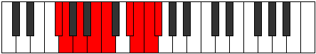

# Mode Badyllic

## Links

- [Documentation](index.md)
- [Scales Index](Scales.md)
- [Modes Index](Modes.md)
- [Chords Index](Chords.md)

## Parent Scale

[Gythyllic](ScaleGythyllic.md)

## Number

[3691](https://ianring.com/musictheory/scales/3691)

## Perfection

- 5 Perfect notes
- 3 Perfect notes

## Perfection Profile

[false false true true true false true true]

## Permutations

| Tonic | Notes | Signature | Illustration | Audio |
|-------|-------|-----------|--------------|-------|
| [C](ModeCNaturalBadyllic.md) | **C**, **C#**, D#, F, F#, **A**, A#, B, **C** | C |  | [midi](ModeCNaturalBadyllic.mid) [ogg](ModeCNaturalBadyllic.ogg) |
| [C#](ModeCSharpBadyllic.md) | **C#**, **D**, E, F#, G, **A#**, B, C, **C#** | C |  | [midi](ModeCSharpBadyllic.mid) [ogg](ModeCSharpBadyllic.ogg) |
| [Db](ModeDFlatBadyllic.md) | **Db**, **D**, E, Gb, G, **Bb**, B, C, **Db** | C |  | [midi](ModeDFlatBadyllic.mid) [ogg](ModeDFlatBadyllic.ogg) |
| [D](ModeDNaturalBadyllic.md) | **D**, **D#**, F, G, G#, **B**, C, C#, **D** | C |  | [midi](ModeDNaturalBadyllic.mid) [ogg](ModeDNaturalBadyllic.ogg) |
| [D#](ModeDSharpBadyllic.md) | **D#**, **E**, F#, G#, A, **C**, C#, D, **D#** | C |  | [midi](ModeDSharpBadyllic.mid) [ogg](ModeDSharpBadyllic.ogg) |
| [Eb](ModeEFlatBadyllic.md) | **Eb**, **E**, Gb, Ab, A, **C**, Db, D, **Eb** | C |  | [midi](ModeEFlatBadyllic.mid) [ogg](ModeEFlatBadyllic.ogg) |
| [E](ModeENaturalBadyllic.md) | **E**, **F**, G, A, A#, **C#**, D, D#, **E** | C |  | [midi](ModeENaturalBadyllic.mid) [ogg](ModeENaturalBadyllic.ogg) |
| [F](ModeFNaturalBadyllic.md) | **F**, **F#**, G#, A#, B, **D**, D#, E, **F** | C |  | [midi](ModeFNaturalBadyllic.mid) [ogg](ModeFNaturalBadyllic.ogg) |
| [F#](ModeFSharpBadyllic.md) | **F#**, **G**, A, B, C, **D#**, E, F, **F#** | C |  | [midi](ModeFSharpBadyllic.mid) [ogg](ModeFSharpBadyllic.ogg) |
| [Gb](ModeGFlatBadyllic.md) | **Gb**, **G**, A, B, C, **Eb**, E, F, **Gb** | C |  | [midi](ModeGFlatBadyllic.mid) [ogg](ModeGFlatBadyllic.ogg) |
| [G](ModeGNaturalBadyllic.md) | **G**, **G#**, A#, C, C#, **E**, F, F#, **G** | C |  | [midi](ModeGNaturalBadyllic.mid) [ogg](ModeGNaturalBadyllic.ogg) |
| [G#](ModeGSharpBadyllic.md) | **G#**, **A**, B, C#, D, **F**, F#, G, **G#** | C |  | [midi](ModeGSharpBadyllic.mid) [ogg](ModeGSharpBadyllic.ogg) |
| [Ab](ModeAFlatBadyllic.md) | **Ab**, **A**, B, Db, D, **F**, Gb, G, **Ab** | C |  | [midi](ModeAFlatBadyllic.mid) [ogg](ModeAFlatBadyllic.ogg) |
| [A](ModeANaturalBadyllic.md) | **A**, **A#**, C, D, D#, **F#**, G, G#, **A** | C |  | [midi](ModeANaturalBadyllic.mid) [ogg](ModeANaturalBadyllic.ogg) |
| [A#](ModeASharpBadyllic.md) | **A#**, **B**, C#, D#, E, **G**, G#, A, **A#** | C |  | [midi](ModeASharpBadyllic.mid) [ogg](ModeASharpBadyllic.ogg) |
| [Bb](ModeBFlatBadyllic.md) | **Bb**, **B**, Db, Eb, E, **G**, Ab, A, **Bb** | C |  | [midi](ModeBFlatBadyllic.mid) [ogg](ModeBFlatBadyllic.ogg) |
| [B](ModeBNaturalBadyllic.md) | **B**, **C**, D, E, F, **G#**, A, A#, **B** | C |  | [midi](ModeBNaturalBadyllic.mid) [ogg](ModeBNaturalBadyllic.ogg) |
