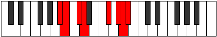

# Mode Bagian

## Links

- [Documentation](README.md)
- [Scales Index](Scales.md)
- [Modes Index](Modes.md)
- [Chords Index](Chords.md)

## Parent Scale

[Epycrian](ScaleEpycrian.md)

## Number

[3355](https://ianring.com/musictheory/scales/3355)

## Interval Pattern

1, 2, 1, 4, 2, 1, 1

## Chord Pattern

## Perfection

- 4 Perfect notes
- 3 Perfect notes

## Perfection Profile

[false true true true true false false]

## Permutations

| Tonic | Notes | Signature | Illustration | Audio |
|-------|-------|-----------|--------------|-------|
| [C](ModeCNaturalBagian.md) | **C**, Db, Eb, Fb, G#, **A#**, **B**, **C** | C |  | [midi](https://github.com/edipermadi/music/blob/main/docs/ModeCNaturalBagian.mid?raw=true) |
| [C#](ModeCSharpBagian.md) | **C#**, D, E, F, G##, **A##**, **B#**, **C#** | C |  | [midi](https://github.com/edipermadi/music/blob/main/docs/ModeCSharpBagian.mid?raw=true) |
| [Db](ModeDFlatBagian.md) | **Db**, Ebb, Fb, Gbb, A, **B**, **C**, **Db** | C |  | [midi](https://github.com/edipermadi/music/blob/main/docs/ModeDFlatBagian.mid?raw=true) |
| [D](ModeDNaturalBagian.md) | **D**, Eb, F, Gb, A#, **B#**, **C#**, **D** | C |  | [midi](https://github.com/edipermadi/music/blob/main/docs/ModeDNaturalBagian.mid?raw=true) |
| [D#](ModeDSharpBagian.md) | **D#**, E, F#, G, A##, **B##**, **C##**, **D#** | C |  | [midi](https://github.com/edipermadi/music/blob/main/docs/ModeDSharpBagian.mid?raw=true) |
| [Eb](ModeEFlatBagian.md) | **Eb**, Fb, Gb, Abb, B, **C#**, **D**, **Eb** | C |  | [midi](https://github.com/edipermadi/music/blob/main/docs/ModeEFlatBagian.mid?raw=true) |
| [E](ModeENaturalBagian.md) | **E**, F, G, Ab, B#, **C##**, **D#**, **E** | C |  | [midi](https://github.com/edipermadi/music/blob/main/docs/ModeENaturalBagian.mid?raw=true) |
| [F](ModeFNaturalBagian.md) | **F**, Gb, Ab, Bbb, C#, **D#**, **E**, **F** | C |  | [midi](https://github.com/edipermadi/music/blob/main/docs/ModeFNaturalBagian.mid?raw=true) |
| [F#](ModeFSharpBagian.md) | **F#**, G, A, Bb, C##, **D##**, **E#**, **F#** | C |  | [midi](https://github.com/edipermadi/music/blob/main/docs/ModeFSharpBagian.mid?raw=true) |
| [Gb](ModeGFlatBagian.md) | **Gb**, Abb, Bbb, Cbb, D, **E**, **F**, **Gb** | C |  | [midi](https://github.com/edipermadi/music/blob/main/docs/ModeGFlatBagian.mid?raw=true) |
| [G](ModeGNaturalBagian.md) | **G**, Ab, Bb, Cb, D#, **E#**, **F#**, **G** | C |  | [midi](https://github.com/edipermadi/music/blob/main/docs/ModeGNaturalBagian.mid?raw=true) |
| [G#](ModeGSharpBagian.md) | **G#**, A, B, C, D##, **E##**, **F##**, **G#** | C |  | [midi](https://github.com/edipermadi/music/blob/main/docs/ModeGSharpBagian.mid?raw=true) |
| [Ab](ModeAFlatBagian.md) | **Ab**, Bbb, Cb, Dbb, E, **F#**, **G**, **Ab** | C |  | [midi](https://github.com/edipermadi/music/blob/main/docs/ModeAFlatBagian.mid?raw=true) |
| [A](ModeANaturalBagian.md) | **A**, Bb, C, Db, E#, **F##**, **G#**, **A** | C |  | [midi](https://github.com/edipermadi/music/blob/main/docs/ModeANaturalBagian.mid?raw=true) |
| [A#](ModeASharpBagian.md) | **A#**, B, C#, D, E##, **F###**, **G##**, **A#** | C |  | [midi](https://github.com/edipermadi/music/blob/main/docs/ModeASharpBagian.mid?raw=true) |
| [Bb](ModeBFlatBagian.md) | **Bb**, Cb, Db, Ebb, F#, **G#**, **A**, **Bb** | C |  | [midi](https://github.com/edipermadi/music/blob/main/docs/ModeBFlatBagian.mid?raw=true) |
| [B](ModeBNaturalBagian.md) | **B**, C, D, Eb, F##, **G##**, **A#**, **B** | C |  | [midi](https://github.com/edipermadi/music/blob/main/docs/ModeBNaturalBagian.mid?raw=true) |
