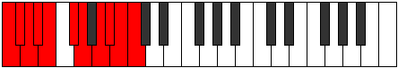

# Mode Bagyllian

## Links

- [Documentation](index.md)
- [Scales Index](Scales.md)
- [Modes Index](Modes.md)
- [Chords Index](Chords.md)

## Parent Scale

[Gothyllian](ScaleGothyllian.md)

## Number

[3807](https://ianring.com/musictheory/scales/3807)

## Perfection

- 8 Perfect notes
- 2 Perfect notes

## Perfection Profile

[true false true true true true true true false true]

## Permutations

| Tonic | Notes | Signature | Illustration | Audio |
|-------|-------|-----------|--------------|-------|
| [C](ModeCNaturalBagyllian.md) | C, **C#**, D, D#, E, F#, G, A, **A#**, B, C | C |  | [midi](ModeCNaturalBagyllian.mid) [ogg](ModeCNaturalBagyllian.ogg) |
| [C#](ModeCSharpBagyllian.md) | C#, **D**, D#, E, F, G, G#, A#, **B**, C, C# | C |  | [midi](ModeCSharpBagyllian.mid) [ogg](ModeCSharpBagyllian.ogg) |
| [Db](ModeDFlatBagyllian.md) | Db, **D**, Eb, E, F, G, Ab, Bb, **B**, C, Db | C |  | [midi](ModeDFlatBagyllian.mid) [ogg](ModeDFlatBagyllian.ogg) |
| [D](ModeDNaturalBagyllian.md) | D, **D#**, E, F, F#, G#, A, B, **C**, C#, D | C |  | [midi](ModeDNaturalBagyllian.mid) [ogg](ModeDNaturalBagyllian.ogg) |
| [D#](ModeDSharpBagyllian.md) | D#, **E**, F, F#, G, A, A#, C, **C#**, D, D# | C |  | [midi](ModeDSharpBagyllian.mid) [ogg](ModeDSharpBagyllian.ogg) |
| [Eb](ModeEFlatBagyllian.md) | Eb, **E**, F, Gb, G, A, Bb, C, **Db**, D, Eb | C |  | [midi](ModeEFlatBagyllian.mid) [ogg](ModeEFlatBagyllian.ogg) |
| [E](ModeENaturalBagyllian.md) | E, **F**, F#, G, G#, A#, B, C#, **D**, D#, E | C |  | [midi](ModeENaturalBagyllian.mid) [ogg](ModeENaturalBagyllian.ogg) |
| [F](ModeFNaturalBagyllian.md) | F, **F#**, G, G#, A, B, C, D, **D#**, E, F | C |  | [midi](ModeFNaturalBagyllian.mid) [ogg](ModeFNaturalBagyllian.ogg) |
| [F#](ModeFSharpBagyllian.md) | F#, **G**, G#, A, A#, C, C#, D#, **E**, F, F# | C |  | [midi](ModeFSharpBagyllian.mid) [ogg](ModeFSharpBagyllian.ogg) |
| [Gb](ModeGFlatBagyllian.md) | Gb, **G**, Ab, A, Bb, C, Db, Eb, **E**, F, Gb | C |  | [midi](ModeGFlatBagyllian.mid) [ogg](ModeGFlatBagyllian.ogg) |
| [G](ModeGNaturalBagyllian.md) | G, **G#**, A, A#, B, C#, D, E, **F**, F#, G | C |  | [midi](ModeGNaturalBagyllian.mid) [ogg](ModeGNaturalBagyllian.ogg) |
| [G#](ModeGSharpBagyllian.md) | G#, **A**, A#, B, C, D, D#, F, **F#**, G, G# | C |  | [midi](ModeGSharpBagyllian.mid) [ogg](ModeGSharpBagyllian.ogg) |
| [Ab](ModeAFlatBagyllian.md) | Ab, **A**, Bb, B, C, D, Eb, F, **Gb**, G, Ab | C |  | [midi](ModeAFlatBagyllian.mid) [ogg](ModeAFlatBagyllian.ogg) |
| [A](ModeANaturalBagyllian.md) | A, **A#**, B, C, C#, D#, E, F#, **G**, G#, A | C |  | [midi](ModeANaturalBagyllian.mid) [ogg](ModeANaturalBagyllian.ogg) |
| [A#](ModeASharpBagyllian.md) | A#, **B**, C, C#, D, E, F, G, **G#**, A, A# | C |  | [midi](ModeASharpBagyllian.mid) [ogg](ModeASharpBagyllian.ogg) |
| [Bb](ModeBFlatBagyllian.md) | Bb, **B**, C, Db, D, E, F, G, **Ab**, A, Bb | C |  | [midi](ModeBFlatBagyllian.mid) [ogg](ModeBFlatBagyllian.ogg) |
| [B](ModeBNaturalBagyllian.md) | B, **C**, C#, D, D#, F, F#, G#, **A**, A#, B | C |  | [midi](ModeBNaturalBagyllian.mid) [ogg](ModeBNaturalBagyllian.ogg) |
