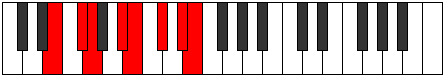

# Mode Banian

## Links

- [Documentation](index.md)
- [Scales Index](Scales.md)
- [Modes Index](Modes.md)
- [Chords Index](Chords.md)

## Parent Scale

[Palian](ScalePalian.md)

## Number

[2765](https://ianring.com/musictheory/scales/2765)

## Perfection

- 4 Perfect notes
- 3 Perfect notes

## Interval Pattern

2, 1, 3, 1, 2, 2, 1

## Perfection Profile

[true true false false true false true]

## Permutations

| Tonic | Notes | Signature | Illustration | Audio |
|-------|-------|-----------|--------------|-------|
| [C](ModeCNaturalBanian.md) | C, D, **Eb**, **F#**, G, **A**, B, C | C |  | [midi](https://github.com/edipermadi/music/blob/main/docs/ModeCNaturalBanian.mid?raw=true) |
| [C#](ModeCSharpBanian.md) | C#, D#, **E**, **F##**, G#, **A#**, B#, C# | C |  | [midi](https://github.com/edipermadi/music/blob/main/docs/ModeCSharpBanian.mid?raw=true) |
| [Db](ModeDFlatBanian.md) | Db, Eb, **Fb**, **G**, Ab, **Bb**, C, Db | C |  | [midi](https://github.com/edipermadi/music/blob/main/docs/ModeDFlatBanian.mid?raw=true) |
| [D](ModeDNaturalBanian.md) | D, E, **F**, **G#**, A, **B**, C#, D | C |  | [midi](https://github.com/edipermadi/music/blob/main/docs/ModeDNaturalBanian.mid?raw=true) |
| [D#](ModeDSharpBanian.md) | D#, E#, **F#**, **G##**, A#, **B#**, C##, D# | C |  | [midi](https://github.com/edipermadi/music/blob/main/docs/ModeDSharpBanian.mid?raw=true) |
| [Eb](ModeEFlatBanian.md) | Eb, F, **Gb**, **A**, Bb, **C**, D, Eb | C |  | [midi](https://github.com/edipermadi/music/blob/main/docs/ModeEFlatBanian.mid?raw=true) |
| [E](ModeENaturalBanian.md) | E, F#, **G**, **A#**, B, **C#**, D#, E | C |  | [midi](https://github.com/edipermadi/music/blob/main/docs/ModeENaturalBanian.mid?raw=true) |
| [F](ModeFNaturalBanian.md) | F, G, **Ab**, **B**, C, **D**, E, F | C |  | [midi](https://github.com/edipermadi/music/blob/main/docs/ModeFNaturalBanian.mid?raw=true) |
| [F#](ModeFSharpBanian.md) | F#, G#, **A**, **B#**, C#, **D#**, E#, F# | C |  | [midi](https://github.com/edipermadi/music/blob/main/docs/ModeFSharpBanian.mid?raw=true) |
| [Gb](ModeGFlatBanian.md) | Gb, Ab, **Bbb**, **C**, Db, **Eb**, F, Gb | C |  | [midi](https://github.com/edipermadi/music/blob/main/docs/ModeGFlatBanian.mid?raw=true) |
| [G](ModeGNaturalBanian.md) | G, A, **Bb**, **C#**, D, **E**, F#, G | C |  | [midi](https://github.com/edipermadi/music/blob/main/docs/ModeGNaturalBanian.mid?raw=true) |
| [G#](ModeGSharpBanian.md) | G#, A#, **B**, **C##**, D#, **E#**, F##, G# | C |  | [midi](https://github.com/edipermadi/music/blob/main/docs/ModeGSharpBanian.mid?raw=true) |
| [Ab](ModeAFlatBanian.md) | Ab, Bb, **Cb**, **D**, Eb, **F**, G, Ab | C |  | [midi](https://github.com/edipermadi/music/blob/main/docs/ModeAFlatBanian.mid?raw=true) |
| [A](ModeANaturalBanian.md) | A, B, **C**, **D#**, E, **F#**, G#, A | C |  | [midi](https://github.com/edipermadi/music/blob/main/docs/ModeANaturalBanian.mid?raw=true) |
| [A#](ModeASharpBanian.md) | A#, B#, **C#**, **D##**, E#, **F##**, G##, A# | C |  | [midi](https://github.com/edipermadi/music/blob/main/docs/ModeASharpBanian.mid?raw=true) |
| [Bb](ModeBFlatBanian.md) | Bb, C, **Db**, **E**, F, **G**, A, Bb | C |  | [midi](https://github.com/edipermadi/music/blob/main/docs/ModeBFlatBanian.mid?raw=true) |
| [B](ModeBNaturalBanian.md) | B, C#, **D**, **E#**, F#, **G#**, A#, B | C |  | [midi](https://github.com/edipermadi/music/blob/main/docs/ModeBNaturalBanian.mid?raw=true) |
