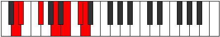
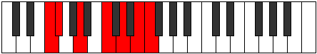
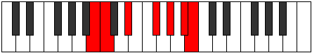

# Mode Banimic

## Links

- [Documentation](README.md)
- [Scales Index](Scales.md)
- [Modes Index](Modes.md)
- [Chords Index](Chords.md)

## Parent Scale

[Palimic](ScalePalimic.md)

## Number

[2707](https://ianring.com/musictheory/scales/2707)

## Interval Pattern

1, 3, 3, 2, 2, 1

## Chord Pattern

IVb5, v

## Perfection

- 3 Perfect notes
- 3 Perfect notes

## Perfection Profile

[true false true false true false]

## Permutations

| Tonic | Notes | Signature | Illustration | Audio |
|-------|-------|-----------|--------------|-------|
| [C](ModeCNaturalBanimic.md) | C, **Db**, E, **F##**, G##, **A##**, C | C |  | [midi](https://github.com/edipermadi/music/blob/main/docs/ModeCNaturalBanimic.mid?raw=true) |
| [C#](ModeCSharpBanimic.md) | C#, **D**, E#, **F###**, G###, **A###**, C# | C |  | [midi](https://github.com/edipermadi/music/blob/main/docs/ModeCSharpBanimic.mid?raw=true) |
| [Db](ModeDFlatBanimic.md) | Db, **Ebb**, F, **G#**, A#, **B#**, Db | C |  | [midi](https://github.com/edipermadi/music/blob/main/docs/ModeDFlatBanimic.mid?raw=true) |
| [D](ModeDNaturalBanimic.md) | D, **Eb**, F#, **G##**, A##, **B##**, D | C |  | [midi](https://github.com/edipermadi/music/blob/main/docs/ModeDNaturalBanimic.mid?raw=true) |
| [D#](ModeDSharpBanimic.md) | D#, **E**, F##, **G###**, A###, **B###**, D# | C |  | [midi](https://github.com/edipermadi/music/blob/main/docs/ModeDSharpBanimic.mid?raw=true) |
| [Eb](ModeEFlatBanimic.md) | Eb, **Fb**, G, **A#**, B#, **C##**, Eb | C |  | [midi](https://github.com/edipermadi/music/blob/main/docs/ModeEFlatBanimic.mid?raw=true) |
| [E](ModeENaturalBanimic.md) | E, **F**, G#, **A##**, B##, **C###**, E | C |  | [midi](https://github.com/edipermadi/music/blob/main/docs/ModeENaturalBanimic.mid?raw=true) |
| [F](ModeFNaturalBanimic.md) | F, **Gb**, A, **B#**, C##, **D##**, F | C |  | [midi](https://github.com/edipermadi/music/blob/main/docs/ModeFNaturalBanimic.mid?raw=true) |
| [F#](ModeFSharpBanimic.md) | F#, **G**, A#, **B##**, C###, **D###**, F# | C |  | [midi](https://github.com/edipermadi/music/blob/main/docs/ModeFSharpBanimic.mid?raw=true) |
| [Gb](ModeGFlatBanimic.md) | Gb, **Abb**, Bb, **C#**, D#, **E#**, Gb | C |  | [midi](https://github.com/edipermadi/music/blob/main/docs/ModeGFlatBanimic.mid?raw=true) |
| [G](ModeGNaturalBanimic.md) | G, **Ab**, B, **C##**, D##, **E##**, G | C |  | [midi](https://github.com/edipermadi/music/blob/main/docs/ModeGNaturalBanimic.mid?raw=true) |
| [G#](ModeGSharpBanimic.md) | G#, **A**, B#, **C###**, D###, **E###**, G# | C |  | [midi](https://github.com/edipermadi/music/blob/main/docs/ModeGSharpBanimic.mid?raw=true) |
| [Ab](ModeAFlatBanimic.md) | Ab, **Bbb**, C, **D#**, E#, **F##**, Ab | C |  | [midi](https://github.com/edipermadi/music/blob/main/docs/ModeAFlatBanimic.mid?raw=true) |
| [A](ModeANaturalBanimic.md) | A, **Bb**, C#, **D##**, E##, **F###**, A | C |  | [midi](https://github.com/edipermadi/music/blob/main/docs/ModeANaturalBanimic.mid?raw=true) |
| [A#](ModeASharpBanimic.md) | A#, **B**, C##, **D###**, E###, **Cbbb**, A# | C |  | [midi](https://github.com/edipermadi/music/blob/main/docs/ModeASharpBanimic.mid?raw=true) |
| [Bb](ModeBFlatBanimic.md) | Bb, **Cb**, D, **E#**, F##, **G##**, Bb | C |  | [midi](https://github.com/edipermadi/music/blob/main/docs/ModeBFlatBanimic.mid?raw=true) |
| [B](ModeBNaturalBanimic.md) | B, **C**, D#, **E##**, F###, **G###**, B | C |  | [midi](https://github.com/edipermadi/music/blob/main/docs/ModeBNaturalBanimic.mid?raw=true) |
