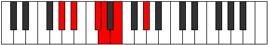

# Mode Banitonic

## Links

- [Documentation](README.md)
- [Scales Index](Scales.md)
- [Modes Index](Modes.md)
- [Chords Index](Chords.md)

## Parent Scale

[Phronitonic](ScalePhronitonic.md)

## Number

[357](https://ianring.com/musictheory/scales/357)

## Luminosity

4

## Transposition

2, 3, 1, 2, 4

## Chord Pattern

## Perfection

- 1 Perfect notes
- 4 Perfect notes

## Perfection Profile

false, false, true, false, false

## Permutations

| Tonic | Notes | Signature | Illustration | Audio |
|-------|-------|-----------|--------------|-------|
| [C](ModeCNaturalBanitonic.md) | **C**, **D**, F, **F#**, **G#**, **C** | C |  | [midi](https://github.com/edipermadi/music/blob/main/docs/ModeCNaturalBanitonic.mid?raw=true) |
| [C#](ModeCSharpBanitonic.md) | **C#**, **D#**, F#, **G**, **A**, **C#** | C |  | [midi](https://github.com/edipermadi/music/blob/main/docs/ModeCSharpBanitonic.mid?raw=true) |
| [Db](ModeDFlatBanitonic.md) | **Db**, **Eb**, Gb, **G**, **A**, **Db** | C |  | [midi](https://github.com/edipermadi/music/blob/main/docs/ModeDFlatBanitonic.mid?raw=true) |
| [D](ModeDNaturalBanitonic.md) | **D**, **E**, G, **G#**, **A#**, **D** | C |  | [midi](https://github.com/edipermadi/music/blob/main/docs/ModeDNaturalBanitonic.mid?raw=true) |
| [D#](ModeDSharpBanitonic.md) | **D#**, **F**, G#, **A**, **B**, **D#** | C |  | [midi](https://github.com/edipermadi/music/blob/main/docs/ModeDSharpBanitonic.mid?raw=true) |
| [Eb](ModeEFlatBanitonic.md) | **Eb**, **F**, Ab, **A**, **B**, **Eb** | C |  | [midi](https://github.com/edipermadi/music/blob/main/docs/ModeEFlatBanitonic.mid?raw=true) |
| [E](ModeENaturalBanitonic.md) | **E**, **F#**, A, **A#**, **C**, **E** | C |  | [midi](https://github.com/edipermadi/music/blob/main/docs/ModeENaturalBanitonic.mid?raw=true) |
| [F](ModeFNaturalBanitonic.md) | **F**, **G**, A#, **B**, **C#**, **F** | C |  | [midi](https://github.com/edipermadi/music/blob/main/docs/ModeFNaturalBanitonic.mid?raw=true) |
| [F#](ModeFSharpBanitonic.md) | **F#**, **G#**, B, **C**, **D**, **F#** | C |  | [midi](https://github.com/edipermadi/music/blob/main/docs/ModeFSharpBanitonic.mid?raw=true) |
| [Gb](ModeGFlatBanitonic.md) | **Gb**, **Ab**, B, **C**, **D**, **Gb** | C |  | [midi](https://github.com/edipermadi/music/blob/main/docs/ModeGFlatBanitonic.mid?raw=true) |
| [G](ModeGNaturalBanitonic.md) | **G**, **A**, C, **C#**, **D#**, **G** | C |  | [midi](https://github.com/edipermadi/music/blob/main/docs/ModeGNaturalBanitonic.mid?raw=true) |
| [G#](ModeGSharpBanitonic.md) | **G#**, **A#**, C#, **D**, **E**, **G#** | C |  | [midi](https://github.com/edipermadi/music/blob/main/docs/ModeGSharpBanitonic.mid?raw=true) |
| [Ab](ModeAFlatBanitonic.md) | **Ab**, **Bb**, Db, **D**, **E**, **Ab** | C |  | [midi](https://github.com/edipermadi/music/blob/main/docs/ModeAFlatBanitonic.mid?raw=true) |
| [A](ModeANaturalBanitonic.md) | **A**, **B**, D, **D#**, **F**, **A** | C |  | [midi](https://github.com/edipermadi/music/blob/main/docs/ModeANaturalBanitonic.mid?raw=true) |
| [A#](ModeASharpBanitonic.md) | **A#**, **C**, D#, **E**, **F#**, **A#** | C |  | [midi](https://github.com/edipermadi/music/blob/main/docs/ModeASharpBanitonic.mid?raw=true) |
| [Bb](ModeBFlatBanitonic.md) | **Bb**, **C**, Eb, **E**, **Gb**, **Bb** | C |  | [midi](https://github.com/edipermadi/music/blob/main/docs/ModeBFlatBanitonic.mid?raw=true) |
| [B](ModeBNaturalBanitonic.md) | **B**, **C#**, E, **F**, **G**, **B** | C |  | [midi](https://github.com/edipermadi/music/blob/main/docs/ModeBNaturalBanitonic.mid?raw=true) |
