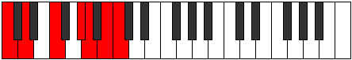

# Mode Baptimic

## Links

- [Documentation](index.md)
- [Scales Index](Scales.md)
- [Modes Index](Modes.md)
- [Chords Index](Chords.md)

## Parent Scale

[Thalimic](ScaleThalimic.md)

## Number

[2853](https://ianring.com/musictheory/scales/2853)

## Perfection

- 2 Perfect notes
- 4 Perfect notes

## Perfection Profile

[false true true false false false]

## Permutations

| Tonic | Notes | Signature | Illustration | Audio |
|-------|-------|-----------|--------------|-------|
| [C](ModeCNaturalBaptimic.md) | **C**, D, E#, **F###**, **G##**, **A##**, **C** | C |  | [midi](ModeCNaturalBaptimic.mid) [ogg](ModeCNaturalBaptimic.ogg) |
| [C#](ModeCSharpBaptimic.md) | **C#**, D#, E##, **Cbbb**, **Cbb**, **Dbb**, **C#** | C |  | [midi](ModeCSharpBaptimic.mid) [ogg](ModeCSharpBaptimic.ogg) |
| [Db](ModeDFlatBaptimic.md) | **Db**, Eb, F#, **G##**, **A#**, **B#**, **Db** | C |  | [midi](ModeDFlatBaptimic.mid) [ogg](ModeDFlatBaptimic.ogg) |
| [D](ModeDNaturalBaptimic.md) | **D**, E, F##, **G###**, **A##**, **B##**, **D** | C |  | [midi](ModeDNaturalBaptimic.mid) [ogg](ModeDNaturalBaptimic.ogg) |
| [D#](ModeDSharpBaptimic.md) | **D#**, E#, F###, **Cb**, **Dbb**, **Ebb**, **D#** | C |  | [midi](ModeDSharpBaptimic.mid) [ogg](ModeDSharpBaptimic.ogg) |
| [Eb](ModeEFlatBaptimic.md) | **Eb**, F, G#, **A##**, **B#**, **C##**, **Eb** | C |  | [midi](ModeEFlatBaptimic.mid) [ogg](ModeEFlatBaptimic.ogg) |
| [E](ModeENaturalBaptimic.md) | **E**, F#, G##, **A###**, **B##**, **C###**, **E** | C |  | [midi](ModeENaturalBaptimic.mid) [ogg](ModeENaturalBaptimic.ogg) |
| [F](ModeFNaturalBaptimic.md) | **F**, G, A#, **B##**, **C##**, **D##**, **F** | C |  | [midi](ModeFNaturalBaptimic.mid) [ogg](ModeFNaturalBaptimic.ogg) |
| [F#](ModeFSharpBaptimic.md) | **F#**, G#, A##, **B###**, **C###**, **D###**, **F#** | C |  | [midi](ModeFSharpBaptimic.mid) [ogg](ModeFSharpBaptimic.ogg) |
| [Gb](ModeGFlatBaptimic.md) | **Gb**, Ab, B, **C##**, **D#**, **E#**, **Gb** | C |  | [midi](ModeGFlatBaptimic.mid) [ogg](ModeGFlatBaptimic.ogg) |
| [G](ModeGNaturalBaptimic.md) | **G**, A, B#, **C###**, **D##**, **E##**, **G** | C |  | [midi](ModeGNaturalBaptimic.mid) [ogg](ModeGNaturalBaptimic.ogg) |
| [G#](ModeGSharpBaptimic.md) | **G#**, A#, B##, **D##**, **E#**, **F##**, **G#** | C |  | [midi](ModeGSharpBaptimic.mid) [ogg](ModeGSharpBaptimic.ogg) |
| [Ab](ModeAFlatBaptimic.md) | **Ab**, Bb, C#, **D##**, **E#**, **F##**, **Ab** | C |  | [midi](ModeAFlatBaptimic.mid) [ogg](ModeAFlatBaptimic.ogg) |
| [A](ModeANaturalBaptimic.md) | **A**, B, C##, **D###**, **E##**, **F###**, **A** | C |  | [midi](ModeANaturalBaptimic.mid) [ogg](ModeANaturalBaptimic.ogg) |
| [A#](ModeASharpBaptimic.md) | **A#**, B#, C###, **E##**, **F##**, **G##**, **A#** | C |  | [midi](ModeASharpBaptimic.mid) [ogg](ModeASharpBaptimic.ogg) |
| [Bb](ModeBFlatBaptimic.md) | **Bb**, C, D#, **E##**, **F##**, **G##**, **Bb** | C |  | [midi](ModeBFlatBaptimic.mid) [ogg](ModeBFlatBaptimic.ogg) |
| [B](ModeBNaturalBaptimic.md) | **B**, C#, D##, **E###**, **F###**, **G###**, **B** | C |  | [midi](ModeBNaturalBaptimic.mid) [ogg](ModeBNaturalBaptimic.ogg) |
