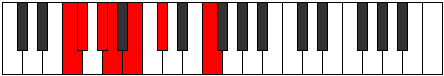

# Mode Barimic

## Links

- [Documentation](README.md)
- [Scales Index](Scales.md)
- [Modes Index](Modes.md)
- [Chords Index](Chords.md)

## Parent Scale

[Modimic](ScaleModimic.md)

## Number

[347](https://ianring.com/musictheory/scales/347)

## Transposition

1, 2, 1, 2, 2, 4

## Chord Pattern

i⁰, ii, ii

## Perfection

- 3 Perfect notes
- 3 Perfect notes

## Perfection Profile

[false true false false true true]

## Permutations

| Tonic | Notes | Signature | Illustration | Audio |
|-------|-------|-----------|--------------|-------|
| [C](ModeCNaturalBarimic.md) | **C**, Db, **Eb**, **Fb**, Gb, Ab, **C** | C |  | [midi](https://github.com/edipermadi/music/blob/main/docs/ModeCNaturalBarimic.mid?raw=true) |
| [C#](ModeCSharpBarimic.md) | **C#**, D, **E**, **F**, G, A, **C#** | C |  | [midi](https://github.com/edipermadi/music/blob/main/docs/ModeCSharpBarimic.mid?raw=true) |
| [Db](ModeDFlatBarimic.md) | **Db**, Ebb, **Fb**, **Gbb**, Abb, Bbb, **Db** | C |  | [midi](https://github.com/edipermadi/music/blob/main/docs/ModeDFlatBarimic.mid?raw=true) |
| [D](ModeDNaturalBarimic.md) | **D**, Eb, **F**, **Gb**, Ab, Bb, **D** | C |  | [midi](https://github.com/edipermadi/music/blob/main/docs/ModeDNaturalBarimic.mid?raw=true) |
| [D#](ModeDSharpBarimic.md) | **D#**, E, **F#**, **G**, A, B, **D#** | C |  | [midi](https://github.com/edipermadi/music/blob/main/docs/ModeDSharpBarimic.mid?raw=true) |
| [Eb](ModeEFlatBarimic.md) | **Eb**, Fb, **Gb**, **Abb**, Bbb, Cb, **Eb** | C |  | [midi](https://github.com/edipermadi/music/blob/main/docs/ModeEFlatBarimic.mid?raw=true) |
| [E](ModeENaturalBarimic.md) | **E**, F, **G**, **Ab**, Bb, C, **E** | C |  | [midi](https://github.com/edipermadi/music/blob/main/docs/ModeENaturalBarimic.mid?raw=true) |
| [F](ModeFNaturalBarimic.md) | **F**, Gb, **Ab**, **Bbb**, Cb, Db, **F** | C |  | [midi](https://github.com/edipermadi/music/blob/main/docs/ModeFNaturalBarimic.mid?raw=true) |
| [F#](ModeFSharpBarimic.md) | **F#**, G, **A**, **Bb**, C, D, **F#** | C |  | [midi](https://github.com/edipermadi/music/blob/main/docs/ModeFSharpBarimic.mid?raw=true) |
| [Gb](ModeGFlatBarimic.md) | **Gb**, Abb, **Bbb**, **Cbb**, Dbb, Ebb, **Gb** | C |  | [midi](https://github.com/edipermadi/music/blob/main/docs/ModeGFlatBarimic.mid?raw=true) |
| [G](ModeGNaturalBarimic.md) | **G**, Ab, **Bb**, **Cb**, Db, Eb, **G** | C |  | [midi](https://github.com/edipermadi/music/blob/main/docs/ModeGNaturalBarimic.mid?raw=true) |
| [G#](ModeGSharpBarimic.md) | **G#**, A, **B**, **C**, D, E, **G#** | C |  | [midi](https://github.com/edipermadi/music/blob/main/docs/ModeGSharpBarimic.mid?raw=true) |
| [Ab](ModeAFlatBarimic.md) | **Ab**, Bbb, **Cb**, **Dbb**, Ebb, Fb, **Ab** | C |  | [midi](https://github.com/edipermadi/music/blob/main/docs/ModeAFlatBarimic.mid?raw=true) |
| [A](ModeANaturalBarimic.md) | **A**, Bb, **C**, **Db**, Eb, F, **A** | C |  | [midi](https://github.com/edipermadi/music/blob/main/docs/ModeANaturalBarimic.mid?raw=true) |
| [A#](ModeASharpBarimic.md) | **A#**, B, **C#**, **D**, E, F#, **A#** | C |  | [midi](https://github.com/edipermadi/music/blob/main/docs/ModeASharpBarimic.mid?raw=true) |
| [Bb](ModeBFlatBarimic.md) | **Bb**, Cb, **Db**, **Ebb**, Fb, Gb, **Bb** | C |  | [midi](https://github.com/edipermadi/music/blob/main/docs/ModeBFlatBarimic.mid?raw=true) |
| [B](ModeBNaturalBarimic.md) | **B**, C, **D**, **Eb**, F, G, **B** | C |  | [midi](https://github.com/edipermadi/music/blob/main/docs/ModeBNaturalBarimic.mid?raw=true) |
