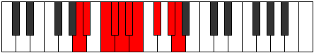

# Mode Barygic

## Links

- [Documentation](index.md)
- [Scales Index](Scales.md)
- [Modes Index](Modes.md)
- [Chords Index](Chords.md)

## Parent Scale

[Porygic](ScalePorygic.md)

## Number

[2811](https://ianring.com/musictheory/scales/2811)

## Perfection

- 6 Perfect notes
- 3 Perfect notes

## Perfection Profile

[true false false true true true false true true]

## Permutations

| Tonic | Notes | Signature | Illustration | Audio |
|-------|-------|-----------|--------------|-------|
| [C](ModeCNaturalBarygic.md) | C, **C#**, **D#**, E, F, F#, **G**, A, B, C | C |  | [midi](ModeCNaturalBarygic.mid) [ogg](ModeCNaturalBarygic.ogg) |
| [C#](ModeCSharpBarygic.md) | C#, **D**, **E**, F, F#, G, **G#**, A#, C, C# | C |  | [midi](ModeCSharpBarygic.mid) [ogg](ModeCSharpBarygic.ogg) |
| [Db](ModeDFlatBarygic.md) | Db, **D**, **E**, F, Gb, G, **Ab**, Bb, C, Db | C |  | [midi](ModeDFlatBarygic.mid) [ogg](ModeDFlatBarygic.ogg) |
| [D](ModeDNaturalBarygic.md) | D, **D#**, **F**, F#, G, G#, **A**, B, C#, D | C |  | [midi](ModeDNaturalBarygic.mid) [ogg](ModeDNaturalBarygic.ogg) |
| [D#](ModeDSharpBarygic.md) | D#, **E**, **F#**, G, G#, A, **A#**, C, D, D# | C |  | [midi](ModeDSharpBarygic.mid) [ogg](ModeDSharpBarygic.ogg) |
| [Eb](ModeEFlatBarygic.md) | Eb, **E**, **Gb**, G, Ab, A, **Bb**, C, D, Eb | C |  | [midi](ModeEFlatBarygic.mid) [ogg](ModeEFlatBarygic.ogg) |
| [E](ModeENaturalBarygic.md) | E, **F**, **G**, G#, A, A#, **B**, C#, D#, E | C |  | [midi](ModeENaturalBarygic.mid) [ogg](ModeENaturalBarygic.ogg) |
| [F](ModeFNaturalBarygic.md) | F, **F#**, **G#**, A, A#, B, **C**, D, E, F | C |  | [midi](ModeFNaturalBarygic.mid) [ogg](ModeFNaturalBarygic.ogg) |
| [F#](ModeFSharpBarygic.md) | F#, **G**, **A**, A#, B, C, **C#**, D#, F, F# | C |  | [midi](ModeFSharpBarygic.mid) [ogg](ModeFSharpBarygic.ogg) |
| [Gb](ModeGFlatBarygic.md) | Gb, **G**, **A**, Bb, B, C, **Db**, Eb, F, Gb | C |  | [midi](ModeGFlatBarygic.mid) [ogg](ModeGFlatBarygic.ogg) |
| [G](ModeGNaturalBarygic.md) | G, **G#**, **A#**, B, C, C#, **D**, E, F#, G | C |  | [midi](ModeGNaturalBarygic.mid) [ogg](ModeGNaturalBarygic.ogg) |
| [G#](ModeGSharpBarygic.md) | G#, **A**, **B**, C, C#, D, **D#**, F, G, G# | C |  | [midi](ModeGSharpBarygic.mid) [ogg](ModeGSharpBarygic.ogg) |
| [Ab](ModeAFlatBarygic.md) | Ab, **A**, **B**, C, Db, D, **Eb**, F, G, Ab | C |  | [midi](ModeAFlatBarygic.mid) [ogg](ModeAFlatBarygic.ogg) |
| [A](ModeANaturalBarygic.md) | A, **A#**, **C**, C#, D, D#, **E**, F#, G#, A | C |  | [midi](ModeANaturalBarygic.mid) [ogg](ModeANaturalBarygic.ogg) |
| [A#](ModeASharpBarygic.md) | A#, **B**, **C#**, D, D#, E, **F**, G, A, A# | C |  | [midi](ModeASharpBarygic.mid) [ogg](ModeASharpBarygic.ogg) |
| [Bb](ModeBFlatBarygic.md) | Bb, **B**, **Db**, D, Eb, E, **F**, G, A, Bb | C |  | [midi](ModeBFlatBarygic.mid) [ogg](ModeBFlatBarygic.ogg) |
| [B](ModeBNaturalBarygic.md) | B, **C**, **D**, D#, E, F, **F#**, G#, A#, B | C |  | [midi](ModeBNaturalBarygic.mid) [ogg](ModeBNaturalBarygic.ogg) |
